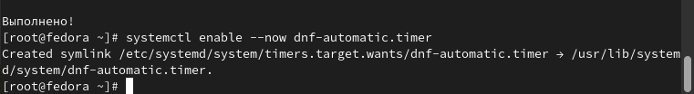

---
## Front matter
title: "ОТЧЕТ ПО ЛАБОРАТОРНОЙ РАБОТЕ №1"
subtitle: "Установка ОС Linux."
author: "Сагдеров Камал Русланович"

## Generic otions
lang: ru-RU
toc-title: "Содержание"

## Bibliography
bibliography: bib/cite.bib
csl: pandoc/csl/gost-r-7-0-5-2008-numeric.csl

## Pdf output format
toc: true # Table of contents
toc-depth: 2
lof: true # List of figures
lot: true # List of tables
fontsize: 12pt
linestretch: 1.5
papersize: a4
documentclass: scrreprt
## I18n polyglossia
polyglossia-lang:
  name: russian
  options:
	- spelling=modern
	- babelshorthands=true
polyglossia-otherlangs:
  name: english
## I18n babel
babel-lang: russian
babel-otherlangs: english
## Fonts
mainfont: PT Serif
romanfont: PT Serif
sansfont: PT Sans
monofont: PT Mono
mainfontoptions: Ligatures=TeX
romanfontoptions: Ligatures=TeX
sansfontoptions: Ligatures=TeX,Scale=MatchLowercase
monofontoptions: Scale=MatchLowercase,Scale=0.9
## Biblatex
biblatex: true
biblio-style: "gost-numeric"
biblatexoptions:
  - parentracker=true
  - backend=biber
  - hyperref=auto
  - language=auto
  - autolang=other*
  - citestyle=gost-numeric
## Pandoc-crossref LaTeX customization
figureTitle: "Рис."
tableTitle: "Таблица"
listingTitle: "Листинг"
lofTitle: "Список иллюстраций"
lotTitle: "Список таблиц"
lolTitle: "Листинги"
## Misc options
indent: true
header-includes:
  - \usepackage{indentfirst}
  - \usepackage{float} # keep figures where there are in the text
  - \floatplacement{figure}{H} # keep figures where there are in the text
---

# Цель работы

Целью данной работы является приобретение практических навыков установки операционной системы на виртуальную машину, настройки минимально необходимых для дальнейшей работы сервисов.

# Задание

    1.Запуск Virtualbox и создание новой виртуальной машины (операционная система Linux, Fedora)
    2. Настроить установки операционной системы.
    3. Подключить образ диска дополнительной гостевой OC
    4. Выполнение домашнего задания.

# Теоретическое введение

Linux — семейство Unix-подобных операционных систем на базе ядра Linux, включающих тот или иной набор утилит и программ проекта GNU, и, возможно, другие компоненты. Как и ядро Linux, системы на его основе, как правило, создаются и распространяются в соответствии с моделью разработки свободного и открытого программного обеспечения. Linux-системы распространяются в основном бесплатно в виде различных дистрибутивов — в форме, готовой для установки и удобной для сопровождения и обновлений, — и имеющих свой набор системных и прикладных компонентов, как свободных, так и проприетарных.  [@Linux-doc:bash]
Например, в табл. @tbl:std-dir приведено краткое описание стандартных каталогов Unix.

# Выполнение лабораторной работы

№1 «Создание виртуальной машины»
Создаем новую виртуальную машину.Указываем имя виртуальной машины (наш логин в дисплейном классе) и тип операционной системы — Linux, Fedora. (рис. @fig:001.)

{#fig:001 width=70%}

Указываем размер основной памяти виртуальной машины — от 2048 МБ.(4100 МБ) (рис. @fig:01.2)

{#fig:01.2 width=70%}

Задаем конфигурацию жёсткого диска — загрузочный, VDI (VirtualBox Disk Image), динамический виртуальный диск.(рис. @fig:01.3)

 {#fig:01.3 width=70%}
 
 {#fig:01.4 width=70%}
 
 {#fig:01.5 width=70%}
 
 Задаем размер диска — 80 ГБ и его расположение 
 
 {#fig:01.6 width=70%}
 
{#fig:1.6.2 width=70%}

№2. «Установка операционной системы»
Запускаем виртуальную машину. (рис. @fig:02.1)

{#fig:02.1 width=70%} 

Выбираем язык интерфейса и перейдите к настройкам установки операционной системы (рис. @fig:02.2)

{#fig:02.2 width=70%}

Скорректирую часовой пояс, раскладку клавиатуры (рис. @fig:02.3)

{#fig:02.3 width=70%}

{#fig:02.4 width=70%}

Место установки ОС оставьте без изменения. (рис. @fig:02.5)

{#fig:02.5 width=70%}

Установим имя и пароль для Нашего пользователя. (рис. @fig:02.6)

{#fig:02.6 width=70%}

Зададим сетевое имя Нашего компьютера. (рис. @fig:02.7)

{#fig:02.7 width=70%}

№3. «После установки»
Войдем в ОС под заданной нами при установке учётной записью. Переключаюсь на роль супер-пользователя (рис. @fig:03.1)

{#fig:03.1 width=70%}

{#fig:03.2 width=70%}

Автоматическое обновление. При необходимости можно использовать автоматическое обновление. (рис. @fig:03.3)

{#fig:03.3 width=70%}

{#fig:03.4 width=70%}

{#fig:03.5 width=70%}

Отключение SELinux (рис. @fig:3.5.1)

{#fig:3.5.1 width=70%}

№4. Установка драйверов для VirtualBox
Войдем в ОС под заданной нами при установке учётной записью.Нажмите комбинацию Win+Enter для запуска терминала.Запускаю терминальный мультиплексор tmux. (рис. @fig:04.1)

{#fig:04.1 width=70%}

{#fig:4.1.1 width=70%}

В меню виртуальной машины подключаю образ диска дополнений гостевой ОС. (рис. @fig:04.2)

{#fig:04.2 width=70%
{#fig:04.3 3width=70%

№5. Настройка раскладки клавиатуры
Отредактирую конфигурационный файл. (рис. @fig:05.1)
{#fig:05.1 width=70%

№6. Установка имени пользователя и названия хоста
При установке виртуальной машины я задал имя пользователя или имя хоста, удовлетворяющее соглашению об именовании, поэтому я просто пропустил данный этап.

№7. Установка программного обеспечения для создания документации
Установливаю pandoc (рис. @fig:07.1)

{#fig:07.1 width=70%}

{#fig:7.1.1 width=70%}

{#fig:07.2 width=70%}

{#fig:07.3 width=70%}

{#fig:07.3 width=70%}

№8. Домашнее задание
Получений следующей информации. (рис. @fig:08.1)

{#fig:08.1 width=70%}

{#fig:08.2 width=70%}

{#fig:08.3 width=70%}

{#fig:08.4 width=70%}

{#fig:08.4 width=70%}

{#fig:08.5 width=70%}

{#fig:08.6 width=70%}

№9. Контрольные вопросы.
1.Какую информацию содержит учётная запись пользователя?
Имя пользователя, зашифрованный пароль пользователя, идентификационный номер пользователя, идентификационный номер группы пользователя, домашний каталог пользователя, командный интерпретатор пользователя

2.Укажите команды терминала и приведите примеры:
для получения справки по команде: man <название команды> 
для перемещения по файловой системе: cd
для просмотра содержимого каталога: ls
для определения объёма каталога: du <имя каталога>
для создания каталогов: mkdir <имя каталога>
для создания файлов: touch <имя файла>
для удаления каталогов: rm <имя файла>
для удаления файлов: rm -r <имя файла>
для задания определённых прав на файл / каталог: chmod + x <имя файла/каталога>
для просмотра истории команд: history
3.Что такое файловая система? Приведите примеры с краткой характеристикой.
Файловая система – это часть операционной системы, инструмент, позволяющий операционной системе и программам обращаться к нужным файлам и работать с ними. Назначение ФС состоит в том, чтобы обеспечить пользователю удобный интерфейс при работе с данными, хранящимися на диске, и обеспечить совместное использование файлов несколькими пользователями и процессами. При этом программы оперируют только названием файла, его размером и датой созданий. Все остальные функции по поиску необходимого файла в хранилище и работе с ним берет на себя файловая система накопителя.

Примеры ФС: 
1.Ext2, Ext3, Ext4 или Extended Filesystem – стандартная файловая система для Linux.
2. XFS – это файловая система с журналированием метаданных. Она обладает конкретным набором возможностей и оптимизирована для масштабирования. Мы рекомендуем использовать эту файловую систему исключительно на Linux системах с высококлассными SCSI и/или Fibre Channel накопителями и источниками бесперебойного питания.
3. ReiserFS – это файловая система, основанная на B-дереве, которая имеет очень хорошую производительность и значительно превосходит ext2 и ext3.  ReiserFS является стабильной и рекомендуется, как в качестве ФС общего назначения, так и в крайних случаях, таких как создание больших файловых систем, использование для множества маленьких файлов, для огромных файлов, а также для каталогов с десятками тысяч файлов.
4. JFS или Journaled File System была разработана для в IBM для AIX UNIX и использовалась в качестве альтернативы для файловых систем ext. Она используется там, где необходима высокая стабильность и минимальное потребление ресусров.
4. Как посмотреть, какие файловые системы подмонтированы в ОС?
С помощью команды mount
5.Как удалить зависший процесс?
С помощью команды kill

№10. Отчет о выполнение домашнего задания:
Открываем терминал. В окне терминала анализируем последовательность загрузки системы, выполнив команду dmesg. Также можно посмотреть вывод этой команды dmesg | less. Дальше с помощью команды grep ищем необходимую информацию dmesg | grep -i “то, что ищем”. Получаем следующую информацию:

{#fig:038 width=70%}
{#fig:039 width=70%}
{#fig:040 width=70%}
{#fig:041 width=70%}
{#fig:042 width=70%}
{#fig:043 width=70%}
{#fig:044 width=70%}
{#fig:045 width=70%}
# Выводы

В результате выполнения лабораторной работы мною были приобретены навыки установления операционной системы на виртуальную машину, а также настройки минимально необходимых для дальнейшей работы сервисов.

# Список литературы{.unnumbered}

::: {#refs}
:::
