---
## Front matter
title: "Отчёт по лабораторной работе №2"
subtitle: "Первоначальная настройка git"
author: "Сагдеров Камал"

## Generic otions
lang: ru-RU
toc-title: "Содержание"

## Bibliography
bibliography: bib/cite.bib
csl: pandoc/csl/gost-r-7-0-5-2008-numeric.csl

## Pdf output format
toc: true # Table of contents
toc-depth: 2
lof: true # List of figures
lot: true # List of tables
fontsize: 12pt
linestretch: 1.5
papersize: a4
documentclass: scrreprt
## I18n polyglossia
polyglossia-lang:
  name: russian
  options:
	- spelling=modern
	- babelshorthands=true
polyglossia-otherlangs:
  name: english
## I18n babel
babel-lang: russian
babel-otherlangs: english
## Fonts
mainfont: PT Serif
romanfont: PT Serif
sansfont: PT Sans
monofont: PT Mono
mainfontoptions: Ligatures=TeX
romanfontoptions: Ligatures=TeX
sansfontoptions: Ligatures=TeX,Scale=MatchLowercase
monofontoptions: Scale=MatchLowercase,Scale=0.9
## Biblatex
biblatex: true
biblio-style: "gost-numeric"
biblatexoptions:
  - parentracker=true
  - backend=biber
  - hyperref=auto
  - language=auto
  - autolang=other*
  - citestyle=gost-numeric
## Pandoc-crossref LaTeX customization
figureTitle: "Рис."
tableTitle: "Таблица"
listingTitle: "Листинг"
lofTitle: "Список иллюстраций"
lotTitle: "Список таблиц"
lolTitle: "Листинги"
## Misc options
indent: true
header-includes:
  - \usepackage{indentfirst}
  - \usepackage{float} # keep figures where there are in the text
  - \floatplacement{figure}{H} # keep figures where there are in the text
---

# Цель работы

   1. Изучить идеологию и применение средств контроля версий.
   2. Освоить умения по работе с git.
  

# Задание

1. Создать базовую конфигурацию для работы с git.
2. Создать ключ SSH.
3. Создать ключ PGP.
4. Настроить подписи git.
5. Зарегистрироваться на Github.
6. Создать локальный каталог для выполнения заданий по предмету.

# Теоретическое введение

В результате выполнения лабораторной работы №2, мы познакомились с системой контроля версий.Системы контроля версий (Version Control System, VCS) применяются при работе нескольких человек над одним проектом. Обычно основное дерево проекта хранится в локальном или удалённом репозитории, к которому настроен доступ для участников проекта. При внесении изменений в содержание проекта система контроля версий позволяет их фиксировать, совмещать изменения, произведённые разными участниками проекта, производить откат к любой более ранней версии проекта, если это требуется.
Система контроля версий имеют возможность отслеживания и разрешения конфликтов, которые могут возникнуть при работе нескольких человек над одним файлом. Системы контроля версий также могут обеспечивать дополнительные, более гибкие функциональные возможности.
Среди классических VCS наиболее известны CVS, Subversion, а среди распределённых — Git, Bazaar, Mercurial. Принципы их работы схожи, отличаются они в основном синтаксисом используемых в работе команд.

# Выполнение лабораторной работы

№1 Установка программного обеспечения
Создаем учетную запись Github и заполняем основные данные. После
устанавливаем программное обеспечение, устанавливаем gh. Затем переходим к
базовой настройки git, где задаю свои данные (имя и email) репозитория.
Настраиваю utf-8 в выводе сообщений git. Задаем имя начальной ветки, параметры
(autocrlf, safecrlf) (рис. @fig:001).

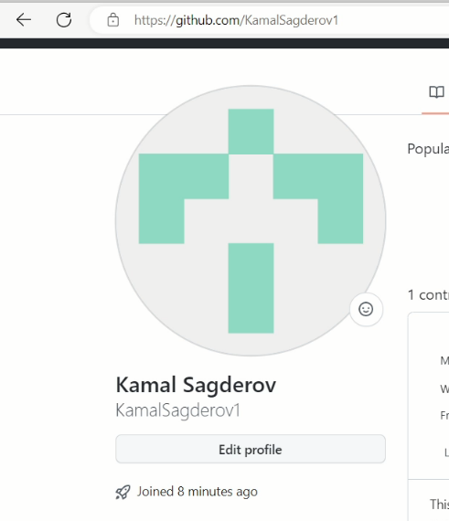{#fig:001 width=70%}

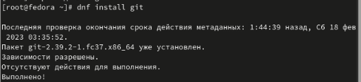{#fig:002 width=70%}

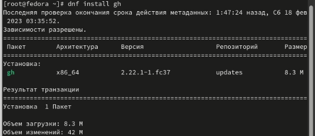{#fig:003 width=70%}

№2 Базовая настройка git
Задаем данные владельца, настраиваем utf-8 в выводе сообщений git, верификацию и подписание коммитов git и зададем имя начальной ветки. (рис. @fig:004).

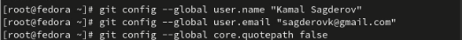{#fig:004 width=70%}

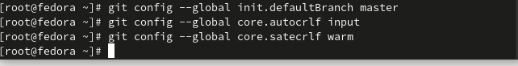{#fig:005 width=70%}

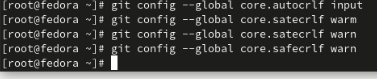{#fig:006 width=70%}

№3 Создание ключей ssh и pgp

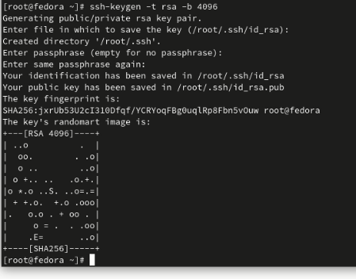{#fig:007 width=70%}

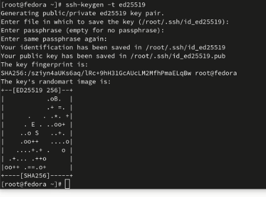{#fig:008 width=70%}

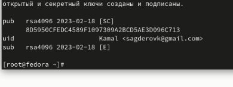{#fig:009 width=70%}

№4 Экспорт ключа
Выводим список ключей и копируем отпечаток приватного ключа, а также экспортируем ключ в формате ASCII по его отпечатку (рис. @fig:010).

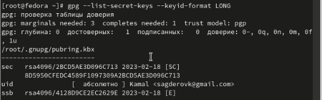{#fig:010 width=70%}

№5 Добавление PGP ключа в GitHub

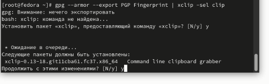{#fig:011 width=70%}

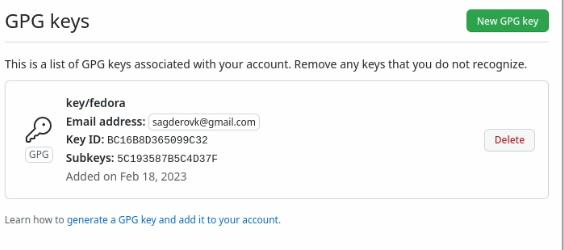{#fig:012 width=70%}

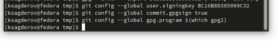{#fig:013 width=70%}

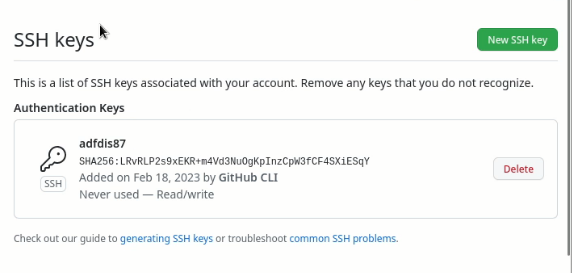{#fig:014 width=70%}

№6 Создание репозитория курса на основе шаблона

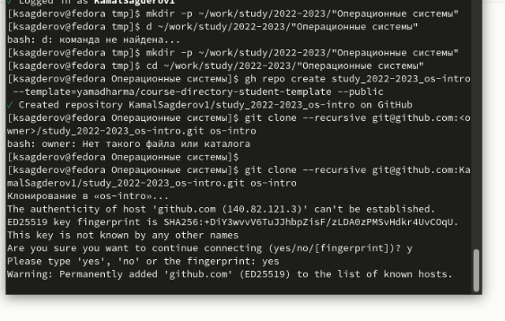{#fig:015 width=70%}

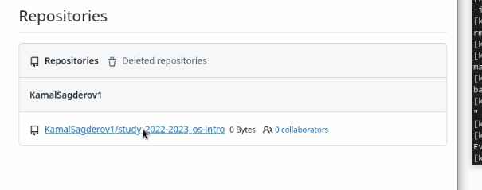{#fig:016 width=70%}

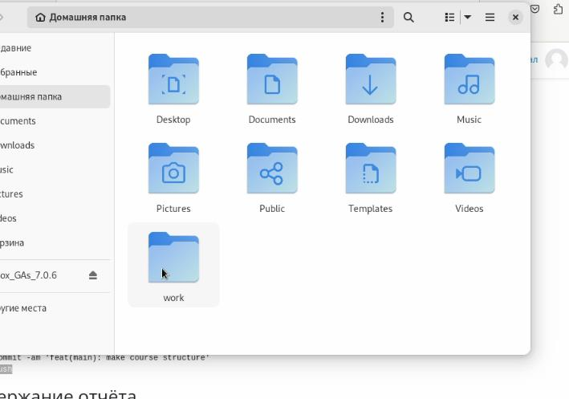{#fig:017 width=70%}

№7 Контрольные вопросы
1.Что такое системы контроля версий (VCS) и для решения каких задач они предназначаются?
Система управления версиями — программное обеспечение для облегчения работы с изменяющейся информацией. Система управления версиями позволяет хранить несколько версий одного и того же документа, при необходимости возвращаться к более ранним версиям, определять, кто и когда сделал то или иное изменение, и многое другое. 

Система контроля версий применяется при работе :
- нескольких человек над одним проектом.
- полной истории изменений
- причин всех производимых изменений
- Откат изменений, если что-то пошло не так
- Поиск причины и ответственного за появления ошибок в программе
- Совместная работа группы над одним проектом

2.Объясните следующие понятия VCS и их отношения: хранилище, commit, история, рабочая копия.
repository - хранилище файлов, ссылок на изменения в файлах, в нем хранятся все документы вместе с историей их изменения и другой служебной информацией.
commit - отслеживание изменений, сохраняет разницу в изменениях
История - хранит все изменения в проекте и позволяет при необходимости обратиться к нужным данным.
Рабочая копия- «снимок» содержимого репозитория, плюс некоторая служебная информация. Изменив содержимое рабочей копии, разработчик фиксирует сделанные изменения в репозитории. Как правило, фиксация сопровождается небольшим текстовым комментарием, описывающим сделанные изменения.

3.Что представляют собой и чем отличаются централизованные и децентрализованные VCS? Приведите примеры VCS каждого вида.
Централизованные VCS - это системы контроля версий, которые имеют один основной удаленный репозиторий, к которому все пользователи имеют доступ. Они базируются на предположении, что репозиторий является истинным и достоверным. Примерами таких VCS являются Subversion и CVS.

Децентрализованные VCS - это системы контроля версий, которые не имеют основного удаленного репозитория. Вместо этого каждый пользователь имеет локальную копию репозитория, которая может быть синхронизирована с копиями
1. Централизованные:

- Subversion (SVN)
- CVS
- Perforce

2. Децентрализованные:

- Git
- Mercurial
- Bazaar

4. Опишите действия с VCS при единоличной работе с хранилищем.
- Создание локального хранилища: Используя команду git init, можно создать локальное хранилище.

- Клонирование хранилища: Если хранилище уже существует в удаленном репозитории, можно использовать команду git clone для клонирования хранилища на локальную машину.

- Добавление файлов: Используя команду git add, можно добавлять файлы в хранилище.

- Коммитирование изменений: Используя команду git commit, можно коммитить изменения в хранилище.

- Просмотр истории коммитов: Используя команду git log

5. Опишите порядок работы с общим хранилищем VCS.
1. Начните с создания репозитория VCS. Это может быть на сервере или на локальном компьютере.

2. Добавьте в репозиторий все необходимые файлы.

3. Создайте коммит для хранения изменений.

4. Обменяйтесь изменениями с другими участниками проекта с помощью пулл-реквестов.

5. Объедините изменения в одну версию.

6. Обновите код на локальной машине.

7. Проверьте изменения и подтвердите их.

8. Отправьте изменения в общее хранилище.

6.Каковы основные задачи, решаемые инструментальным средством git?
1 - хранить информацию о всех изменениях в вашем коде, начиная с самой первой строчки
2 - обеспечение удобства командной работы над кодом

7. Назовите и дайте краткую характеристику командам git.

1. git init - Инициализация нового репозитория Git в текущем каталоге.

2. git clone - Клонирование удаленного репозитория в текущий каталог.

3. git add - Добавление файлов в репозиторий для последующего коммита.

4. git commit - Сохранение изменений в репозитории.

5. git push - Отправка изменений из локального репозитория в удаленный репозиторий.

6. git pull - Загрузка изменений из удаленного репозитория в локальный репозиторий.

7. git status - Просмотр текущего состояния репозитория.

8. git diff - Просмотр изменений, внесенных

8. Приведите примеры использования при работе с локальным и удалённым репозиториями.
git push - all(push origin master/любой branch)
$ git fetch <name> - загрузка изменений с удаленного репозитория
$ git push <name><branch> - отправка изменений в удаленный репозиторий

9. что такое и зачем могут быть нужны ветви (branches)?
Ветви (branches) — это варианты исходного кода, которые могут быть использованы для разработки различных версий программы. Они позволяют разработчикам и тестировщикам работать над одним проектом одновременно, не пересекаясь друг с другом. Кроме того, они позволяют отслеживать изменения в исходном коде и настраивать процесс разработки.

10. Как и зачем можно игнорировать некоторые файлы при commit?
Во время работы над проектом так или иначе могут создаваться файлы, которые не требуется добавлять в последствии в репозиторий. Например, временные файлы, создаваемые редакторами, или объектные файлы, создаваемые компиляторами. Можно прописать шаблоны игнорируемых при добавлении в репозиторий типов файлов в файл .gitignore с помощью сервисов.

# Выводы

В результате выполнения лабораторной работы я научился создавать учетную запись GitHub, устанавливать и работать с программным обеспечением. Также научился базовой настройки git и работать с серверами репозиториями, добавлять SSH/PGP  ключи в свою учетную запись Github

