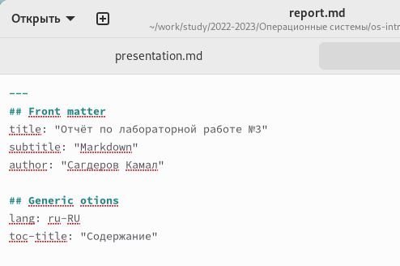
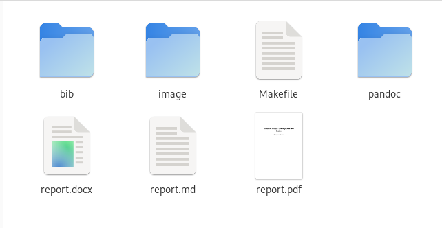

---
## Front matter
lang: ru-RU
title: Лабораторная работе №3
subtitle: "Markdown"
author:
  - Сагдеров Камал
institute:
  - Российский университет дружбы народов, Москва, Россия
date: 23.02.2023

## i18n babel
babel-lang: russian
babel-otherlangs: english

## Formatting pdf
toc: false
toc-title: Содержание
slide_level: 2
aspectratio: 169
section-titles: true
theme: metropolis
header-includes:
 - \metroset{progressbar=frametitle,sectionpage=progressbar,numbering=fraction}
 - '\makeatletter'
 - '\beamer@ignorenonframefalse'
 - '\makeatother'
---

## Цель работы

Научиться оформлять отчёты с помощью легковесного языка разметки Markdown. (рис. @fig:001).

{#fig:001 width=70%}

## Задание

1. Сделать отчёт по предыдущей лабораторной работе в формате Markdown.
2. В качестве отчёта предоставить отчёты в 3 форматах: pdf, docx и md (в архиве,
поскольку он должен содержать скриншоты, Makefile и т.д.) (рис. @fig:002).

{#fig:002 width=70%}

## Выводы

В процессе выполнения лабораторной работы я научился работать с языком разметки Markdown, а также изучил базовый синтаксис Markdown.

# Спасибо за внимание!

