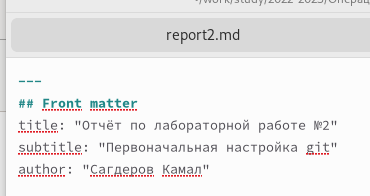
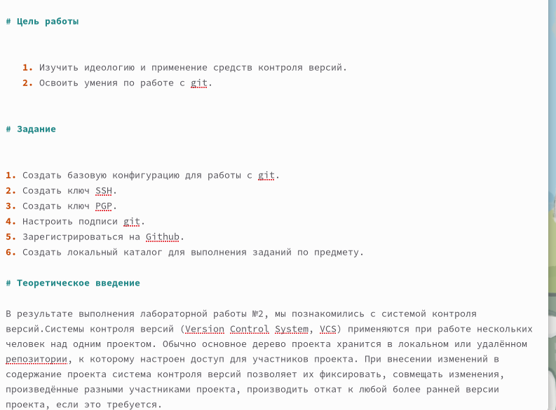
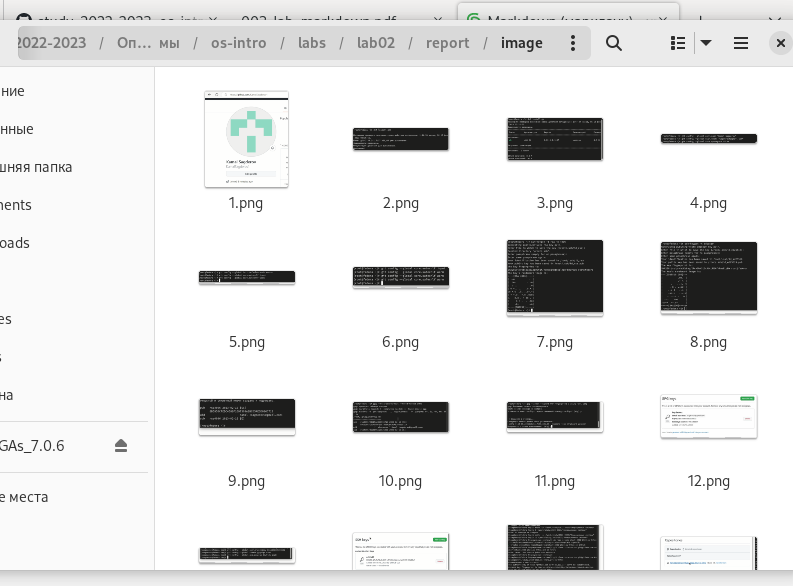
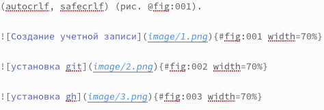
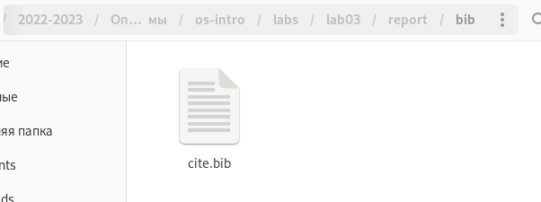

---
## Front matter
title: "Отчёт по лабораторной работе №3"
subtitle: "Markdown"
author: "Сагдеров Камал"

## Generic otions
lang: ru-RU
toc-title: "Содержание"

## Bibliography
bibliography: bib/cite3.bib
csl: pandoc/csl/gost-r-7-0-5-2008-numeric.csl

## Pdf output format
toc: true # Table of contents
toc-depth: 2
lof: true # List of figures
lot: false # List of tables
fontsize: 12pt
linestretch: 1.5
papersize: a4
documentclass: scrreprt
## I18n polyglossia
polyglossia-lang:
  name: russian
  options:
	- spelling=modern
	- babelshorthands=true
polyglossia-otherlangs:
  name: english
## I18n babel
babel-lang: russian
babel-otherlangs: english
## Fonts
mainfont: PT Serif
romanfont: PT Serif
sansfont: PT Sans
monofont: PT Mono
mainfontoptions: Ligatures=TeX
romanfontoptions: Ligatures=TeX
sansfontoptions: Ligatures=TeX,Scale=MatchLowercase
monofontoptions: Scale=MatchLowercase,Scale=0.9
## Biblatex
biblatex: true
biblio-style: "gost-numeric"
biblatexoptions:
  - parentracker=true
  - backend=biber
  - hyperref=auto
  - language=auto
  - autolang=other*
  - citestyle=gost-numeric
## Pandoc-crossref LaTeX customization
figureTitle: "Рис."
tableTitle: "Таблица"
listingTitle: "Листинг"
lofTitle: "Список иллюстраций"
lotTitle: "Список таблиц"
lolTitle: "Листинги"
## Misc options
indent: true
header-includes:
  - \usepackage{indentfirst}
  - \usepackage{float} # keep figures where there are in the text
  - \floatplacement{figure}{H} # keep figures where there are in the text
---

# Цель работы

Научиться оформлять отчёты с помощью легковесного языка разметки Markdown.

# Задание

1. Сделать отчёт по предыдущей лабораторной работе в формате Markdown.
2. В качестве отчёта предоставить отчёты в 3 форматах: pdf, docx и md (в архиве,
поскольку он должен содержать скриншоты, Makefile и т.д.)

# Теоретическое введение

Markdown — язык разметки текстов. Такие тексты легко писать и читать. Их можно без труда сконвертировать в HTML. Большинство программистов предпочитают Markdown для написания документации, описаний своих проектов, написания блогов и так далее. 
Использование: 
1. Для добавления разметки туда, где невозможна реальная разметка. Например, в простом текстовом файле или в тех же СМС, где невозможно выделение жирным, создание заголовков, выделение цитат и пр.
2. Для более удобного написания текстов для последующей конвертации в HTML или другие форматы.
3. Написание документации для кода.
4. Составление заметок в личном цифровом блокноте.
5. Написание красивых сообщений в мессенджерах. [@mark:bash]

# Выполнение лабораторной работы

№1
Открыли шаблон(отчет) по 2 лабораторной работе и указали свои данные (рис. @fig:001).

{#fig:001 width=70%}

Указали цели работы, задание и теоретическое введение (рис. @fig:002).

{#fig:002 width=70%}

№2
Поместили картинки в папку "image", сделали ссылки на картинки (рис. @fig:003).

{#fig:003 width=70%}

{#fig:004 width=70%}

№3
Создаем список литературы, открыв  в папке "bib" файл "cite.bib", где можем создать необходимый нам список литературы. (рис. @fig:005).

{#fig:005 width=70%}

# Выводы

В процессе выполнения лабораторной работы я научился работать с языком разметки Markdown, а также изучил базовый синтаксис Markdown.

