---
## Front matter
lang: ru-RU
title: Презентация по лабораторной работе №4
subtitle: "Взаимодействие пользователя с системой Unix на уровне командной строки"
author:
  - Сагдеров Камал
institute:
  - Российский университет дружбы народов, Москва, Россия
date: 03.03.2023

## i18n babel
babel-lang: russian
babel-otherlangs: english

## Formatting pdf
toc: false
toc-title: Содержание
slide_level: 2
aspectratio: 169
section-titles: true
theme: metropolis
header-includes:
 - \metroset{progressbar=frametitle,sectionpage=progressbar,numbering=fraction}
 - '\makeatletter'
 - '\beamer@ignorenonframefalse'
 - '\makeatother'
---

## Цель работы

Приобретение практических навыков взаимодействия пользователя с системой по-
средством командной строки.

## Основные задачи

1. Определите полное имя вашего домашнего каталога. Далее относительно этого каталога будут выполняться последующие упражнения.
2. Выполните следующие действия:
2.1. Перейдите в каталог /tmp.
2.2. Выведите на экран содержимое каталога /tmp. Для этого используйте команду ls
с различными опциями. Поясните разницу в выводимой на экран информации.
2.3. Определите, есть ли в каталоге /var/spool подкаталог с именем cron?
2.4. Перейдите в Ваш домашний каталог и выведите на экран его содержимое. Определите, кто является владельцем файлов и подкаталогов?
3. Выполните следующие действия:
3.1. В домашнем каталоге создайте новый каталог с именем newdir.
3.2. В каталоге ~/newdir создайте новый каталог с именем morefun.
3.3. В домашнем каталоге создайте одной командой три новых каталога с именами
letters, memos, misk. Затем удалите эти каталоги одной командой.
3.4. Попробуйте удалить ранее созданный каталог ~/newdir командой rm. Проверьте,
был ли каталог удалён.
3.5. Удалите каталог ~/newdir/morefun из домашнего каталога. Проверьте, был ли
каталог удалён.

## Основные задачи

4. С помощью команды man определите, какую опцию команды ls нужно использовать для просмотра содержимое не только указанного каталога, но и подкаталогов, входящих в него.
5. С помощью команды man определите набор опций команды ls, позволяющий отсортировать по времени последнего изменения выводимый список содержимого каталога с развёрнутым описанием файлов.
6. Используйте команду man для просмотра описания следующих команд: cd, pwd, mkdir,
rmdir, rm. Поясните основные опции этих команд.
7. Используя информацию, полученную при помощи команды history, выполните модификацию и исполнение нескольких команд из буфера команд.

## Процесс выполнения

1. Определили полное имя нашего домашнего каталога с помощью команды pwd .

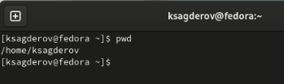{#fig:001 width=70%}

## Процесс выполнения

2.  Переход в каталог /tmp .

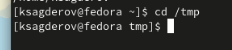{#fig:002 width=70%}

Вывожу на экран содержимое каталога /tmp. Для этого использю команду ls
с различными опциями.

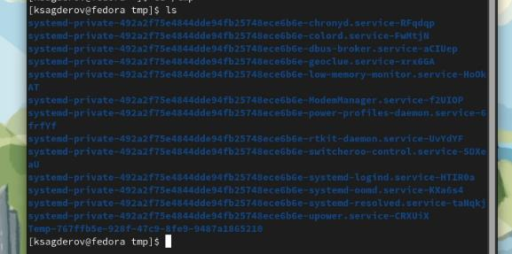{#fig:003 width=70%}

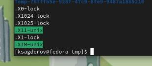{#fig:004 width=70%}

{#fig:005 width=70%}

## Процесс выполнения

3. В домашнем каталоге создаем одной командой (mkdir) три новых каталога с именами letters, memos, misk. Затем удаляем эти каталоги одной командой (rmdir).

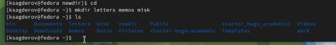{#fig:012 width=70%}

## Процесс выполнения

4. С помощью команды man определяем, какую опцию команды ls нужно использовать для просмотра содержимое не только указанного каталога, но и подкаталогов, входящих в него. Узнаем, что можно сделать с помощью опции 
-R.

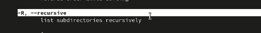{#fig:016 width=70%}

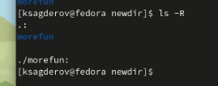{#fig:017 width=70%}

## Процесс выполнения

5. С помощью команды man определяем , какую опцию команды ls нужно использовать для просмотра содержимого не только указанного каталога, но и подкаталогов, входящих в него. Узнаем что можно сделать с помощью опции -lt. 

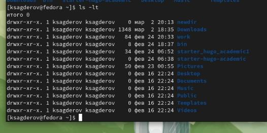{#fig:018 width=70%}

## Процесс выполнения

6. Используем команду man для просмотра описания следующих команд: cd, pwd, mkdir,rmdir, rm.

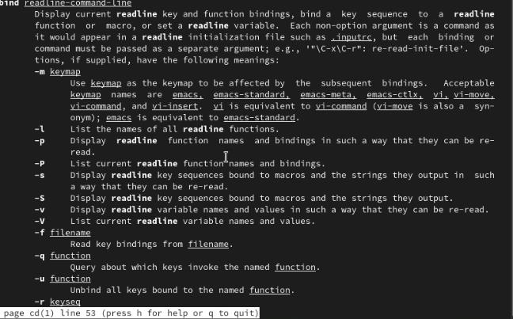{#fig:019 width=70%}

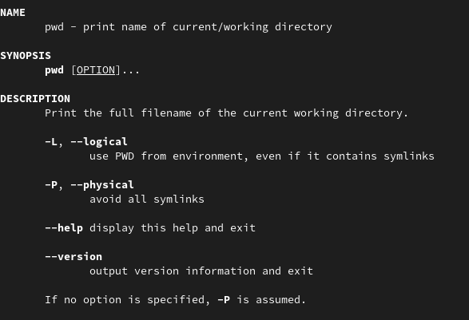{#fig:026 width=70%}

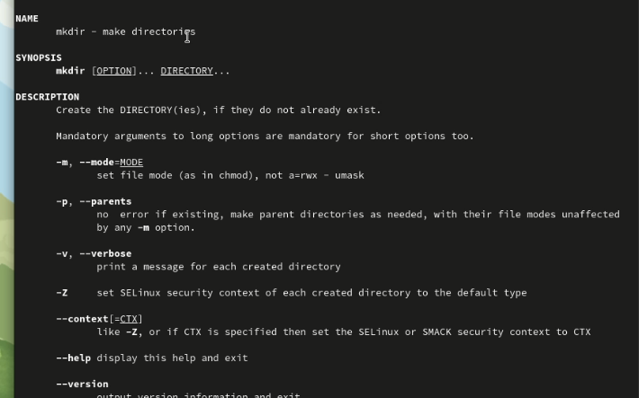{#fig:020 width=70%}

## Процесс выполнения

7. Используя информацию, полученную при помощи команды history, выполните модификацию и исполнение нескольких команд из буфера команд.

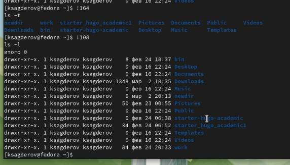{#fig:024 width=70%}

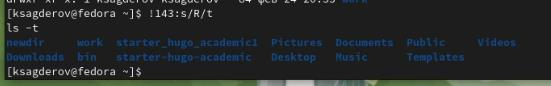{#fig:025 width=70%}

## Выводы

В результате выполнения лабораторной работы я приобрел практические навыки работы с командной строкой, изучил новые для себя команды и научился применять их на практике.

# Спасибо за внимание!
