---
## Front matter
title: "Отчёт по лабораторной работе №4"
subtitle: "Взаимодействие пользователя с системой Unix на уровне командной строки"
author: "Сагдеров Камал, НКАбд-05-22"

## Generic otions
lang: ru-RU
toc-title: "Содержание"

## Bibliography
bibliography: bib/cite4.bib
csl: pandoc/csl/gost-r-7-0-5-2008-numeric.csl

## Pdf output format
toc: true # Table of contents
toc-depth: 2
lof: true # List of figures
lot: false # List of tables
fontsize: 12pt
linestretch: 1.5
papersize: a4
documentclass: scrreprt
## I18n polyglossia
polyglossia-lang:
  name: russian
  options:
	- spelling=modern
	- babelshorthands=true
polyglossia-otherlangs:
  name: english
## I18n babel
babel-lang: russian
babel-otherlangs: english
## Fonts
mainfont: PT Serif
romanfont: PT Serif
sansfont: PT Sans
monofont: PT Mono
mainfontoptions: Ligatures=TeX
romanfontoptions: Ligatures=TeX
sansfontoptions: Ligatures=TeX,Scale=MatchLowercase
monofontoptions: Scale=MatchLowercase,Scale=0.9
## Biblatex
biblatex: true
biblio-style: "gost-numeric"
biblatexoptions:
  - parentracker=true
  - backend=biber
  - hyperref=auto
  - language=auto
  - autolang=other*
  - citestyle=gost-numeric
## Pandoc-crossref LaTeX customization
figureTitle: "Рис."
tableTitle: "Таблица"
listingTitle: "Листинг"
lofTitle: "Список иллюстраций"
lotTitle: "Список таблиц"
lolTitle: "Листинги"
## Misc options
indent: true
header-includes:
  - \usepackage{indentfirst}
  - \usepackage{float} # keep figures where there are in the text
  - \floatplacement{figure}{H} # keep figures where there are in the text
---

# Цель работы

Приобретение практических навыков взаимодействия пользователя с системой по-
средством командной строки.

# Задание

1. Определите полное имя вашего домашнего каталога. Далее относительно этого каталога будут выполняться последующие упражнения.
2. Выполните следующие действия:
2.1. Перейдите в каталог /tmp.
2.2. Выведите на экран содержимое каталога /tmp. Для этого используйте команду ls
с различными опциями. Поясните разницу в выводимой на экран информации.
2.3. Определите, есть ли в каталоге /var/spool подкаталог с именем cron?
2.4. Перейдите в Ваш домашний каталог и выведите на экран его содержимое. Определите, кто является владельцем файлов и подкаталогов?
3. Выполните следующие действия:
3.1. В домашнем каталоге создайте новый каталог с именем newdir.
3.2. В каталоге ~/newdir создайте новый каталог с именем morefun.
3.3. В домашнем каталоге создайте одной командой три новых каталога с именами
letters, memos, misk. Затем удалите эти каталоги одной командой.
3.4. Попробуйте удалить ранее созданный каталог ~/newdir командой rm. Проверьте,
был ли каталог удалён.
3.5. Удалите каталог ~/newdir/morefun из домашнего каталога. Проверьте, был ли
каталог удалён.
4. С помощью команды man определите, какую опцию команды ls нужно использовать для просмотра содержимое не только указанного каталога, но и подкаталогов, входящих в него.
5. С помощью команды man определите набор опций команды ls, позволяющий отсортировать по времени последнего изменения выводимый список содержимого каталога с развёрнутым описанием файлов.
6. Используйте команду man для просмотра описания следующих команд: cd, pwd, mkdir,
rmdir, rm. Поясните основные опции этих команд.
7. Используя информацию, полученную при помощи команды history, выполните модификацию и исполнение нескольких команд из буфера команд.

# Теоретическое введение

Основным интерфейсом взаимодействия пользователя
с операционной системой UNIX во всех её модификациях была и остается
командная строка 
Командная строка (консоль или Терминал) – это специальная программа, которая позволяет управлять компьютером путем ввода текстовых команд с клавиатуры ;способ взаимодействия между человеком и компьютером путём отправки компьютеру команд, представляющих собой последовательность символов. [@komanda:bash]
Команды, введённые пользователем, интерпретируются и выполняются
специальной программой — командной оболочкой (или «shell»
по-английски).

# Выполнение лабораторной работы

1. Определили полное имя нашего домашнего каталога с помощью команды pwd (рис. @fig:001).

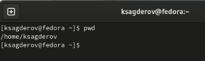{#fig:001 width=70%}

2.  Переход в каталог /tmp. (рис. @fig:002).

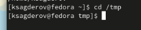{#fig:002 width=70%}

Вывожу на экран содержимое каталога /tmp. Для этого использю команду ls
с различными опциями. (рис. @fig:003).

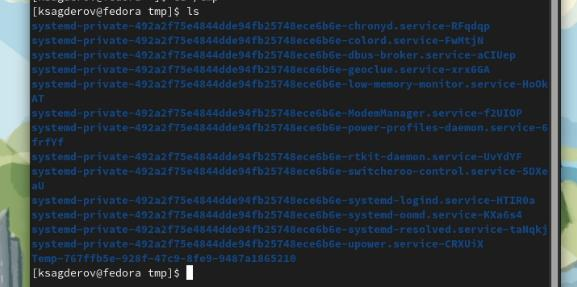{#fig:003 width=70%}

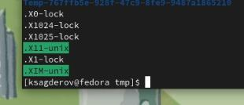{#fig:004 width=70%}

{#fig:005 width=70%}

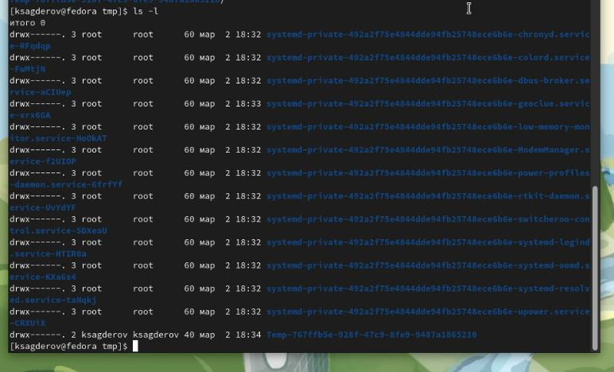{#fig:006 width=70%}

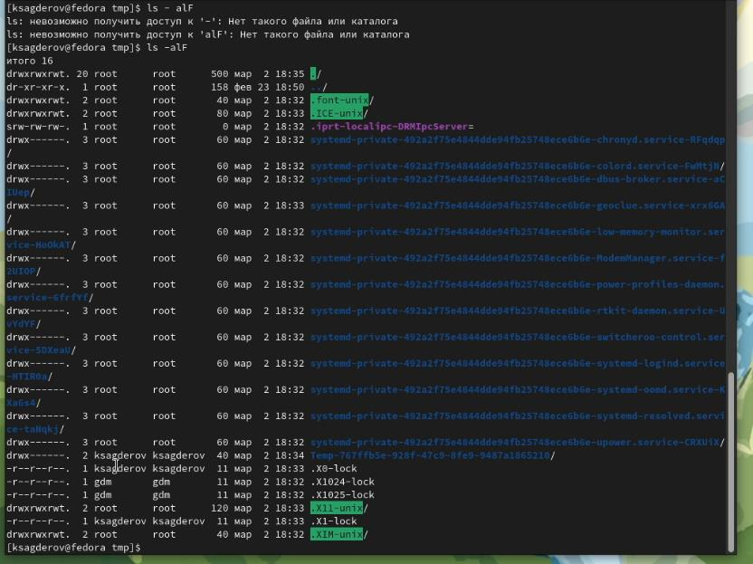{#fig:007 width=70%}

Определил, есть ли в каталоге /var/spool подкаталог с именем cron. Его там нет. (рис. @fig:008).

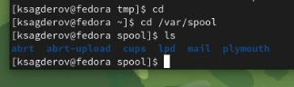{#fig:008 width=70%}

Перехожу в свой домашний каталог и вижу, что владельцем файлов и каталогов является ksagderov - это я(рис. @fig:009) 

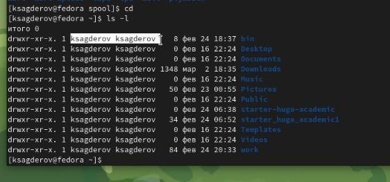{#fig:009 width=70%}

3. В домашнем каталоге создаем новый каталог с именем newdir (рис. @fig:010).

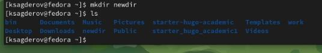{#fig:010 width=70%}

В каталоге ~/newdir создаем новый каталог с именем morefun (рис. @fig:011).

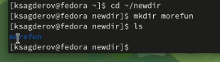{#fig:011 width=70%}

В домашнем каталоге создаем одной командой (mkdir) три новых каталога с именами letters, memos, misk. Затем удаляем эти каталоги одной командой (rmdir) (рис. @fig:012).

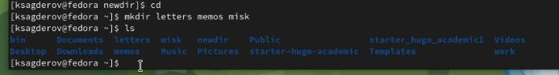{#fig:012 width=70%}

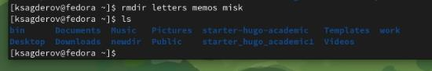{#fig:013 width=70%}

Попробуем удалить ранее созданный каталог ~/newdir командой rm. Терминал выдает ошибку.(рис. @fig:014).

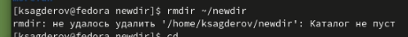{#fig:014 width=70%}

Удаляем каталог ~/newdir/morefun из домашнего каталога. Проверим, был ли
каталог удалён с помощью команды (ls), в итоге каталог был удален.(рис. @fig:015).

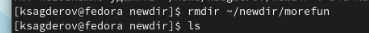{#fig:015 width=70%}

4. С помощью команды man определяем, какую опцию команды ls нужно использовать для просмотра содержимое не только указанного каталога, но и подкаталогов, входящих в него. Узнаем, что можно сделать с помощью опции 
-R(рис. @fig:016).

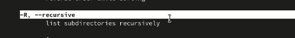{#fig:016 width=70%}

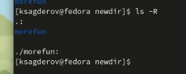{#fig:017 width=70%}

5. С помощью команды man определяем , какую опцию команды ls нужно использовать для просмотра содержимого не только указанного каталога, но и подкаталогов, входящих в него. Узнаем что можно сделать с помощью опции -lt. ( рис. @fig:018).

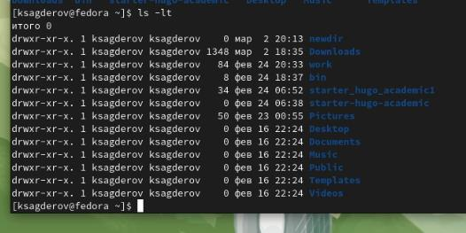{#fig:018 width=70%}

6. Используем команду man для просмотра описания следующих команд: cd, pwd, mkdir,rmdir, rm. (рис. @fig:019).

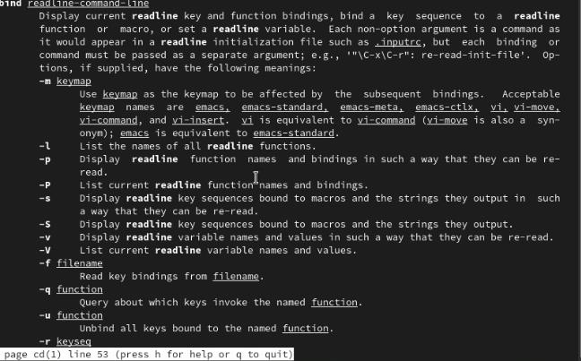{#fig:019 width=70%}

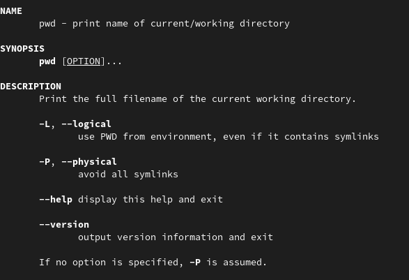{#fig:026 width=70%}

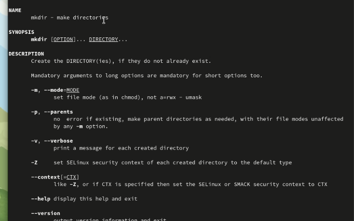{#fig:020 width=70%}

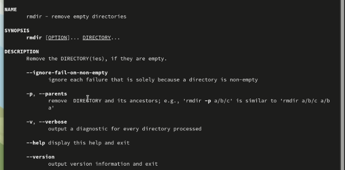{#fig:021 width=70%}

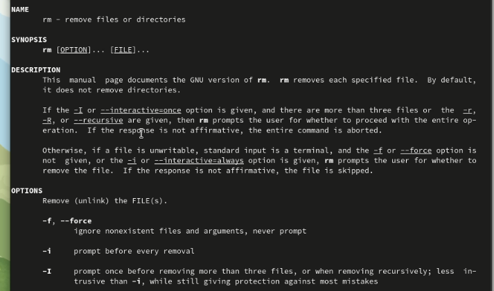{#fig:022 width=70%}

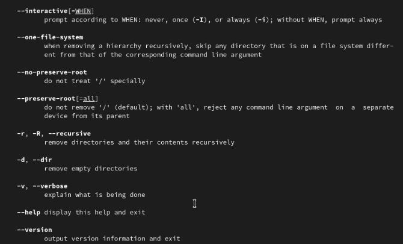{#fig:023 width=70%}

7. Используя информацию, полученную при помощи команды history, выполните модификацию и исполнение нескольких команд из буфера команд (рис. @fig:024).

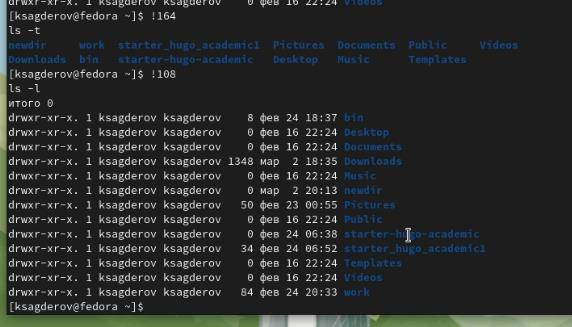{#fig:024 width=70%}

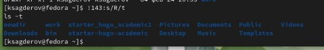{#fig:025 width=70%}

# Выводы

В результате выполнения лабораторной работы я приобрел практические навыки работы с командной строкой, изучил новые для себя команды и научился применять их на практике.

# Ответы на контрольные вопросы.

1. Что такое командная строка?

Командная строка (консоль или Терминал) – это специальная программа, которая позволяет управлять компьютером путем ввода текстовых команд с клавиатуры ;способ взаимодействия между человеком и компьютером путём отправки компьютеру команд, представляющих собой последовательность символов.

2. При помощи какой команды можно определить абсолютный путь текущего каталога? Приведите пример.

Для определения абсолютного пути к текущему каталогу используется команда pwd (print working directory).
Пример 
(абсолютное имя текущего каталога пользователя dharma):

 (pwd
 
результат:

 /afs/dk.sci.pfu.edu.ru/home/d/h/dharma)
 
3. При помощи какой команды и каких опций можно определить только тип файлов и их имена в текущем каталоге? Приведите примеры.

При помощи команды ls -F можно определить только тип файлов и их имена в текущем каталоге.

(ls -F

bin/        Downloads/  Pictures/               starter_hugo_academic1/  work/

Desktop/    Music/      Public/                 Templates/

Documents/  newdir/     starter-hugo-academic/  Videos/)

4. Каким образом отобразить информацию о скрытых файлах? Приведите примеры.

При помощи команды ls -a

(s -a

.              Downloads   starter-hugo-academic

..             .gitconfig  starter_hugo_academic1

.bash_history  .gnupg      Templates

.bash_logout   .lesshst    .texlive2021

.bash_profile  .local      .vboxclient-clipboard.pid

.bashrc        .mozilla    .vboxclient-draganddrop.pid

bin            Music       .vboxclient-seamless.pid

.cache         newdir      .vboxclient-vmsvga-session-tty2.pid

.config        Pictures    Videos

Desktop        Public      work

Documents      .ssh)

5. При помощи каких команд можно удалить файл и каталог? Можно ли это сделать одной и той же командой? Приведите примеры.

Команда rm используется для удаления файлов и/или каталогов. Чтобы удалить каталог, содержащий файлы, нужно использовать опцию r. Без указания этой опции команда не будет выполняться. (rm -r abc)
Если каталог пуст, то можно воспользоваться командой rmdir. Если удаляемый
каталог содержит файлы, то команда не будет выполнена — нужно использовать rm -
r имя_каталога.

6. Каким образом можно вывести информацию о последних выполненных пользователем командах? работы?

С помощью команды history.

7. Как воспользоваться историей команд для их модифицированного выполнения? Приведите примеры.

Можно модифицировать команду из выведенного на экран списка при помощи следу-
ющей конструкции:

<номер_команды>:s/<что_меняем>/<на_что_меняем>

Пример:
(!3:s/a/F
ls -F)

8. Приведите примеры запуска нескольких команд в одной строке.

Если требуется выполнить последовательно несколько команд, записанный в одной строке, то для этого используется символ точка с запятой (cd; ls)

9. Дайте определение и приведите примеры символов экранирования.

Если в заданном контексте встречаются специальные символы (типа «.»,
«/», «*» и т.д.), надо перед ними поставить символ экранирования \ (обратный слэш).

10. Охарактеризуйте вывод информации на экран после выполнения команды ls с опцией l.

Чтобы вывести на экран подробную информацию о файлах и каталогах, необходимо
использовать опцию l. При этом о каждом файле и каталоге будет выведена следующая
информация:
– тип файла,
– право доступа,
– число ссылок,
– владелец,
– размер,
– дата последней ревизии,
– имя файла или каталога.
11. Что такое относительный путь к файлу? Приведите примеры использования относительного и абсолютного пути при выполнении какой-либо команды.

Относительный путь - это ссылка, которая указывает на другие страницы нашего сайта относительно веб-страницы, на которой эта ссылка уже находится.

Пример относительного пути: ./docs/files/file.txt

Пример абсолютного пути : cd /home/ksagderov/work/study

12. Как получить информацию об интересующей вас команде?

С помощью команды help.

13. Какая клавиша или комбинация клавиш служит для автоматического дополнения вводимых команд?

Клавиша Tab.

# Список литературы{.unnumbered}

::: {#refs}
:::
