---
## Front matter
lang: ru-RU
title: Презентация по лабораторной работе №5
subtitle: "Анализ файловой системы Linux. Команды для работы с файлами и каталогами"
author:
  - Сагдеров Камал
institute:
  - Российский университет дружбы народов, Москва, Россия
date: 10.03.2022

## i18n babel
babel-lang: russian
babel-otherlangs: english

## Formatting pdf
toc: false
toc-title: Содержание
slide_level: 2
aspectratio: 169
section-titles: true
theme: metropolis
header-includes:
 - \metroset{progressbar=frametitle,sectionpage=progressbar,numbering=fraction}
 - '\makeatletter'
 - '\beamer@ignorenonframefalse'
 - '\makeatother'
---

## Цель работы

Ознакомление с файловой системой Linux, её структурой, именами и содержанием каталогов. Приобретение практических навыков по применению команд для работы с файлами и каталогами, по управлению процессами (и работами), по проверке использования диска и обслуживанию файловой системы

## Основные задачи

1. Выполните все примеры, приведённые в первой части описания лабораторной работы.
2. Выполните следующие действия, зафиксировав в отчёте по лабораторной работе
используемые при этом команды и результаты их выполнения:
2.1. Скопируйте файл /usr/include/sys/io.h в домашний каталог и назовите его
equipment. Если файла io.h нет, то используйте любой другой файл в каталоге
/usr/include/sys/ вместо него.

## Основные задачи

2.2. В домашнем каталоге создайте директорию ~/ski.plases.
2.3. Переместите файл equipment в каталог ~/ski.plases.
2.4. Переименуйте файл ~/ski.plases/equipment в ~/ski.plases/equiplist.
2.5. Создайте в домашнем каталоге файл abc1 и скопируйте его в каталог
~/ski.plases, назовите его equiplist2.
2.6. Создайте каталог с именем equipment в каталоге ~/ski.plases.

## Основные задачи

2.7. Переместите файлы ~/ski.plases/equiplist и equiplist2 в каталог
~/ski.plases/equipment.
2.8. Создайте и переместите каталог ~/newdir в каталог ~/ski.plases и назовите
его plans.

## Основные задачи

3. Определите опции команды chmod, необходимые для того, чтобы присвоить перечис-
ленным ниже файлам выделенные права доступа, считая, что в начале таких прав
нет:
3.1. drwxr--r-- ... australia
3.2. drwx--x--x ... play
3.3. -r-xr--r-- ... my_os
3.4. -rw-rw-r-- ... feathers

## Основные задачи

4. Проделайте приведённые ниже упражнения, записывая в отчёт по лабораторной
работе используемые при этом команды:
4.1. Просмотрите содержимое файла /etc/password.
4.2. Скопируйте файл ~/feathers в файл ~/file.old.
4.3. Переместите файл ~/file.old в каталог ~/play.
4.4. Скопируйте каталог ~/play в каталог ~/fun.

## Основные задачи

4.5. Переместите каталог ~/fun в каталог ~/play и назовите его games.
4.6. Лишите владельца файла ~/feathers права на чтение.
4.7. Что произойдёт, если вы попытаетесь просмотреть файл ~/feathers командой
cat?
4.8. Что произойдёт, если вы попытаетесь скопировать файл ~/feathers?
4.9. Дайте владельцу файла ~/feathers право на чтение.

## Основные задачи

4.10. Лишите владельца каталога ~/play права на выполнение.
4.11. Перейдите в каталог ~/play. Что произошло?
4.12. Дайте владельцу каталога ~/play право на выполнение.

## Основные задачи

5. Прочитайте man по командам mount, fsck, mkfs, kill и кратко их охарактеризуйте,
приведя примеры.

## Процесс выполнения

1. Выполнили все примеры, приведённые в первой части описания лабораторной работы 

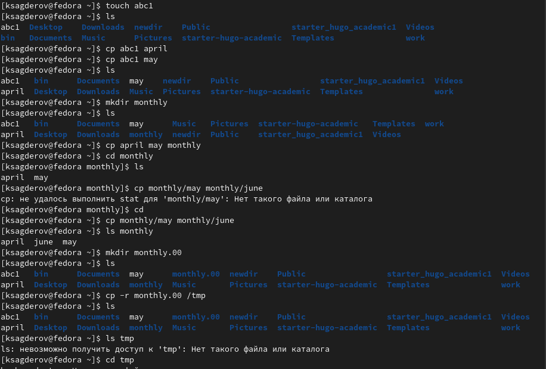{#fig:001 width=70%}

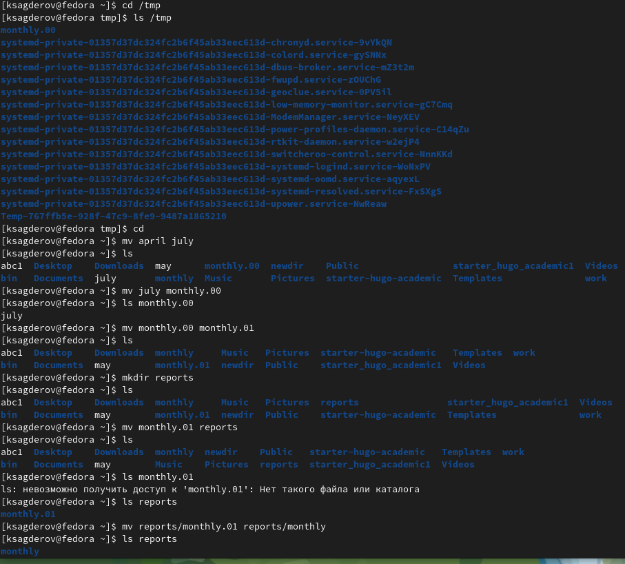{#fig:002 width=70%}

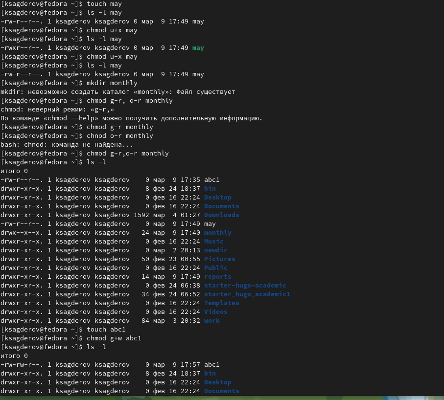{#fig:003 width=70%}

## Процесс выполнения

2. Выполним следующие действия, зафиксировав в отчёте по лабораторной работе используемые при этом команды и результаты их выполнения:
2.1. Скопируем файл /usr/include/sys/io.h в домашний каталог и назовем его
equipment 

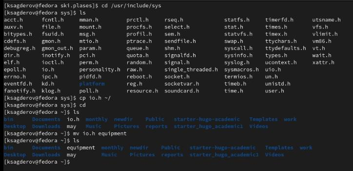{#fig:004 width=70%}

## Процесс выполнения

2.2. В домашнем каталоге создаем директорию ~/ski.plases

!Создание каталога](image/5.png){#fig:005 width=70%}

2.3. Переместим файл equipment в каталог ~/ski.plases

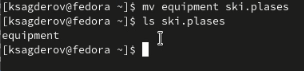{#fig:006 width=70%}

## Процесс выполнения

2.4. Переименуем файл ~/ski.plases/equipment в ~/ski.plases/equiplist 

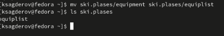{#fig:007 width=70%}

2.5. Создайте в домашнем каталоге файл abc1 и скопируйте его в каталог ~/ski.plases, назовите его equiplist2 (рис. @fig:008).

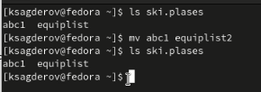{#fig:008 width=70%}

2.6. Создаем каталог с именем equipment в каталоге ~/ski.p

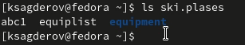{#fig:009 width=70%}

## Процесс выполнения

2.7. Переместите файлы ~/ski.plases/equiplist и equiplist2 в каталог ~/ski.plases/equipment 

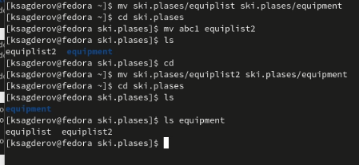{#fig:010 width=70%}

2.8. Создайте и переместите каталог ~/newdir в каталог ~/ski.plases и назовите его plans 

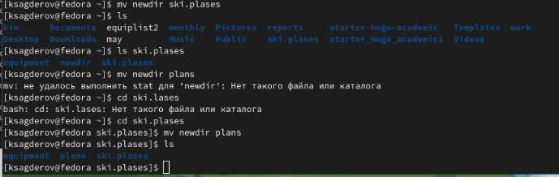{#fig:011 width=70%}

## Процесс выполнения

3. Определите опции команды chmod, необходимые для того, чтобы присвоить перечисленным ниже файлам выделенные права доступа, считая, что в начале таких прав нет:
3.1. drwxr--r-- ... australia 

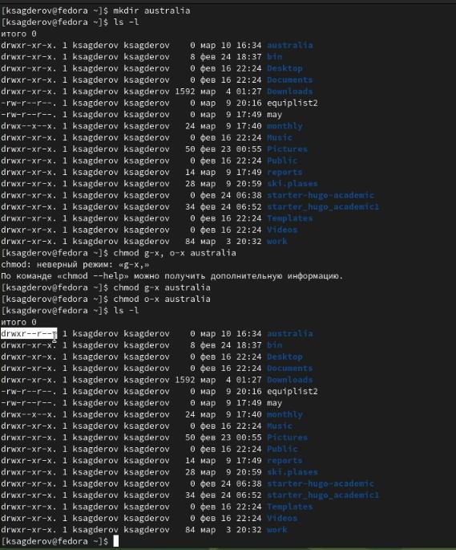{#fig:012 width=70%}

3.2. drwx--x--x ... play 

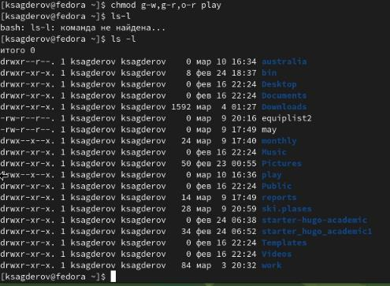{#fig:013 width=70%}

## Процесс выполнения

3.3. -r-xr--r-- ... my_os 

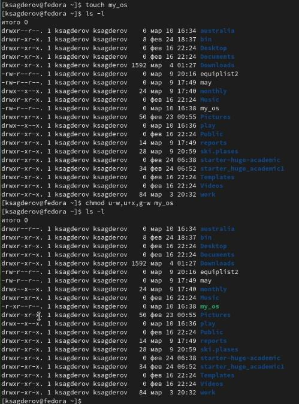{#fig:014 width=70%}

3.4. -rw-rw-r-- ... feathers 

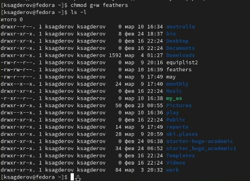{#fig:015 width=70%}

## Процесс выполнения

4. Проделываем приведённые ниже упражнения, записывая в отчёт по лабораторной работе используемые при этом команды:
4.1. Просматриваем содержимое файла /etc/password 

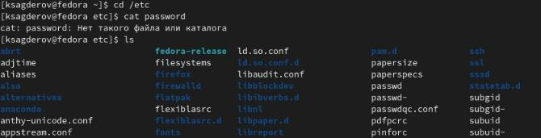{#fig:016 width=70%}

4.2. Скопируем файл ~/feathers в файл ~/file.old

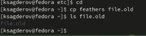{#fig:017 width=70%}

4.3. Переместим файл ~/file.old в каталог ~/play 

## Процесс выполнения

4.4. Скопируем каталог ~/play в каталог ~/fun 

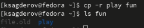{#fig:019 width=70%}

4.5. Переместим каталог ~/fun в каталог ~/play и назовите его games 

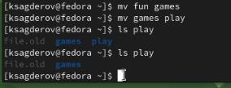{#fig:020 width=70%}

4.6. Лишим владельца файла ~/feathers права на чтение

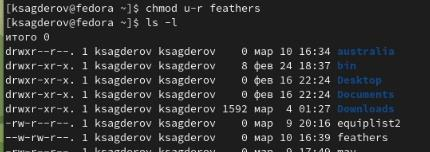{#fig:021 width=70%}

## Процесс выполнения

4.7. Что произойдёт, если вы попытаетесь просмотреть файл ~/feathers командой cat? (Мы не можем файл, т.к лишили владельца права на чтение).Что произойдёт, если вы попытаетесь скопировать файл ~/feathers?(Невозможно открыть файл, т.к лишили владельца права на чтение) Даем владельцу файла ~/feathers право на чтение  

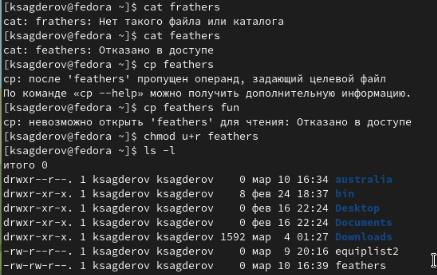{#fig:022 width=70%}

## Процесс выполнения

4.10. Лишим владельца каталога ~/play права на выполнение. Перейдем в каталог ~/play. Что произошло?
4.12. Даем владельцу каталога ~/play право на выполнени

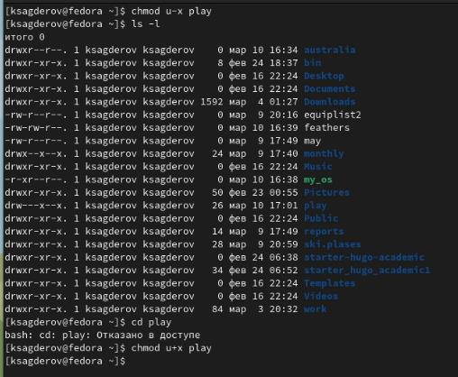{#fig:023 width=70%}

## Процесс выполнения

5. Прочитаем man по командам mount, fsck, mkfs, kill и кратко их охарактеризуйте, приведя примеры 

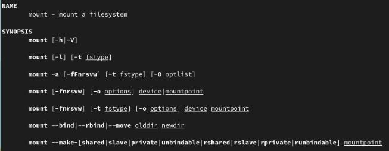{#fig:024 width=70%}

## Процесс выполнения

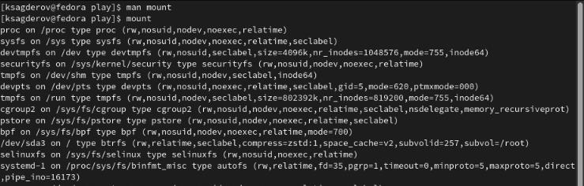{#fig:025 width=70%}

## Процесс выполнения

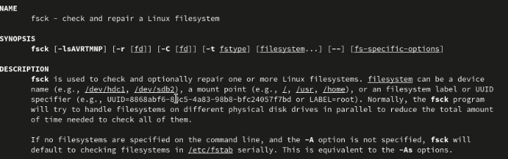{#fig:026 width=70%}

## Процесс выполнения

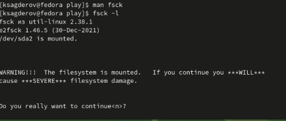{#fig:027 width=70%}

## Процесс выполнения

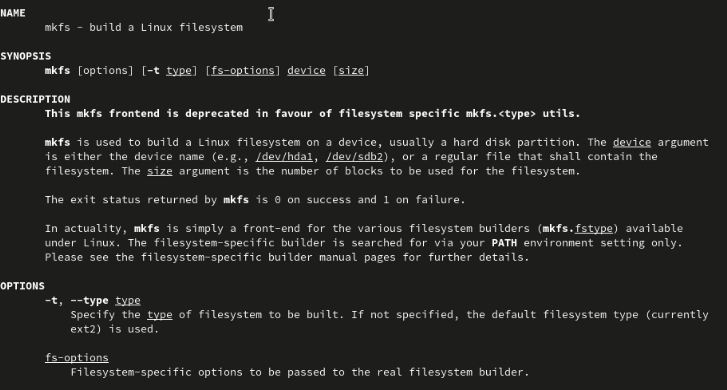{#fig:028 width=70%}

## Процесс выполнения

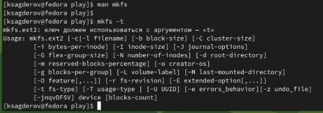{#fig:029 width=70%}

## Процесс выполнения

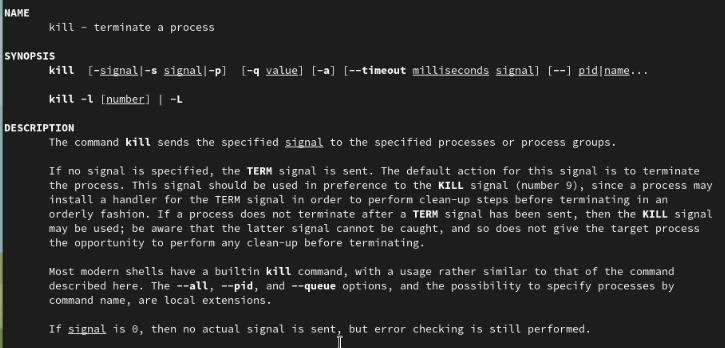{#fig:020 width=70%}

## Процесс выполнения

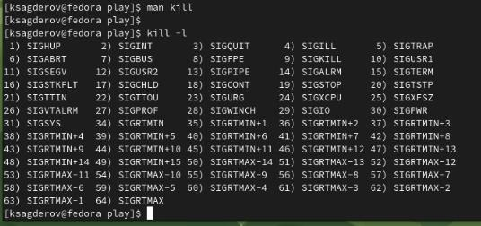{#fig:031 width=70%}

## Выводы

Ознакомился с файловой системой и с структурой Linux. Изучил и научился использовать различные команды в терминале для работы с файлами и каталогами.

# Спасибо за внимание!

