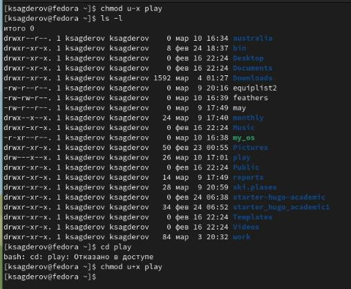

---
## Front matter
title: "Отчет по лабораторной работе №5"
subtitle: "Анализ файловой системы Linux. Команды для работы с файлами и каталогами"
author: "Сагдеров Камал, НКАбд-05-22"

## Generic otions
lang: ru-RU
toc-title: "Содержание"

## Bibliography
bibliography: bib/cite5.bib
csl: pandoc/csl/gost-r-7-0-5-2008-numeric.csl

## Pdf output format
toc: true # Table of contents
toc-depth: 2
lof: true # List of figures
lot: false # List of tables
fontsize: 12pt
linestretch: 1.5
papersize: a4
documentclass: scrreprt
## I18n polyglossia
polyglossia-lang:
  name: russian
  options:
	- spelling=modern
	- babelshorthands=true
polyglossia-otherlangs:
  name: english
## I18n babel
babel-lang: russian
babel-otherlangs: english
## Fonts
mainfont: PT Serif
romanfont: PT Serif
sansfont: PT Sans
monofont: PT Mono
mainfontoptions: Ligatures=TeX
romanfontoptions: Ligatures=TeX
sansfontoptions: Ligatures=TeX,Scale=MatchLowercase
monofontoptions: Scale=MatchLowercase,Scale=0.9
## Biblatex
biblatex: true
biblio-style: "gost-numeric"
biblatexoptions:
  - parentracker=true
  - backend=biber
  - hyperref=auto
  - language=auto
  - autolang=other*
  - citestyle=gost-numeric
## Pandoc-crossref LaTeX customization
figureTitle: "Рис."
tableTitle: "Таблица"
listingTitle: "Листинг"
lofTitle: "Список иллюстраций"
lotTitle: "Список таблиц"
lolTitle: "Листинги"
## Misc options
indent: true
header-includes:
  - \usepackage{indentfirst}
  - \usepackage{float} # keep figures where there are in the text
  - \floatplacement{figure}{H} # keep figures where there are in the text
---

# Цель работы

Ознакомление с файловой системой Linux, её структурой, именами и содержанием каталогов. Приобретение практических навыков по применению команд для работы с файлами и каталогами, по управлению процессами (и работами), по проверке использования диска и обслуживанию файловой системы

# Задание

1. Выполните все примеры, приведённые в первой части описания лабораторной работы.
2. Выполните следующие действия, зафиксировав в отчёте по лабораторной работе
используемые при этом команды и результаты их выполнения:
2.1. Скопируйте файл /usr/include/sys/io.h в домашний каталог и назовите его
equipment. Если файла io.h нет, то используйте любой другой файл в каталоге
/usr/include/sys/ вместо него.
2.2. В домашнем каталоге создайте директорию ~/ski.plases.
2.3. Переместите файл equipment в каталог ~/ski.plases.
2.4. Переименуйте файл ~/ski.plases/equipment в ~/ski.plases/equiplist.
2.5. Создайте в домашнем каталоге файл abc1 и скопируйте его в каталог
~/ski.plases, назовите его equiplist2.
2.6. Создайте каталог с именем equipment в каталоге ~/ski.plases.
2.7. Переместите файлы ~/ski.plases/equiplist и equiplist2 в каталог
~/ski.plases/equipment.
2.8. Создайте и переместите каталог ~/newdir в каталог ~/ski.plases и назовите
его plans.
3. Определите опции команды chmod, необходимые для того, чтобы присвоить перечис-
ленным ниже файлам выделенные права доступа, считая, что в начале таких прав
нет:
3.1. drwxr--r-- ... australia
3.2. drwx--x--x ... play
3.3. -r-xr--r-- ... my_os
3.4. -rw-rw-r-- ... feathers
При необходимости создайте нужные файлы.
4. Проделайте приведённые ниже упражнения, записывая в отчёт по лабораторной
работе используемые при этом команды:
4.1. Просмотрите содержимое файла /etc/password.
4.2. Скопируйте файл ~/feathers в файл ~/file.old.
4.3. Переместите файл ~/file.old в каталог ~/play.
4.4. Скопируйте каталог ~/play в каталог ~/fun.
4.5. Переместите каталог ~/fun в каталог ~/play и назовите его games.
4.6. Лишите владельца файла ~/feathers права на чтение.
4.7. Что произойдёт, если вы попытаетесь просмотреть файл ~/feathers командой
cat?
4.8. Что произойдёт, если вы попытаетесь скопировать файл ~/feathers?
4.9. Дайте владельцу файла ~/feathers право на чтение.
4.10. Лишите владельца каталога ~/play права на выполнение.
4.11. Перейдите в каталог ~/play. Что произошло?
4.12. Дайте владельцу каталога ~/play право на выполнение.
5. Прочитайте man по командам mount, fsck, mkfs, kill и кратко их охарактеризуйте,
приведя примеры.

# Теоретическое введение

Файловая система – это инструмент, позволяющий операционной системе и программам обращаться к нужным файлам и работать с ними. При этом программы оперируют только названием файла, его размером и датой созданий. Все остальные функции по поиску необходимого файла в хранилище и работе с ним берет на себя файловая система накопителя. [@system:bash]
Файловая система определяет, какую структуру принимают файлы в каждом из разделов, создает правила для их генерации, а также управляет файлами в соответствии с особенностями каждой конкретной ФС.
Список основных файловых систем: Ext2; Ext3; Ext4; JFS; ReiserFS; XFS; Btrfs; ZFS. [@system2:bash]

# Выполнение лабораторной работы

1. Выполнили все примеры, приведённые в первой части описания лабораторной работы (рис. @fig:001).

{#fig:001 width=70%}

{#fig:002 width=70%}

{#fig:003 width=70%}

2. Выполним следующие действия, зафиксировав в отчёте по лабораторной работе используемые при этом команды и результаты их выполнения:
2.1. Скопируем файл /usr/include/sys/io.h в домашний каталог и назовем его
equipment (рис. @fig:004).

{#fig:004 width=70%}

2.2. В домашнем каталоге создаем директорию ~/ski.plases (рис. @fig:005).

!Создание каталога](image/5.png){#fig:005 width=70%}

2.3. Переместим файл equipment в каталог ~/ski.plases (рис. @fig:006).

{#fig:006 width=70%}

2.4. Переименуем файл ~/ski.plases/equipment в ~/ski.plases/equiplist (рис. @fig:007).

{#fig:007 width=70%}

2.5. Создайте в домашнем каталоге файл abc1 и скопируйте его в каталог ~/ski.plases, назовите его equiplist2 (рис. @fig:008).

{#fig:008 width=70%}

2.6. Создаем каталог с именем equipment в каталоге ~/ski.plases (рис. @fig:009).

{#fig:009 width=70%}

2.7. Переместите файлы ~/ski.plases/equiplist и equiplist2 в каталог ~/ski.plases/equipment (рис. @fig:010).

{#fig:010 width=70%}

2.8. Создайте и переместите каталог ~/newdir в каталог ~/ski.plases и назовите его plans (рис. @fig:011).

{#fig:011 width=70%}

3. Определите опции команды chmod, необходимые для того, чтобы присвоить перечисленным ниже файлам выделенные права доступа, считая, что в начале таких прав нет:
3.1. drwxr--r-- ... australia (рис. @fig:012).

{#fig:012 width=70%}

3.2. drwx--x--x ... play (рис. @fig:013).

{#fig:013 width=70%}

3.3. -r-xr--r-- ... my_os (рис. @fig:014).

{#fig:014 width=70%}

3.4. -rw-rw-r-- ... feathers (рис. @fig:015).

{#fig:015 width=70%}

4. Проделываем приведённые ниже упражнения, записывая в отчёт по лабораторной работе используемые при этом команды:
4.1. Просматриваем содержимое файла /etc/password (рис. @fig:016).

{#fig:016 width=70%}

4.2. Скопируем файл ~/feathers в файл ~/file.old (рис. @fig:017).

{#fig:017 width=70%}

4.3. Переместим файл ~/file.old в каталог ~/play (рис. @fig:018).

{#fig:018 width=70%}

4.4. Скопируем каталог ~/play в каталог ~/fun (рис. @fig:019).

{#fig:019 width=70%}

4.5. Переместим каталог ~/fun в каталог ~/play и назовите его games (рис. @fig:020).

{#fig:020 width=70%}

4.6. Лишим владельца файла ~/feathers права на чтение (рис. @fig:021).

{#fig:021 width=70%}

4.7. Что произойдёт, если вы попытаетесь просмотреть файл ~/feathers командой cat? (Мы не можем файл, т.к лишили владельца права на чтение).Что произойдёт, если вы попытаетесь скопировать файл ~/feathers?(Невозможно открыть файл, т.к лишили владельца права на чтение) Даем владельцу файла ~/feathers право на чтение  (рис. @fig:022).

{#fig:022 width=70%}

4.10. Лишим владельца каталога ~/play права на выполнение. Перейдем в каталог ~/play. Что произошло?
4.12. Даем владельцу каталога ~/play право на выполнение (рис. @fig:023).

{#fig:023 width=70%}

5. Прочитаем man по командам mount, fsck, mkfs, kill и кратко их охарактеризуйте, приведя примеры (рис. @fig:024).

{#fig:024 width=70%}

{#fig:025 width=70%}

{#fig:026 width=70%}

{#fig:027 width=70%}

{#fig:028 width=70%}

{#fig:029 width=70%}

{#fig:020 width=70%}

{#fig:031 width=70%}

# Выводы

Ознакомился с файловой системой и с структурой Linux. Изучил и научился использовать различные команды в терминале для работы с файлами и каталогами.

# Контрольные вопросы 

1. Дайте характеристику каждой файловой системе, существующей на жёстком диске компьютера, на котором вы выполняли лабораторную работу.
Ext2, Ext3, Ext4 или Extended Filesystem - это стандартная файловая система для Linux. Она была разработана еще для Minix. Она самая стабильная из всех существующих, кодовая база изменяется очень редко и эта файловая система содержит больше всего функций. Версия ext2 была разработана уже именно для Linux и получила много улучшений. В 2001 году вышла ext3, которая добавила еще больше стабильности благодаря использованию журналирования. В 2006 была выпущена версия ext4, которая используется во всех дистрибутивах Linux до сегодняшнего дня. В ней было внесено много улучшений, в том числе увеличен максимальный размер раздела до одного экзабайта.
Btrfs или B-Tree File System - это совершенно новая файловая система, ко- торая сосредоточена на отказоустойчивости, легкости администрирования и восстановления данных. Файловая система объединяет в себе очень много новых интересных возможностей, таких как размещение на нескольких разделах, поддержка подтомов, изменение размера не лету, создание мгновенных снимков, а также высокая производительность. Но многими пользователями файловая система Btrfs считается нестабильной. Тем не менее, она уже используется как
файловая система по умолчанию в OpenSUSE и SUSE Linux.

2. Приведите общую структуру файловой системы и дайте характеристику каждой директории первого уровня этой структуры.
/boot — тут расположены файлы, используемые для загрузки системы (образ initrd, ядро vmlinuz);
/dev — в данной директории располагаются файлы устройств (драйверов). С помощью этих файлов можно взаимодействовать с устройствами. К примеру, если это жесткий диск, можно подключить его к файловой системе. В файл принтера же можно написать напрямую и отправить задание на печать;
/etc — в этой директории находятся файлы конфигураций программ. Эти файлы позволяют настраивать системы, сервисы, скрипты системных демонов;
/home — каталог, аналогичный каталогу Users в Windows. Содержит домашние каталоги учетных записей пользователей (кроме root). При создании нового пользователя здесь создается одноименный каталог с аналогичным именем и хранит личные файлы этого пользователя;
/lib — содержит системные библиотеки, с которыми работают программы и модули ядра;
/proc — содержит файлы, хранящие информацию о запущенных процессах и о состоянии ядра ОС;
/root — директория, которая содержит файлы и личные настройки суперпользователя;
/run — содержит файлы состояния приложений. Например, PID-файлы или UNIX-сокеты;
/sbin — аналогично /bin содержит бинарные файлы. Утилиты нужны для настройки и администрирования системы суперпользователем;
/srv — содержит файлы сервисов, предоставляемых сервером (прим. FTP или Apache HTTP);
/tmp — содержит временные файлы. Данные файлы доступны всем пользователям на чтение и запись. Стоит отметить, что данный каталог очищается при перезагрузке;
/usr — содержит пользовательские приложения и утилиты второго уровня, используемые пользователями, а не системой. Содержимое доступно только для чтения (кроме root). Каталог имеет вторичную иерархию и похож на корневой;
/var — содержит переменные файлы. Имеет подкаталоги, отвечающие за отдельные переменные. Например, логи будут храниться в /var/log, кэш в /var/cache, очереди заданий в /var/spool/ и так далее.

3. Какая операция должна быть выполнена, чтобы содержимое некоторой файловой системы было доступно операционной системе?
Монтирование тома.

4. Назовите основные причины нарушения целостности файловой системы. Как устранить повреждения файловой системы?
Отсутствие синхронизации между образом файловой системы в памяти и ее данными на диске в случае аварийного останова может привести к появлению следующих ошибок:
1) Один блок адресуется несколькими mode (принадлежит нескольким файлам).
2) Блок помечен как свободный, но в то же время занят (на него ссылается onode).
3) Блок помечен как занятый, но в то же время свободен (ни один inode на него не ссылается).
4) Неправильное число ссылок в inode (недостаток или избыток ссылающихся записей в каталогах).
5) Несовпадение между размером файла и суммарным размером адресуемых inode блоков.
6) Недопустимые адресуемые блоки (например, расположенные за пределами файловой системы).
7) “Потерянные” файлы (правильные inode, на которые не ссылаются записи каталогов).
8) Недопустимые или неразмещенные номера inode в записях каталогов.

5. Как создаётся файловая система?
mkfs - позволяет создать файловую систему Linux.

6. Дайте характеристику командам для просмотра текстовых файлов.
Cat - выводит содержимое файла на стандартное устройство вывода

7. Приведите основные возможности команды cp в Linux.
Cp – копирует или перемещает директорию, файлы

8. Приведите основные возможности команды mv в Linux.
Mv - переименовать или переместить файл или директорию

9. Что такое права доступа? Как они могут быть изменены?
Права доступа к файлу или каталогу можно изменить, воспользовавшись командой chmod. Сделать это может владелец файла (или каталога) или пользователь справами администратора.

# Список литературы{.unnumbered}

::: {#refs}
:::
