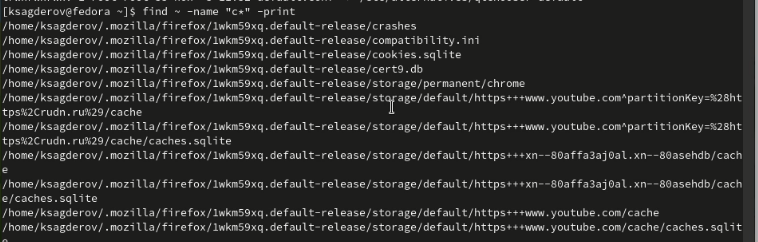

---
## Front matter
lang: ru-RU
title: Презентация по лабораторной работе №6
subtitle: "Поиск файлов. Перенаправление ввода-вывода. Просмотр запущенных процессов"
author:
  - Сагдеров Камал
institute:
  - Российский университет дружбы народов, Москва, Россия
date: 14.03.2023

## i18n babel
babel-lang: russian
babel-otherlangs: english

## Formatting pdf
toc: false
toc-title: Содержание
slide_level: 2
aspectratio: 169
section-titles: true
theme: metropolis
header-includes:
 - \metroset{progressbar=frametitle,sectionpage=progressbar,numbering=fraction}
 - '\makeatletter'
 - '\beamer@ignorenonframefalse'
 - '\makeatother'
---

## Цель работы

Ознакомление с инструментами поиска файлов и фильтрации текстовых данных.
Приобретение практических навыков: по управлению процессами (и заданиями), по
проверке использования диска и обслуживанию файловых систем

## Основные задачи

1. Осуществите вход в систему, используя соответствующее имя пользователя.
2. Запишите в файл file.txt названия файлов, содержащихся в каталоге /etc. Допишите в этот же файл названия файлов, содержащихся в вашем домашнем каталоге.
3. Выведите имена всех файлов из file.txt, имеющих расширение .conf, после чего запишите их в новый текстовой файл conf.txt.

## Основные задачи

4. Определите, какие файлы в вашем домашнем каталоге имеют имена, начинавшиеся с символа c? Предложите несколько вариантов, как это сделать.
5. Выведите на экран (по странично) имена файлов из каталога /etc, начинающиеся с символа h.
6. Запустите в фоновом режиме процесс, который будет записывать в файл ~/logfile файлы, имена которых начинаются с log.
7. Удалите файл ~/logfile.

## Основные задачи

8. Запустите из консоли в фоновом режиме редактор gedit.
9. Определите идентификатор процесса gedit, используя команду ps, конвейер и фильтр grep. Как ещё можно определить идентификатор процесса?
10. Прочтите справку (man) команды kill, после чего используйте её для завершения процесса gedit.
11. Выполните команды df и du, предварительно получив более подробную информацию об этих командах, с помощью команды man.
12. Воспользовавшись справкой команды find, выведите имена всех директорий, имеющихся в вашем домашнем каталоге.

## Процесс выполнения

1. Запишим в файл file.txt названия файлов, содержащихся в каталоге /etc. Допи-
шим в этот же файл названия файлов, содержащихся в нашем домашнем каталоге 

{#fig:001 width=70%}

## Процесс выполнения

{#fig:002 width=70%}

## Процесс выполнения

2. Выведим имена всех файлов из file.txt, имеющих расширение .conf, после чего
запишим их в новый текстовой файл conf.txt 

{#fig:003 width=70%}

## Процесс выполнения

{#fig:004 width=70%}

## Процесс выполнения

3. Определим, какие файлы в нашем домашнем каталоге имеют имена, начинавшиеся
с символа c? Предложим несколько вариантов, как это сделать 

{#fig:005 width=70%}

## Процесс выполнения

{#fig:006 width=70%}

## Процесс выполнения

4. Выведим на экран (по странично) имена файлов из каталога /etc, начинающиеся
с символа h

{#fig:007 width=70%}

## Процесс выполнения

5. Запустим в фоновом режиме процесс, который будет записывать в файл ~/logfile
файлы, имена которых начинаются с log

{#fig:008 width=70%}

## Процесс выполнения

6. Удалим файл ~/logfile 

{#fig:009 width=70%}

## Процесс выполнения

7. Запустим из консоли в фоновом режиме редактор gedit 

{#fig:010 width=70%}

## Процесс выполнения

8. Определим идентификатор процесса gedit, используя команду ps, конвейер и фильтр
grep 

{#fig:011 width=70%}

## Процесс выполнения

{#fig:012 width=70%}

9. Прочтитаем справку (man) команды kill, после чего используем её для завершения
процесса gedit 

{#fig:013 width=70%}

## Процесс выполнения

{#fig:014 width=70%}

## Процесс выполнения

10. Выполним команды df и du, предварительно получив более подробную информацию
об этих командах, с помощью команды man 

{#fig:015 width=70%}

## Процесс выполнения

{#fig:016 width=70%}

## Процесс выполнения

{#fig:017 width=70%}

## Процесс выполнения

{#fig:018 width=70%}

## Процесс выполнения

11. Воспользовавшись справкой команды find, выведим имена всех директорий, имеющихся в нашем домашнем каталоге 

{#fig:019 width=70%}

## Процесс выполнения

{#fig:020 width=70%}

## Выводы

В процессе выполнения лабораторной работы я ознакомился с инструментами поиска файлов и фильтрации текстовых данных. Приобрел практические навыки по управлению процессами и обслуживанию файловых систем.

# Спасибо за внимание!

