---
## Front matter
title: "Отчет по лабораторной работе №6"
subtitle: "Поиск файлов. Перенаправление ввода-вывода. Просмотр запущенных процессов"
author: "Сагдеров Камал"

## Generic otions
lang: ru-RU
toc-title: "Содержание"

## Bibliography
bibliography: bib/cite6.bib
csl: pandoc/csl/gost-r-7-0-5-2008-numeric.csl

## Pdf output format
toc: true # Table of contents
toc-depth: 2
lof: true # List of figures
lot: false # List of tables
fontsize: 12pt
linestretch: 1.5
papersize: a4
documentclass: scrreprt
## I18n polyglossia
polyglossia-lang:
  name: russian
  options:
	- spelling=modern
	- babelshorthands=true
polyglossia-otherlangs:
  name: english
## I18n babel
babel-lang: russian
babel-otherlangs: english
## Fonts
mainfont: PT Serif
romanfont: PT Serif
sansfont: PT Sans
monofont: PT Mono
mainfontoptions: Ligatures=TeX
romanfontoptions: Ligatures=TeX
sansfontoptions: Ligatures=TeX,Scale=MatchLowercase
monofontoptions: Scale=MatchLowercase,Scale=0.9
## Biblatex
biblatex: true
biblio-style: "gost-numeric"
biblatexoptions:
  - parentracker=true
  - backend=biber
  - hyperref=auto
  - language=auto
  - autolang=other*
  - citestyle=gost-numeric
## Pandoc-crossref LaTeX customization
figureTitle: "Рис."
tableTitle: "Таблица"
listingTitle: "Листинг"
lofTitle: "Список иллюстраций"
lotTitle: "Список таблиц"
lolTitle: "Листинги"
## Misc options
indent: true
header-includes:
  - \usepackage{indentfirst}
  - \usepackage{float} # keep figures where there are in the text
  - \floatplacement{figure}{H} # keep figures where there are in the text
---

# Цель работы

Ознакомление с инструментами поиска файлов и фильтрации текстовых данных.
Приобретение практических навыков: по управлению процессами (и заданиями), по
проверке использования диска и обслуживанию файловых систем

# Задание

1. Осуществите вход в систему, используя соответствующее имя пользователя.
2. Запишите в файл file.txt названия файлов, содержащихся в каталоге /etc. Допишите в этот же файл названия файлов, содержащихся в вашем домашнем каталоге.
3. Выведите имена всех файлов из file.txt, имеющих расширение .conf, после чего запишите их в новый текстовой файл conf.txt.
4. Определите, какие файлы в вашем домашнем каталоге имеют имена, начинавшиеся с символа c? Предложите несколько вариантов, как это сделать.
5. Выведите на экран (по странично) имена файлов из каталога /etc, начинающиеся с символа h.
6. Запустите в фоновом режиме процесс, который будет записывать в файл ~/logfile файлы, имена которых начинаются с log.
7. Удалите файл ~/logfile.
8. Запустите из консоли в фоновом режиме редактор gedit.
9. Определите идентификатор процесса gedit, используя команду ps, конвейер и фильтр grep. Как ещё можно определить идентификатор процесса?
10. Прочтите справку (man) команды kill, после чего используйте её для завершения процесса gedit.
11. Выполните команды df и du, предварительно получив более подробную информацию об этих командах, с помощью команды man.
12. Воспользовавшись справкой команды find, выведите имена всех директорий, имеющихся в вашем домашнем каталоге.

# Теоретическое введение

Перенаправление ввода-вывода — возможность командной оболочки ряда операционных систем перенаправлять стандартные потоки в определённое пользователем место, например, в файл. Характерна для Unix-подобных операционных систем, но в разной степени реализована и в операционных системах других семейств. 
К каждой программе, запускаемой в командной строке, по умолчанию подключено три потока данных: 
    STDIN (0) — стандартный поток ввода (данные, загружаемые в программу).
    STDOUT (1) — стандартный поток вывода (данные, которые выводит программа). По умолчанию — терминал.
    STDERR (2) — стандартный поток вывода диагностических и отладочных сообщений (например, сообщениях об ошибках). По умолчанию — терминал. [@cod:bash]
Конвейер (англ. pipeline) в терминологии операционных систем семейства Unix — некоторое множество процессов, для которых выполнено следующее перенаправление ввода-вывода: то, что выводит на поток стандартного вывода предыдущий процесс, попадает в поток стандартного ввода следующего процесса. Запуск конвейера реализован с помощью системного вызова pipe(). 

# Выполнение лабораторной работы

1. Запишим в файл file.txt названия файлов, содержащихся в каталоге /etc. Допи-
шим в этот же файл названия файлов, содержащихся в нашем домашнем каталоге (рис. @fig:001), (рис. @fig:002).

{#fig:001 width=70%}

{#fig:002 width=70%}

2. Выведим имена всех файлов из file.txt, имеющих расширение .conf, после чего
запишим их в новый текстовой файл conf.txt (рис. @fig:003),(рис. @fig:004).

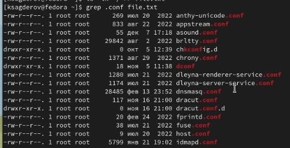{#fig:003 width=70%}

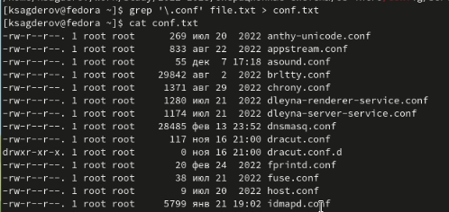{#fig:004 width=70%}

3. Определим, какие файлы в нашем домашнем каталоге имеют имена, начинавшиеся
с символа c? Предложим несколько вариантов, как это сделать (рис. @fig:005),(рис. @fig:006).

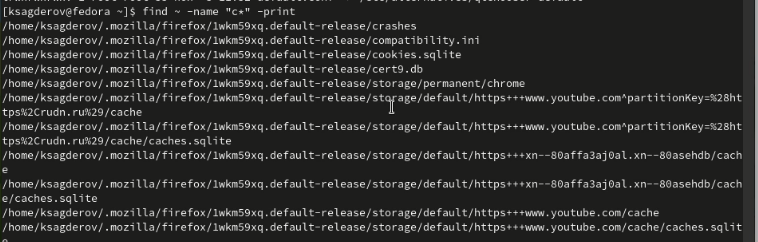{#fig:005 width=70%}

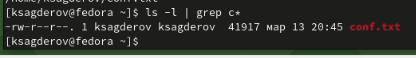{#fig:006 width=70%}

4. Выведим на экран (по странично) имена файлов из каталога /etc, начинающиеся
с символа h (рис. @fig:007).

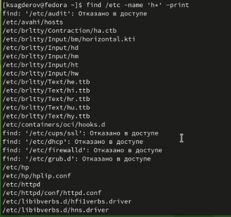{#fig:007 width=70%}

5. Запустим в фоновом режиме процесс, который будет записывать в файл ~/logfile
файлы, имена которых начинаются с log (рис. @fig:008).

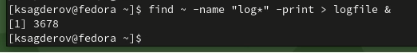{#fig:008 width=70%}

6. Удалим файл ~/logfile (рис. @fig:009).

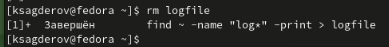{#fig:009 width=70%}

7. Запустим из консоли в фоновом режиме редактор gedit (рис. @fig:010).

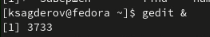{#fig:010 width=70%}

8. Определим идентификатор процесса gedit, используя команду ps, конвейер и фильтр
grep (рис. @fig:011),(рис. @fig:012).

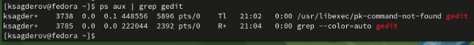{#fig:011 width=70%}

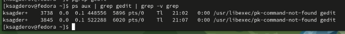{#fig:012 width=70%}

9. Прочтитаем справку (man) команды kill, после чего используем её для завершения
процесса gedit (рис. @fig:013),(рис. @fig:014).

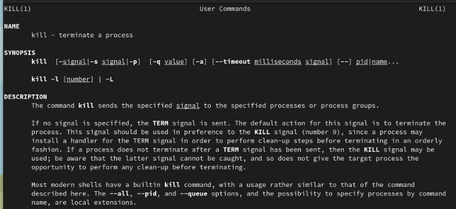{#fig:013 width=70%}

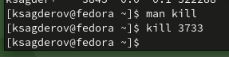{#fig:014 width=70%}

10. Выполним команды df и du, предварительно получив более подробную информацию
об этих командах, с помощью команды man (рис. @fig:015),(рис. @fig:016),(рис. @fig:017),(рис. @fig:018).

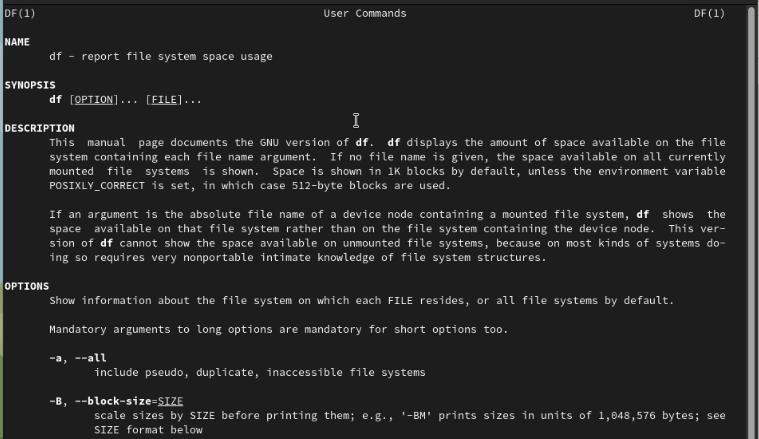{#fig:015 width=70%}

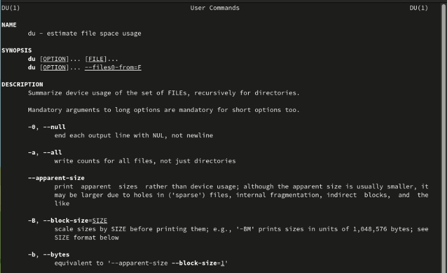{#fig:016 width=70%}

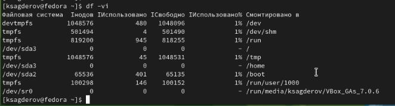{#fig:017 width=70%}

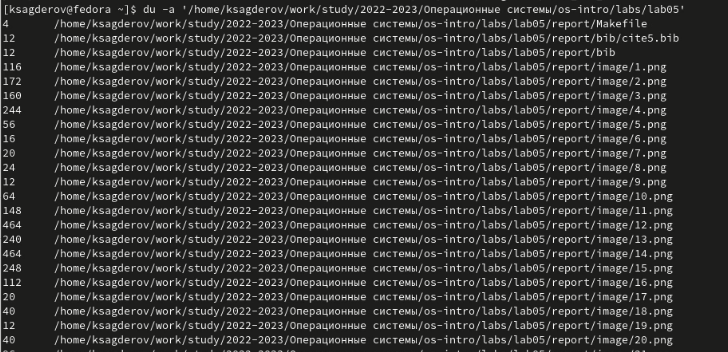{#fig:018 width=70%}

11. Воспользовавшись справкой команды find, выведим имена всех директорий, имею-
щихся в нашем домашнем каталоге (рис. @fig:019),(рис. @fig:020).

{#fig:019 width=70%}

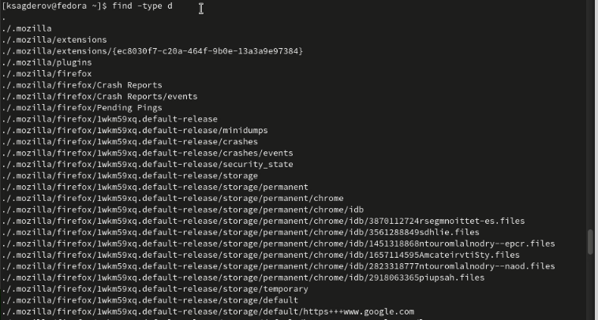{#fig:020 width=70%}

# Выводы

В процессе выполнения лабораторной работы я ознакомился с инструментами поиска файлов и фильтрации текстовых данных. Приобрел практические навыки по управлению процессами и обслуживанию файловых систем.

# Ответы на контрольные вопросы

1. Какие потоки ввода вывода вы знаете?

В системе по умолчанию открыто три специальных потока: – stdin — стандартный поток ввода (по умолчанию: клавиатура), файловый дескриптор 0; – stdout — стандартный поток вывода (по умолчанию: консоль), файловый дескриптор 1; – stderr — стандартный поток вывод сообщений об ошибках (по умолчанию: консоль), файловый дескриптор 2.

2. Объясните разницу между операцией > и >>.

Этот знак > - перенаправление ввода/вывода, а >> - перенаправление в режиме добавления.

3. Что такое конвейер?

Конвейер (pipe) служит для объединения простых команд или утилит в цепочки, в которых результат работы предыдущей команды передаётся последующей.

4. Что такое процесс? Чем это понятие отличается от программы?

Главное отличие между программой и процессом заключается в том, что программа - это набор инструкций, который позволяет ЦПУ выполнять определенную задачу, в то время как процесс - это исполняемая программа.

5. Что такое PID и GID?

PPID - (parent process ID) идентификатор родительского процесса. Процесс может порождать и другие процессы. UID, GID - реальные идентификаторы пользователя и его группы, запустившего данный процесс.

6. Что такое задачи и какая команда позволяет ими управлять?

Запущенные фоном программы называются задачами (jobs). Ими можно управлять с помощью команды jobs, которая выводит список запущенных в данный момент задач.

7. Найдите информацию об утилитах top и htop. Каковы их функции?

Команда htop похожа на команду top по выполняемой функции: они обе показывают информацию о процессах в реальном времени, выводят данные о потреблении системных ресурсов и позволяют искать, останавливать и управлять процессами.

У обеих команд есть свои преимущества. Например, в программе htop реализован очень удобный поиск по процессам, а также их фильтрация. В команде top это не так удобно — нужно знать кнопку для вывода функции поиска.

Зато в top можно разделять область окна и выводить информацию о процессах в соответствии с разными настройками. В целом top намного более гибкая в настройке отображения процессов.

8. Назовите и дайте характеристику команде поиска файлов. Приведите примеры использования этой команды.

Команда find - это одна из наиболее важных и часто используемых утилит системы Linux. Это команда для поиска файлов и каталогов на основе специальных условий. Ее можно использовать в различных обстоятельствах, например, для поиска файлов по разрешениям, владельцам, группам, типу, размеру и другим подобным критериям.

Утилита find предустановлена по умолчанию во всех Linux дистрибутивах, поэтому вам не нужно будет устанавливать никаких дополнительных пакетов. Это очень важная находка для тех, кто хочет использовать командную строку наиболее эффективно.

Команда find имеет такой синтаксис: find [папка] [параметры] критерий шаблон [действие] Пример: find /etc -name "p*" -print

9. Можно ли по контексту (содержанию) найти файл? Если да, то как?

find / -type f -exec grep -H 'текстДляПоиска' {} ;

10. Как определить объем свободной памяти на жёстком диске?

С помощью команды df -h.

11. Как определить объем вашего домашнего каталога?

С помощью команды du -s.

12. Как удалить зависший процесс?

С помощью команды kill% номер задачи.

# Список литературы{.unnumbered}

::: {#refs}
:::
