---
## Front matter
lang: ru-RU
title: Презентация по лабораторной работе №7"
subtitle: "Командная оболочка Midnight Commander"
author:
  - Сагдеров Камал
institute:
  - Российский университет дружбы народов, Москва, Россия
date: 24.02.2023

## i18n babel
babel-lang: russian
babel-otherlangs: english

## Formatting pdf
toc: false
toc-title: Содержание
slide_level: 2
aspectratio: 169
section-titles: true
theme: metropolis
header-includes:
 - \metroset{progressbar=frametitle,sectionpage=progressbar,numbering=fraction}
 - '\makeatletter'
 - '\beamer@ignorenonframefalse'
 - '\makeatother'
---

## Цель работы

Освоение основных возможностей командной оболочки Midnight Commander. Приобретение навыков практической работы по просмотру каталогов и файлов; манипуляций с ними.

## Основные задачи

3.1. Задание по mc
1. Изучите информацию о mc, вызвав в командной строке man mc.
2. Запустите из командной строки mc, изучите его структуру и меню.
3. Выполните несколько операций в mc, используя управляющие клавиши (операции с панелями; выделение/отмена выделения файлов, копирование/перемещение файлов, получение информации о размере и правах доступа на файлы и/или каталоги и т.п.)

## Основные задачи

4. Выполните основные команды меню левой (или правой) панели. Оцените степень подробности вывода информации о файлах.
5. Используя возможности подменю Файл , выполните:
– просмотр содержимого текстового файла;
– редактирование содержимого текстового файла (без сохранения результатов редактирования);
– создание каталога;
– копирование в файлов в созданный каталог.

## Основные задачи

6. С помощью соответствующих средств подменю Команда осуществите:
– поиск в файловой системе файла с заданными условиями (например, файла
с расширением .c или .cpp, содержащего строку main);
– выбор и повторение одной из предыдущих команд;
– переход в домашний каталог;
– анализ файла меню и файла расширений.

## Основные задачи

7. Вызовите подменю Настройки . Освойте операции, определяющие структуру экрана mc (Full screen, Double Width, Show Hidden Files и т.д.)
3.2. Задание по встроенному редактору mc
1. Создайте текстовой файл text.txt.
2. Откройте этот файл с помощью встроенного в mc редактора.
3. Вставьте в открытый файл небольшой фрагмент текста, скопированный из любого другого файла или Интернета.

## Основные задачи

4. Проделайте с текстом следующие манипуляции, используя горячие клавиши:
4.1. Удалите строку текста.
4.2. Выделите фрагмент текста и скопируйте его на новую строку
4.3. Выделите фрагмент текста и перенесите его на новую строку.
4.4. Сохраните файл.
4.5. Отмените последнее действие.

## Основные задачи

4.6. Перейдите в конец файла (нажав комбинацию клавиш) и напишите некоторый
текст.
4.7. Перейдите в начало файла (нажав комбинацию клавиш) и напишите некоторый текст.
4.8. Сохраните и закройте файл.

## Основные задачи

5. Откройте файл с исходным текстом на некотором языке программирования (например C или Java)
6. Используя меню редактора, включите подсветку синтаксиса, если она не включена, или выключите, если она включена.

## Процесс выполнения

1. Изучим информацию о mc, вызовем в командной строке man mc 

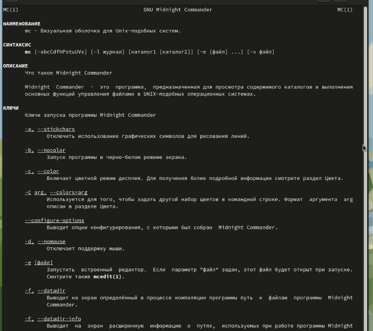{#fig:001 width=70%}

## Процесс выполнения

2. Запустим из командной строки mc, изучим его структуру и меню 

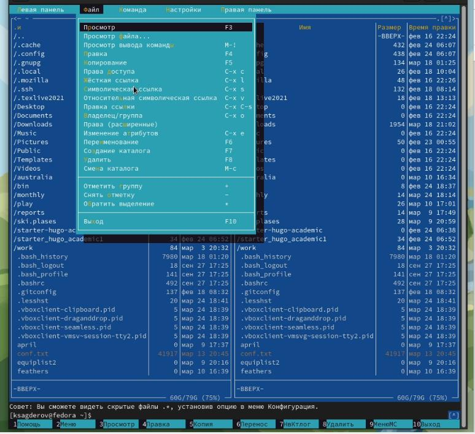{#fig:002 width=70%}

## Процесс выполнения

3. Выполним несколько операций в mc, используя управляющие клавиши (операции с панелями; выделение/отмена выделения файлов, копирование/перемещение файлов, получение информации о размере и правах доступа на файлы и/или каталоги и т.п.)

## Процесс выполнения

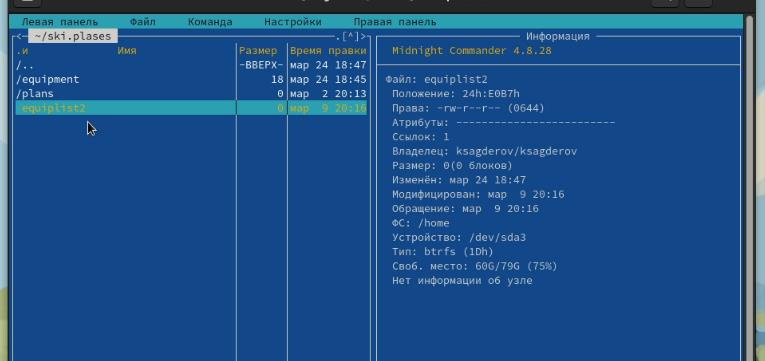{#fig:003 width=70%}

## Процесс выполнения

4. Выполним основные команды меню левой (или правой) панели. Оценим степень подробности вывода информации о файлах 

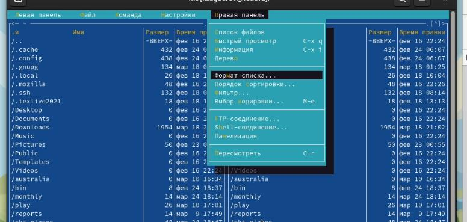{#fig:004 width=70%}

## Процесс выполнения

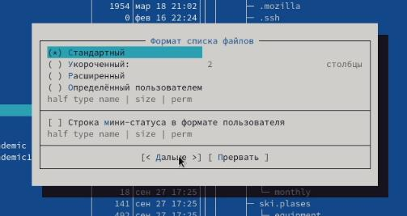{#fig:005 width=70%}

## Процесс выполнения

5. Используя возможности подменю Файл , выполните:просмотр содержимого текстового файла;редактирование содержимого текстового файла (без сохранения результатов редактирования);создание каталога; копирование в файлов в созданный каталог 

## Процесс выполнения

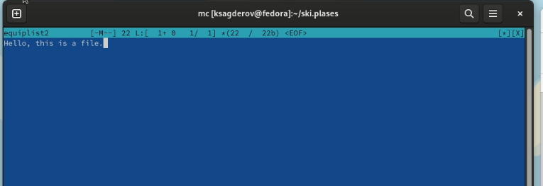{#fig:006 width=70%}

## Процесс выполнения

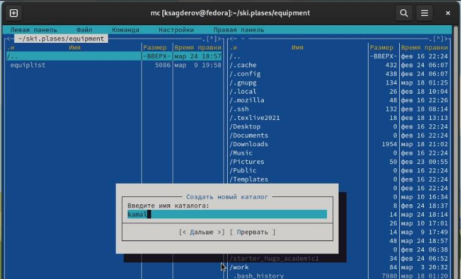{#fig:007 width=70%}

## Процесс выполнения

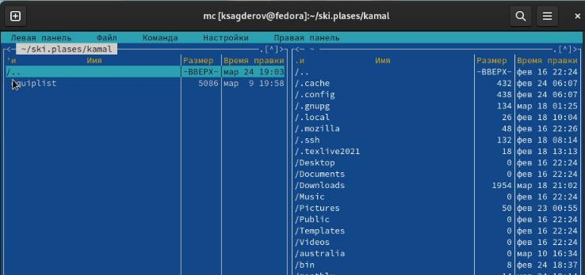{#fig:008 width=70%}

## Процесс выполнения

6. С помощью соответствующих средств подменю Команда осуществите:поиск в файловой системе файла с заданными условиями (например, файла с расширением .c или .cpp, содержащего строку main); выбор и повторение одной из предыдущих команд;переход в домашний каталог; анализ файла меню и файла расширений

## Процесс выполнения

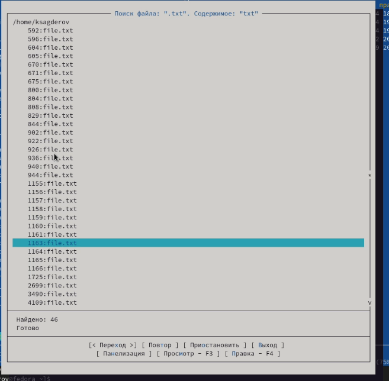{#fig:009 width=70%}

## Процесс выполнения

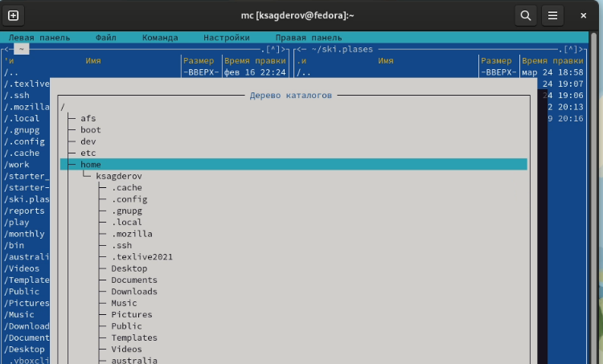{#fig:010 width=70%}

## Процесс выполнения

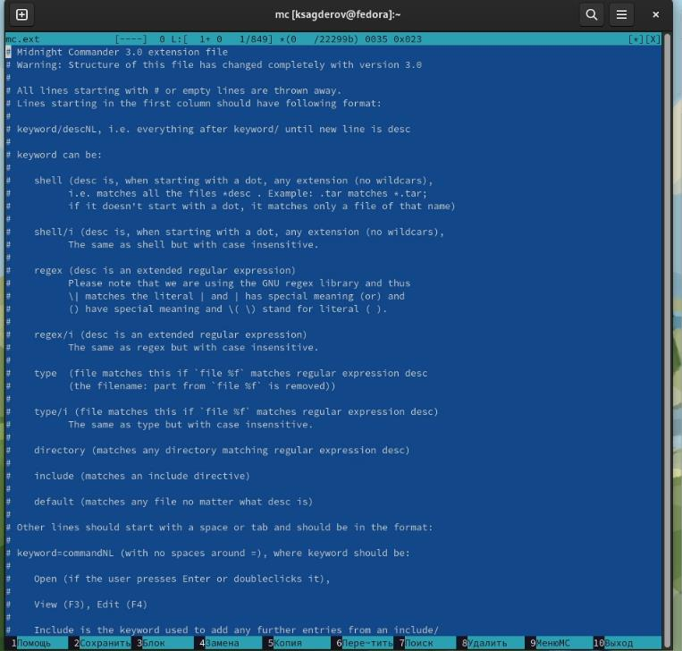{#fig:011 width=70%}

## Процесс выполнения

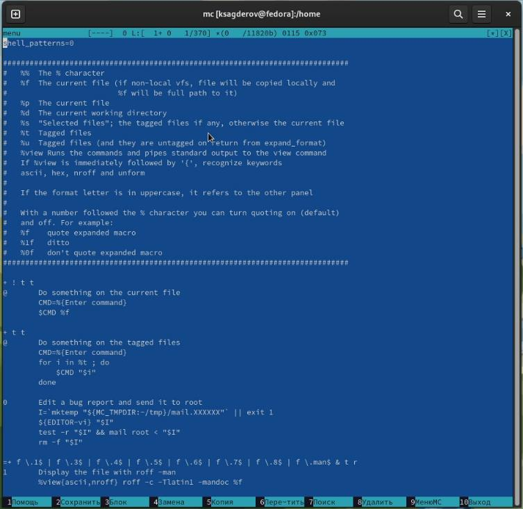{#fig:012 width=70%}

## Процесс выполнения

7. Вызовим подменю Настройки . Освойте операции, определяющие структуру экрана mc (Full screen, Double Width, Show Hidden Files и т.д 
## Процесс выполнения

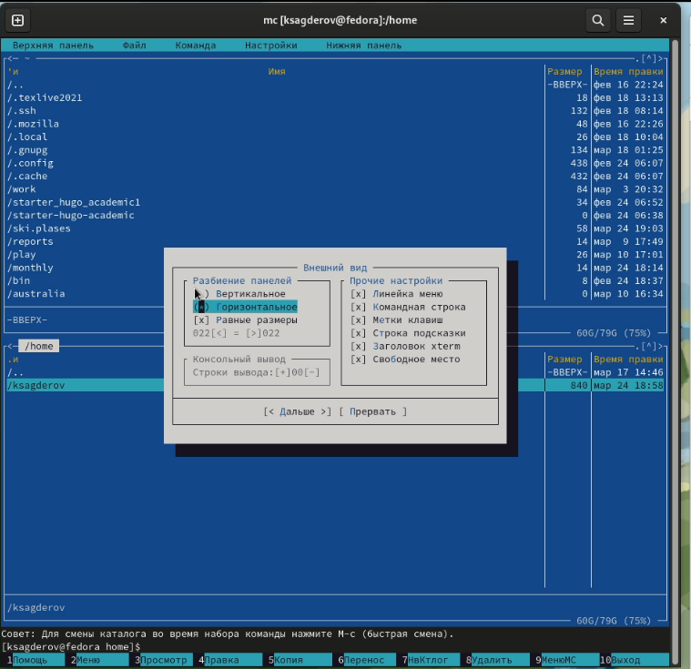{#fig:013 width=70%}

## Процесс выполнения

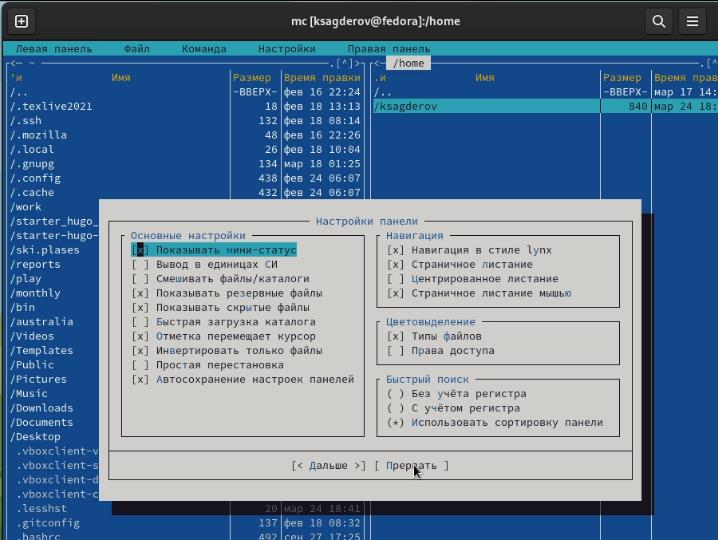{#fig:014 width=70%}

## Процесс выполнения

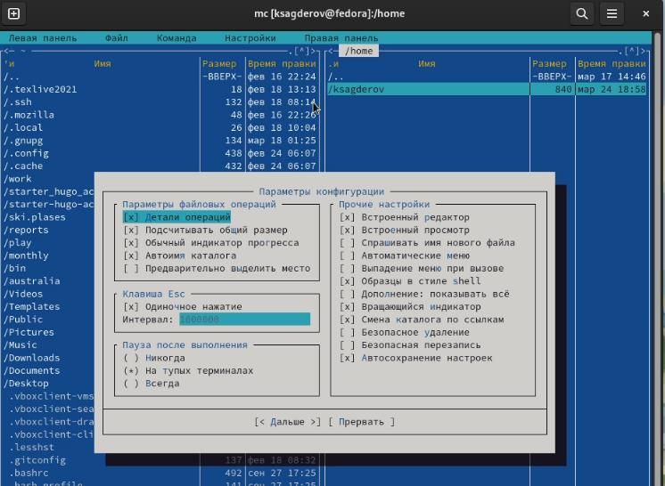{#fig:015 width=70%}

## Процесс выполнения

7.3.2. Задание по встроенному редактору mc

1. Создадим текстовой файл text.txt 

## Процесс выполнения

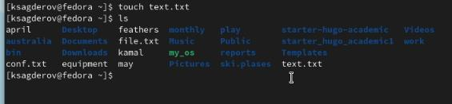{#fig:016 width=70%}

## Процесс выполнения

2. Откроем этот файл с помощью встроенного в mc редактора.
3. Вставьте в открытый файл небольшой фрагмент текста, скопированный из любого другого файла или Интернета 
## Процесс выполнения

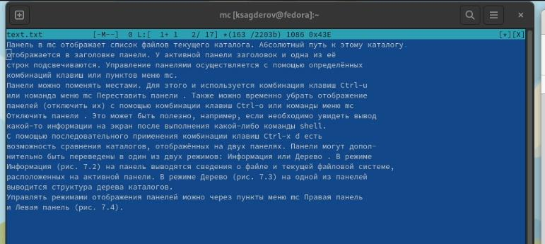{#fig:017 width=70%}

## Процесс выполнения

4. Проделайте с текстом следующие манипуляции, используя горячие клавиши:
4.1. Удалите строку текста.
4.2. Выделите фрагмент текста и скопируйте его на новую строку.
4.3. Выделите фрагмент текста и перенесите его на новую строку.
4.4. Сохраните файл.
4.5. Отмените последнее действие.
4.6. Перейдите в конец файла (нажав комбинацию клавиш) и напишите некоторый текст.
4.7. Перейдите в начало файла (нажав комбинацию клавиш) и напишите некоторый текст.
4.8. Сохраните и закройте файл 

## Процесс выполнения

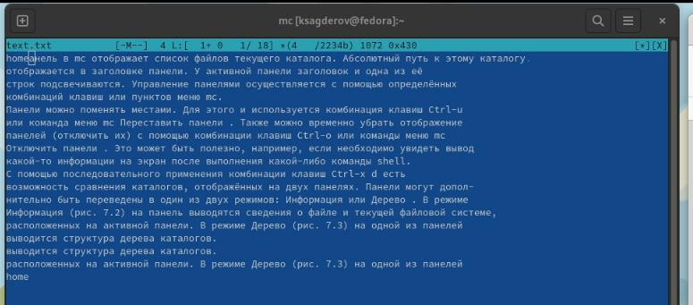{#fig:018 width=70%}

## Процесс выполнения

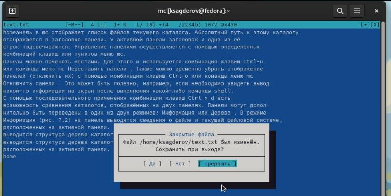{#fig:019 width=70%}

## Процесс выполнения

5. Откроем файл с исходным текстом на некотором языке программирования (например C или Java) 

## Процесс выполнения

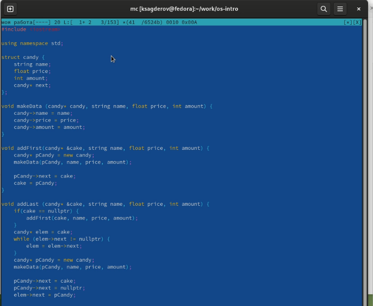{#fig:020 width=70%}

## Процесс выполнения

6. Используя меню редактора, включим подсветку синтаксиса, если она не включена, или выключите, если она включена 

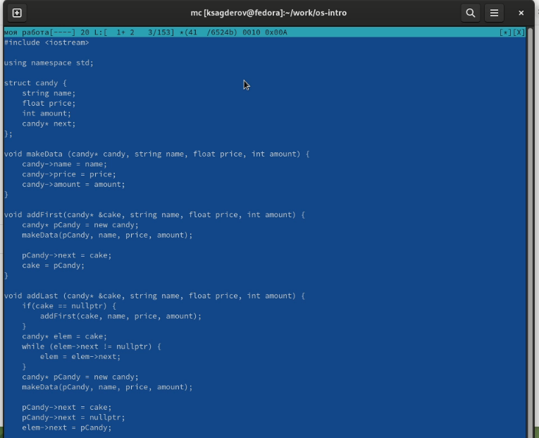{#fig:021 width=70%}

## Выводы

В процессе выполнения данной лабораторной работы я освоил работу с командной оболочкой mc, приобрел практические навыки по работе с ней, а также по просмотру файлов и каталогов, манипуляции с ними.

# Спасибо за внимание!

