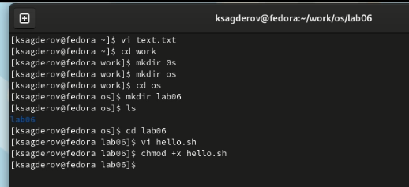

---
## Front matter
lang: ru-RU
title: Презентация по лабораторной работе №8
subtitle: "Текстовой редактор vi"
author:
  - Сагдеров Камал
institute:
  - Российский университет дружбы народов, Москва, Россия
date: 26.03.23

## i18n babel
babel-lang: russian
babel-otherlangs: english

## Formatting pdf
toc: false
toc-title: Содержание
slide_level: 2
aspectratio: 169
section-titles: true
theme: metropolis
header-includes:
 - \metroset{progressbar=frametitle,sectionpage=progressbar,numbering=fraction}
 - '\makeatletter'
 - '\beamer@ignorenonframefalse'
 - '\makeatother'
---

## Цель работы

Познакомиться с операционной системой Linux. Получить практические навыки работы с редактором vi, установленным по умолчанию практически во всех дистрибутивах.

## Основные задачи

8.3.1. Задание 1. Создание нового файла с использованием vi
1. Создайте каталог с именем ~/work/os/lab06.
2. Перейдите во вновь созданный каталог.
3. Вызовите vi и создайте файл hello.sh
4. Нажмите клавишу i и вводите следующий текст
5. Нажмите клавишу Esc для перехода в командный режим после завершения вводатекста.
6. Нажмите : для перехода в режим последней строки и внизу вашего экрана появится приглашение в виде двоеточия.

## Основные задачи

7. Нажмите w (записать) и q (выйти), а затем нажмите клавишу Enter для сохранения вашего текста и завершения работы.
8. Сделайте файл исполняемым
8.3.2. Задание 2. Редактирование существующего файла
1. Вызовите vi на редактирование файл
2. Установите курсор в конец слова HELL второй строки.
3. Перейдите в режим вставки и замените на HELLO. Нажмите Esc для возврата в командный режим.
4. Установите курсор на четвертую строку и сотрите слово LOCAL.

## Основные задачи

5. Перейдите в режим вставки и наберите следующий текст: local, нажмите Esc для возврата в командный режим.
6. Установите курсор на последней строке файла. Вставьте после неё строку, содержащую следующий текст: echo $HELLO.
7. Нажмите Esc для перехода в командный режим.
8. Удалите последнюю строку.
9. Введите команду отмены изменений u для отмены последней команды.
10. Введите символ : для перехода в режим последней строки. Запишите произведённыеизменения и выйдите из vi

## Процесс выполнения

Ознакомимся с теоретическим материалом.Ознакомиться с редактором vi. Выполнить упражнения, используя команды vi 

{#fig:001 width=70%}

## Процесс выполнения

Задание 1. Создание нового файла с использованием vi
1. Создаем каталог с именем ~/work/os/lab06
2. Перейдем во вновь созданный каталог.
3. Вызовем vi и создадим файл hello.sh 
## Процесс выполнения

{#fig:002 width=70%}

## Процесс выполнения

{#fig:003 width=70%}

## Процесс выполнения

4. Нажмем клавишу i и вводите следующий текст 

{#fig:004 width=70%}

## Процесс выполнения

5. Нажмем клавишу Esc для перехода в командный режим после завершения ввода текста.
6. Нажмем : для перехода в режим последней строки и внизу вашего экрана появится приглашение в виде двоеточия.
7. Нажмем w (записать) и q (выйти), а затем нажмите клавишу Enter для сохранения вашего текста и завершения работы 

## Процесс выполнения

{#fig:005 width=70%}

## Процесс выполнения

8. Сделаем файл исполняемым 

{#fig:006 width=70%}

## Процесс выполнения

Задание 2. Редактирование существующего файла
1. Вызовите vi на редактирование файла
2. Установите курсор в конец слова HELL второй строки.
3. Перейдите в режим вставки и замените на HELLO. Нажмите Esc для возврата в командный режим 

## Процесс выполнения

{#fig:007 width=70%}

## Процесс выполнения

4. Установите курсор на четвертую строку и сотрите слово LOCAL.
5. Перейдите в режим вставки и наберите следующий текст: local, нажмите Esc для возврата в командный режим
6. Установите курсор на последней строке файла. Вставьте после неё строку, содержащую
следующий текст: echo $HELLO

## Процесс выполнения

{#fig:008 width=70%}

## Процесс выполнения

7. Нажмите Esc для перехода в командный режим.
8. Удалите последнюю строку 

## Процесс выполнения

{#fig:009 width=70%}

## Процесс выполнения

9. Введите команду отмены изменений u для отмены последней команды 

{#fig:010 width=70%}

## Процесс выполнения

10. Введите символ : для перехода в режим последней строки. Запишите произведённые изменения и выйдите из vi

{#fig:011 width=70%}

## Выводы

В процессе выполнения лабораторной работы я ознакомился с текстовом редактором vi, получил практические навыки по работе с редактором, установленными по умолчанию практически во всех дистрибутивах.

# Спасибо за внимание!
