---
## Front matter
title: "Отчёт по лабораторной работе №8"
subtitle: "Текстовой редактор vi"
author: "Сагдеров Камал"

## Generic otions
lang: ru-RU
toc-title: "Содержание"

## Bibliography
bibliography: bib/cite8.bib
csl: pandoc/csl/gost-r-7-0-5-2008-numeric.csl

## Pdf output format
toc: true # Table of contents
toc-depth: 2
lof: true # List of figures
lot: false # List of tables
fontsize: 12pt
linestretch: 1.5
papersize: a4
documentclass: scrreprt
## I18n polyglossia
polyglossia-lang:
  name: russian
  options:
	- spelling=modern
	- babelshorthands=true
polyglossia-otherlangs:
  name: english
## I18n babel
babel-lang: russian
babel-otherlangs: english
## Fonts
mainfont: PT Serif
romanfont: PT Serif
sansfont: PT Sans
monofont: PT Mono
mainfontoptions: Ligatures=TeX
romanfontoptions: Ligatures=TeX
sansfontoptions: Ligatures=TeX,Scale=MatchLowercase
monofontoptions: Scale=MatchLowercase,Scale=0.9
## Biblatex
biblatex: true
biblio-style: "gost-numeric"
biblatexoptions:
  - parentracker=true
  - backend=biber
  - hyperref=auto
  - language=auto
  - autolang=other*
  - citestyle=gost-numeric
## Pandoc-crossref LaTeX customization
figureTitle: "Рис."
tableTitle: "Таблица"
listingTitle: "Листинг"
lofTitle: "Список иллюстраций"
lotTitle: "Список таблиц"
lolTitle: "Листинги"
## Misc options
indent: true
header-includes:
  - \usepackage{indentfirst}
  - \usepackage{float} # keep figures where there are in the text
  - \floatplacement{figure}{H} # keep figures where there are in the text
---

# Цель работы

Познакомиться с операционной системой Linux. Получить практические навыки работы с редактором vi, установленным по умолчанию практически во всех дистрибутивах.

# Задание

8.3.1. Задание 1. Создание нового файла с использованием vi
1. Создайте каталог с именем ~/work/os/lab06.
2. Перейдите во вновь созданный каталог.
3. Вызовите vi и создайте файл hello.sh
4. Нажмите клавишу i и вводите следующий текст
5. Нажмите клавишу Esc для перехода в командный режим после завершения вводатекста.
6. Нажмите : для перехода в режим последней строки и внизу вашего экрана появится приглашение в виде двоеточия.
7. Нажмите w (записать) и q (выйти), а затем нажмите клавишу Enter для сохранения вашего текста и завершения работы.
8. Сделайте файл исполняемым
8.3.2. Задание 2. Редактирование существующего файла
1. Вызовите vi на редактирование файла
2. Установите курсор в конец слова HELL второй строки.
3. Перейдите в режим вставки и замените на HELLO. Нажмите Esc для возврата в командный режим.
4. Установите курсор на четвертую строку и сотрите слово LOCAL.
5. Перейдите в режим вставки и наберите следующий текст: local, нажмите Esc для возврата в командный режим.
6. Установите курсор на последней строке файла. Вставьте после неё строку, содержащую следующий текст: echo $HELLO.
7. Нажмите Esc для перехода в командный режим.
8. Удалите последнюю строку.
9. Введите команду отмены изменений u для отмены последней команды.
10. Введите символ : для перехода в режим последней строки. Запишите произведённыеизменения и выйдите из vi

# Теоретическое введение

екстовым редактором (text editor) называют программу, которая предназначена для редактирования (составления и изменения) файлов, содержащих только текст, например: письмо, программа на языке C, системный конфигурационный файл. При том, что имеется много различных редакторов для системы Linux, единственный, чьё присутствие будет гарантировано в любой системе UNIX или Linux═ — это vi (visual editor). Редактор vi не является самым простым в использовании, и его интерфейс не очень понятен сам по себе. Однако ввиду своей распространённости, а отчасти и потому, что владение им в некоторых ситуациях необходимо, ему посвящается внимание в этой книге.

В любой момент при работе в редакторе vi вы находитесь в одном из трёх режимов редактора: командный режим (command mode), режим ввода (insert mode) и режим последней строки (last line mode).

При запуске редактора vi вы оказываетесь в командном режиме. В этом режиме можно давать команды для редактирования файлов или перейти в другой режим. Например, вводя x в командном режиме мы удаляем символ, на который указывает курсор. Клавиши-стрелки перемещают курсор по редактируемому файлу. Как правило, команды, используемые в командном режиме, состоят из одного или двух символов.

Основной ввод и редактирование текста осуществляется в режиме ввода. При использовании редактора vi основное время, скорее всего, будет проводиться именно в этом режиме. Переход в режим ввода из командного режима осуществляется командой i (от слова insert). Находясь в режиме ввода, можно вводить текст в то место, куда указывает курсор. Выход из режима ввода в командный режим осуществляется клавишей Esc.

Основной ввод и редактирование текста осуществляется в режиме ввода. При использовании редактора vi основное время, скорее всего, будет проводиться именно в этом режиме. Переход в режим ввода из командного режима осуществляется командой i (от слова insert). Находясь в режиме ввода, можно вводить текст в то место, куда указывает курсор. Выход из режима ввода в командный режим осуществляется клавишей Esc.

Нажмём клавишу i, и редактор перейдёт в режим ввода текста.Помимо команды i, есть ещё несколько способов вставить текст. Так, команда a начинает вставлять текст после текущего положения курсора, а не прямо в текущую. Например, приведём с помощью клавиш-стрелок курсор к пробелу, разделяющему слова good и men.Для того, чтобы начать вводить текст со следующей строки, используем команду o.

В командном режиме нажатие клавиши x удаляет символ, на который указывает курсор. Можно удалять целые строки командой dd (т. е. нажав клавишу d два раза подряд). Для того, чтобы удалить слово, на которое показывает курсор, можно использовать команду dw. Подведите курсор к слову good и введите dw. [@vi:bash]

# Выполнение лабораторной работы

Ознакомимся с теоретическим материалом.Ознакомиться с редактором vi. Выполнить упражнения, используя команды vi (рис. @fig:001).

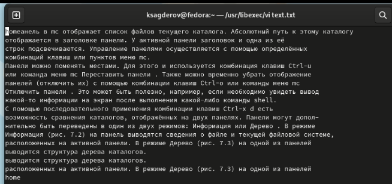{#fig:001 width=70%}

Задание 1. Создание нового файла с использованием vi
1. Создаем каталог с именем ~/work/os/lab06
2. Перейдем во вновь созданный каталог.
3. Вызовем vi и создадим файл hello.sh (рис. @fig:002), (рис. @fig:003).

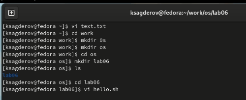{#fig:002 width=70%}

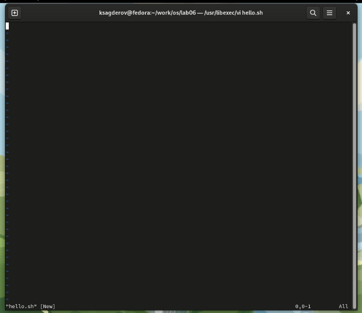{#fig:003 width=70%}

4. Нажмем клавишу i и вводите следующий текст (рис. @fig:004).

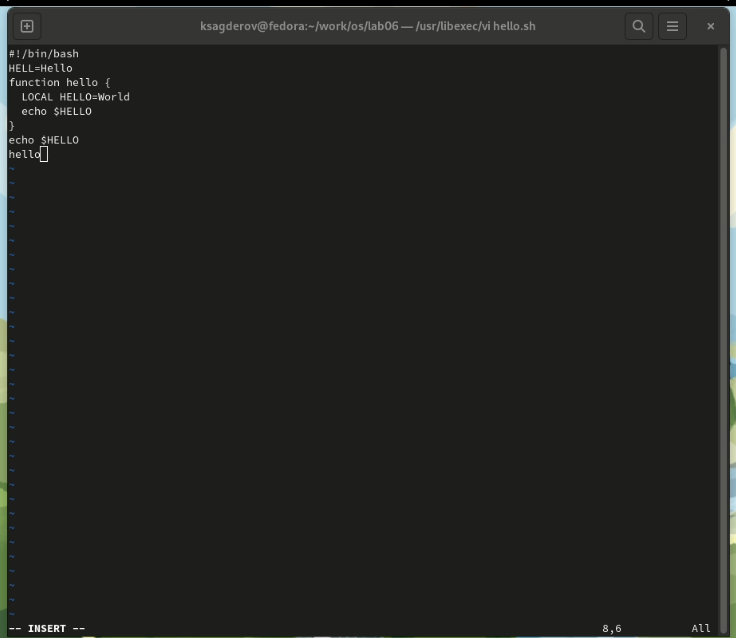{#fig:004 width=70%}

5. Нажмем клавишу Esc для перехода в командный режим после завершения ввода текста.
6. Нажмем : для перехода в режим последней строки и внизу вашего экрана появится приглашение в виде двоеточия.
7. Нажмем w (записать) и q (выйти), а затем нажмите клавишу Enter для сохранения вашего текста и завершения работы (рис. @fig:005).

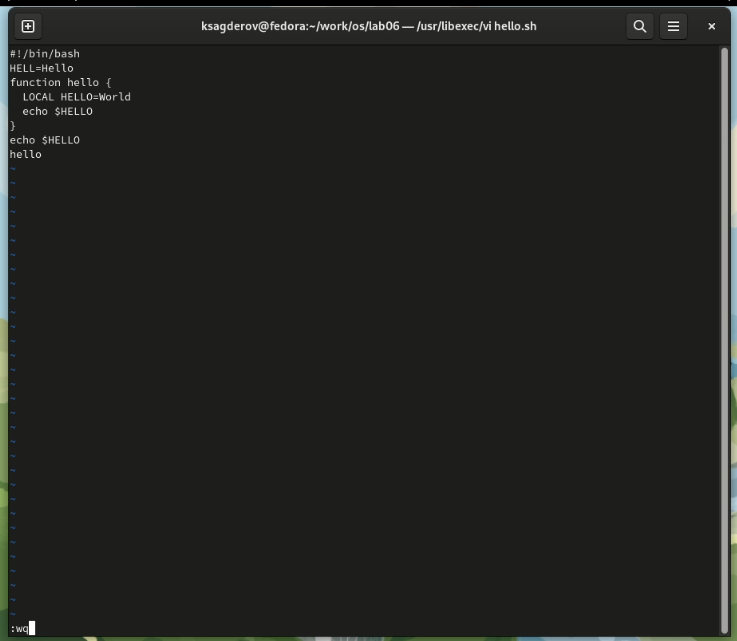{#fig:005 width=70%}

8. Сделаем файл исполняемым (рис. @fig:006).

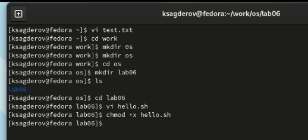{#fig:006 width=70%}

Задание 2. Редактирование существующего файла
1. Вызовите vi на редактирование файла
2. Установите курсор в конец слова HELL второй строки.
3. Перейдите в режим вставки и замените на HELLO. Нажмите Esc для возврата в командный режим (рис. @fig:007).

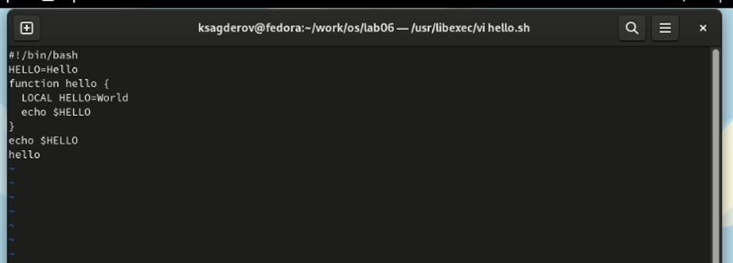{#fig:007 width=70%}

4. Установите курсор на четвертую строку и сотрите слово LOCAL.
5. Перейдите в режим вставки и наберите следующий текст: local, нажмите Esc для возврата в командный режим
6. Установите курсор на последней строке файла. Вставьте после неё строку, содержащую
следующий текст: echo $HELLO (рис. @fig:008).

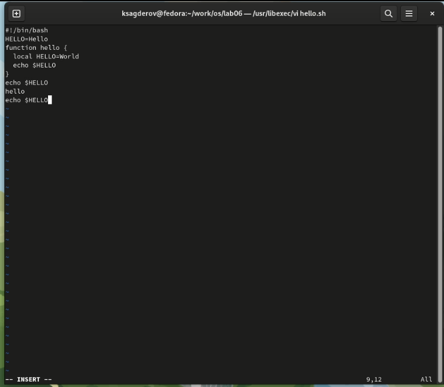{#fig:008 width=70%}

7. Нажмите Esc для перехода в командный режим.
8. Удалите последнюю строку (рис. @fig:009).

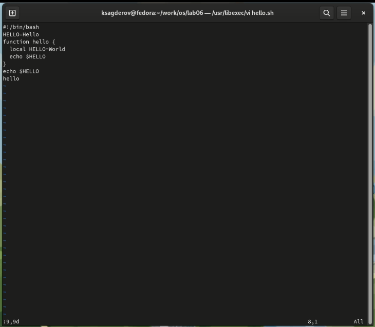{#fig:009 width=70%}

9. Введите команду отмены изменений u для отмены последней команды (рис. @fig:010).

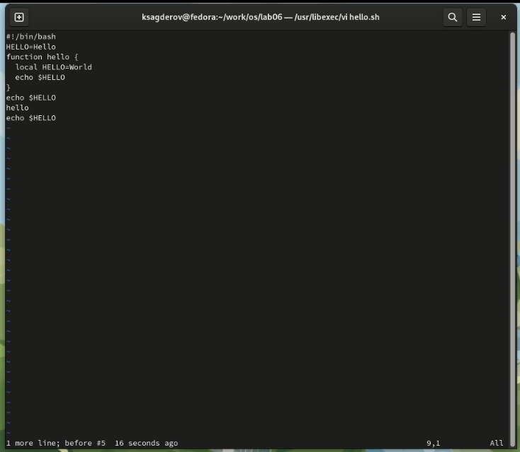{#fig:010 width=70%}

10. Введите символ : для перехода в режим последней строки. Запишите произведённые изменения и выйдите из vi
(рис. @fig:011).

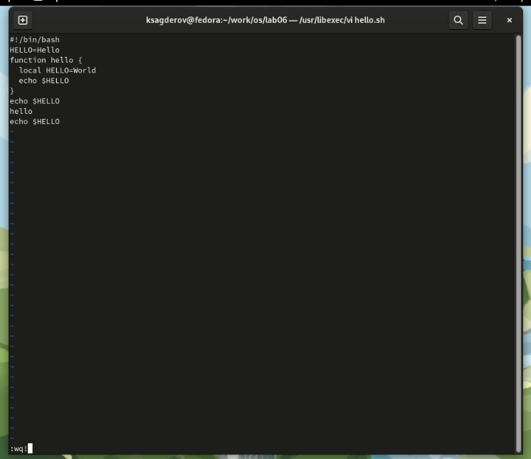{#fig:011 width=70%}

# Выводы

В процессе выполнения лабораторной работы я ознакомился с текстовом редактором vi, получил практические навыки по работе с редактором, установленными по умолчанию практически во всех дистрибутивах.

# Контрольные вопросы

1. Дайте краткую характеристику режимам работы редактора vi.
- командный режим — предназначен для ввода команд редактирования и навигации по редактируемому файлу;
- режим вставки — предназначен для ввода содержания редактируемого файла;
- режим последней (или командной) строки — используется для записи изменений в файл и выхода из редактора.
2. Как выйти из редактора, не сохраняя произведённые изменения?
Можно нажимать символ q (или q!), если требуется выйти из редактора без сохранения.
3. Назовите и дайте краткую характеристику командам позиционирования.
- 0 (ноль) — переход в начало строки;
- $ — переход в конец строки;
- G — переход в конец файла;
- n G — переход на строку с номером n.
4. Что для редактора vi является словом?
Редактор vi предполагает, что слово - это строка символов, которая может включать в себя буквы, цифры и символы подчеркивания.
5. Каким образом из любого места редактируемого файла перейти в начало (конец) файла?
С помощью G — переход в конец файла
6. Назовите и дайте краткую характеристику основным группам команд редактирования.
- Вставка текста – а — вставить текст после курсора; – А — вставить текст в конец строки; – i — вставить текст перед курсором; – n i — вставить текст n раз; – I — вставить текст в начало строки.
- Вставка строки – о — вставить строку под курсором; – О — вставить строку над курсором.
- Удаление текста – x — удалить один символ в буфер; – d w — удалить одно слово в буфер; – d $ — удалить в буфер текст от курсора до конца строки; – d 0 — удалить в буфер текст от начала строки до позиции курсора; – d d — удалить в буфер одну строку; – n d d — удалить в буфер n строк.
- Отмена и повтор произведённых изменений – u — отменить последнее изменение; – . — повторить последнее изменение.
- Копирование текста в буфер – Y — скопировать строку в буфер; – n Y — скопировать n строк в буфер; – y w — скопировать слово в буфер.
- Вставка текста из буфера – p — вставить текст из буфера после курсора; – P — вставить текст из буфера перед курсором.
- Замена текста – c w — заменить слово; – n c w — заменить n слов; – c $ — заменить текст от курсора до конца строки; – r — заменить слово; – R — заменить текст.
- Поиск текста – / текст — произвести поиск вперёд по тексту указанной строки символов текст; – ? текст — произвести поиск назад по тексту указанной строки символов текст.
7. Необходимо заполнить строку символами $. Каковы ваши действия?
Перейти в режим вставки.
8. Как отменить некорректное действие, связанное с процессом редактирования?
С помощью u — отменить последнее изменение
9. Назовите и дайте характеристику основным группам команд режима последней строки.
Режим последней строки — используется для записи изменений в файл и выхода из редактора.
10. Как определить, не перемещая курсора, позицию, в которой заканчивается строка?
$ — переход в конец строки
11. Выполните анализ опций редактора vi (сколько их, как узнать их назначение и т.д.).
Опции редактора vi позволяют настроить рабочую среду. Для задания опций используется команда set (в режиме последней строки): – : set all — вывести полный список опций; – : set nu — вывести номера строк; – : set list — вывести невидимые символы; – : set ic — не учитывать при поиске, является ли символ прописным или строчным.
12. Как определить режим работы редактора vi?
В редакторе vi есть два основных режима: командный режим и режим вставки. По умолчанию работа начинается в командном режиме. В режиме вставки клавиатура используется для набора текста. Для выхода в командный режим используется клавиша Esc или комбинация Ctrl + c .

# Список литературы{.unnumbered}

::: {#refs}
:::
