---
## Front matter
lang: ru-RU
title: Презентация по лабораторной работе №9
subtitle: "Текстовой редактор emacs"
author:
  - Сагдеров Камал
institute:
  - Российский университет дружбы народов, Москва, Россия
date: 31.03.2023

## i18n babel
babel-lang: russian
babel-otherlangs: english

## Formatting pdf
toc: false
toc-title: Содержание
slide_level: 2
aspectratio: 169
section-titles: true
theme: metropolis
header-includes:
 - \metroset{progressbar=frametitle,sectionpage=progressbar,numbering=fraction}
 - '\makeatletter'
 - '\beamer@ignorenonframefalse'
 - '\makeatother'
---

## Цель работы

Познакомиться с операционной системой Linux. Получить практические навыки работы с редактором Emacs

## Основные задачи

1. Открыть emacs.
2. Создать файл lab07.sh с помощью комбинации Ctrl-x Ctrl-f (C-x C-f).
3. Наберите текст
4. Сохранить файл с помощью комбинации Ctrl-x Ctrl-s (C-x C-s).
5. Проделать с текстом стандартные процедуры редактирования, каждое действие должно осуществляться комбинацией клавиш.

## Основные задачи

5.1. Вырезать одной командой целую строку (С-k).
5.2. Вставить эту строку в конец файла (C-y).
5.3. Выделить область текста (C-space).
5.4. Скопировать область в буфер обмена (M-w).

## Основные задачи

5.5. Вставить область в конец файла.
5.6. Вновь выделить эту область и на этот раз вырезать её (C-w).
5.7. Отмените последнее действие (C-/).

## Основные задачи

6. Научитесь использовать команды по перемещению курсора.
6.1. Переместите курсор в начало строки (C-a).
6.2. Переместите курсор в конец строки (C-e).
6.3. Переместите курсор в начало буфера (M-<).
6.4. Переместите курсор в конец буфера (M->).

## Основные задачи

7. Управление буферами.
7.1. Вывести список активных буферов на экран (C-x C-b).
7.2. Переместитесь во вновь открытое окно (C-x) o со списком открытых буферов и переключитесь на другой буфер.
7.3. Закройте это окно (C-x 0).
7.4. Теперь вновь переключайтесь между буферами, но уже без вывода их списка на экран (C-x b).

## Основные задачи

8. Управление окнами.
8.1. Поделите фрейм на 4 части: разделите фрейм на два окна по вертикали (C-x 3), а затем каждое из этих окон на две части по горизонтали (C-x 2) 
8.2. В каждом из четырёх созданных окон откройте новый буфер (файл) и введите несколько строк текста.

## Основные задачи

9. Режим поиска
9.1. Переключитесь в режим поиска (C-s) и найдите несколько слов, присутствующих в тексте.
9.2. Переключайтесь между результатами поиска, нажимая C-s.
9.3. Выйдите из режима поиска, нажав C-g.
9.4. Перейдите в режим поиска и замены (M-%), введите текст, который следует найти и заменить, нажмите Enter , затем введите текст для замены. После того как будут подсвечены результаты поиска, нажмите ! для подтверждения замены.
9.5. Испробуйте другой режим поиска, нажав M-s o. Объясните, чем он отличается от обычного режима?

## Процесс выполнения

1. Открыть emacs 

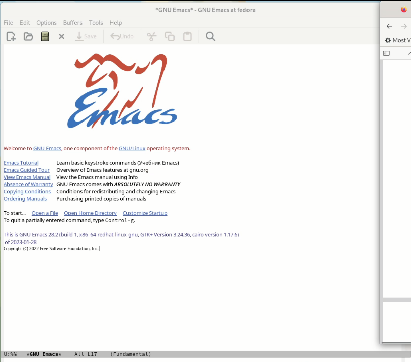{#fig:001 width=70%}

## Процесс выполнения

2. Создадим файл lab07.sh с помощью комбинации Ctrl-x Ctrl-f (C-x C-f) 

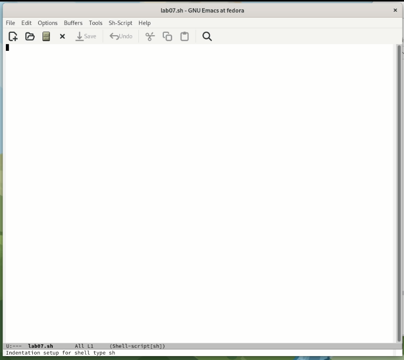{#fig:002 width=70%}

## Процесс выполнения

3. Наберем текст. 
4. Сохраним файл с помощью комбинации Ctrl-x Ctrl-s (C-x C-s) 

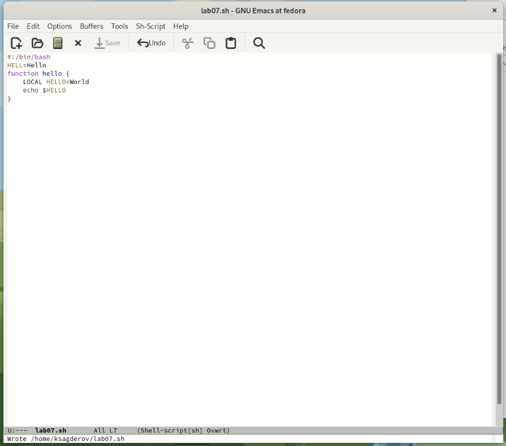{#fig:003 width=70%}

## Процесс выполнения

5. Проделаем с текстом стандартные процедуры редактирования, каждое действие должно осуществляться комбинацией клавиш.
5.1. Вырезать одной командой целую строку (С-k) 
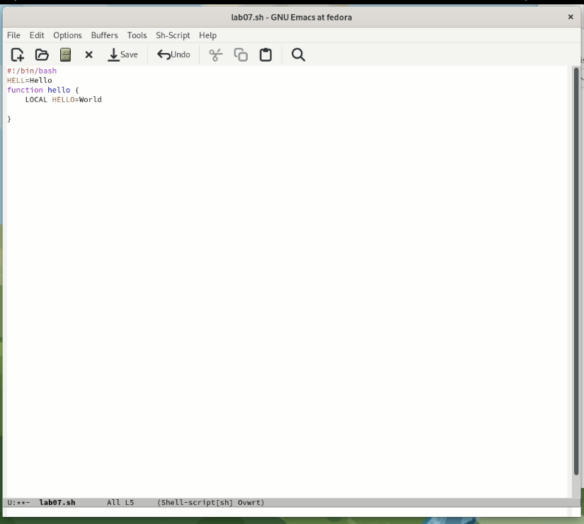{#fig:004 width=70%}

## Процесс выполнения

5.2. Вставим эту строку в конец файла (C-y) 

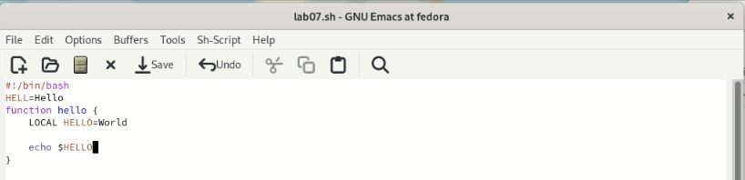{#fig:005 width=70%}

## Процесс выполнения

5.3. Выделить область текста (C-space).
5.4. Скопировать область в буфер обмена (M-w).
5.5. Вставить область в конец файла 

## Процесс выполнения

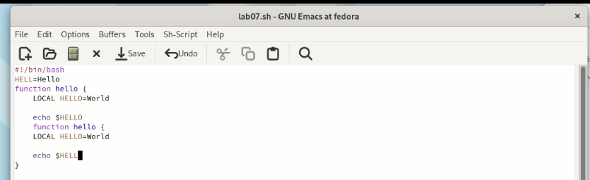{#fig:006 width=70%}

## Процесс выполнения

5.6. Вновь выделить эту область и на этот раз вырезать её (C-w)  

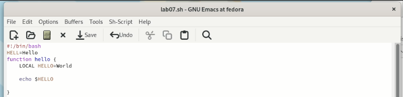{#fig:007 width=70%}

## Процесс выполнения

5.7. Отмените последнее действие (C-/) 

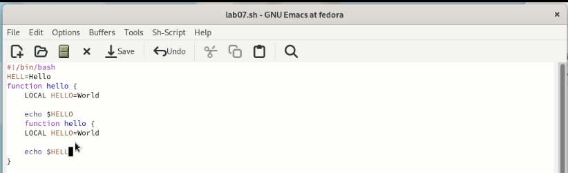{#fig:008 width=70%}

## Процесс выполнения

6. Научитесь использовать команды по перемещению курсора.
6.1. Переместите курсор в начало строки (C-a).
6.2. Переместите курсор в конец строки (C-e) 

## Процесс выполнения

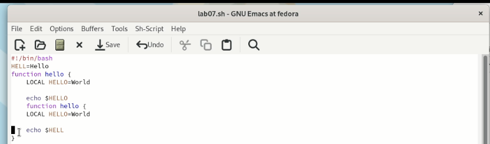{#fig:009 width=70%}

6.3. Переместите курсор в начало буфера (M-<).
6.4. Переместите курсор в конец буфера (M->) 

## Процесс выполнения

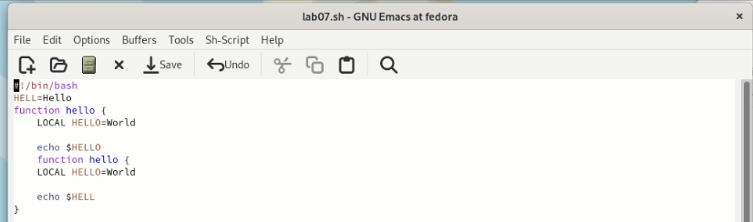{#fig:010 width=70%}

## Процесс выполнения

7. Управление буферами.
7.1. Вывести список активных буферов на экран (C-x C-b).
7.2. Переместитесь во вновь открытое окно (C-x) o со списком открытых буферов и переключитесь на другой буфер.
7.3. Закройте это окно (C-x 0).
7.4. Теперь вновь переключайтесь между буферами, но уже без вывода их списка на
экран (C-x b)  

## Процесс выполнения

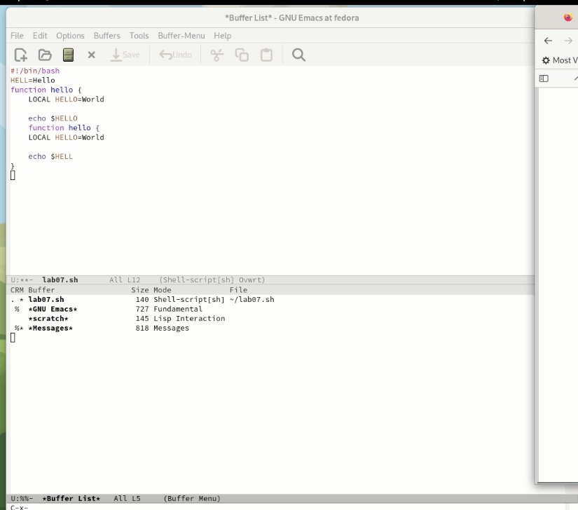{#fig:011 width=70%}

## Процесс выполнения

8. Управление окнами.
8.1. Поделите фрейм на 4 части: разделите фрейм на два окна по вертикали (C-x 3), а затем каждое из этих окон на две части по горизонтали (C-x 2) 

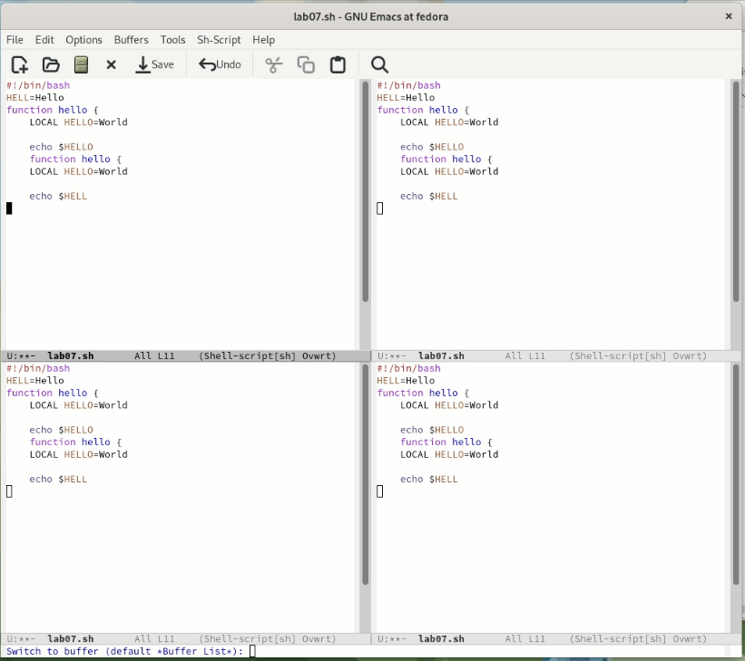{#fig:012 width=70%}

## Процесс выполнения

8.2. В каждом из четырёх созданных окон откройте новый буфер (файл) и введите несколько строк текста  

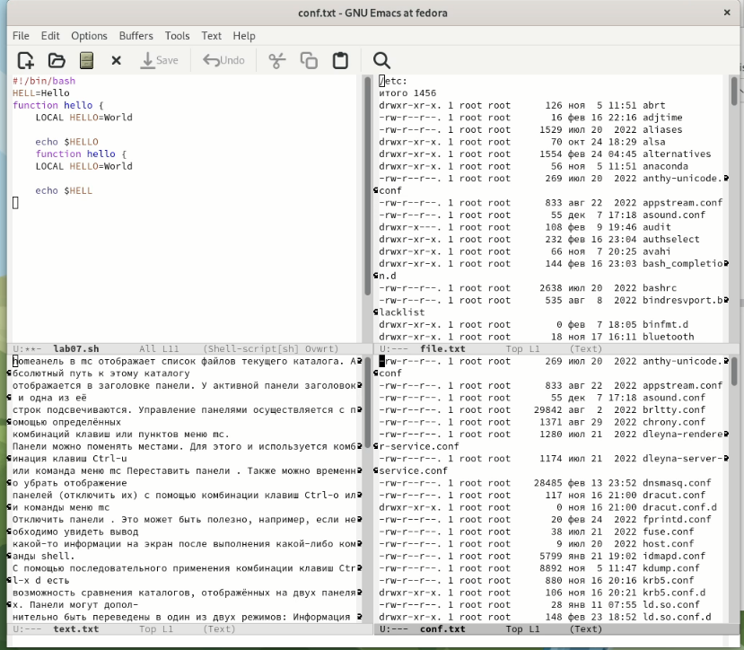{#fig:013 width=70%}

## Процесс выполнения

9. Режим поиска
9.1. Переключитесь в режим поиска (C-s) и найдите несколько слов, присутствующих в тексте.
9.2. Переключайтесь между результатами поиска, нажимая C-s 

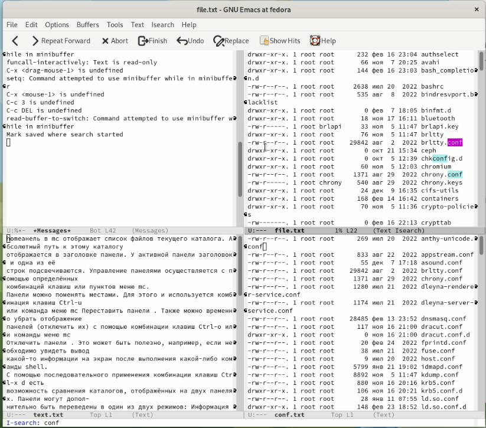{#fig:014 width=70%}

## Процесс выполнения

9.3. Выйдите из режима поиска, нажав C-g.
9.4. Перейдите в режим поиска и замены (M-%), введите текст, который следует найти и заменить, нажмите Enter , затем введите текст для замены. После того как будут подсвечены результаты поиска, нажмите ! для подтверждения замены 

## Процесс выполнения

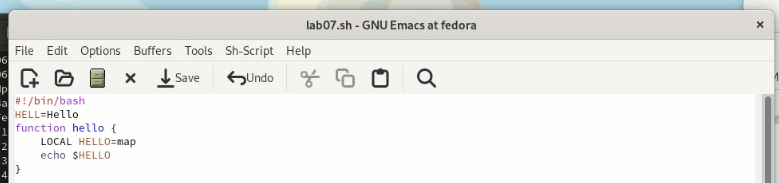{#fig:015 width=70%}

## Процесс выполнения

9.5. Испробуйте другой режим поиска, нажав M-s o. Объясните, чем он отличается от обычного режима? 

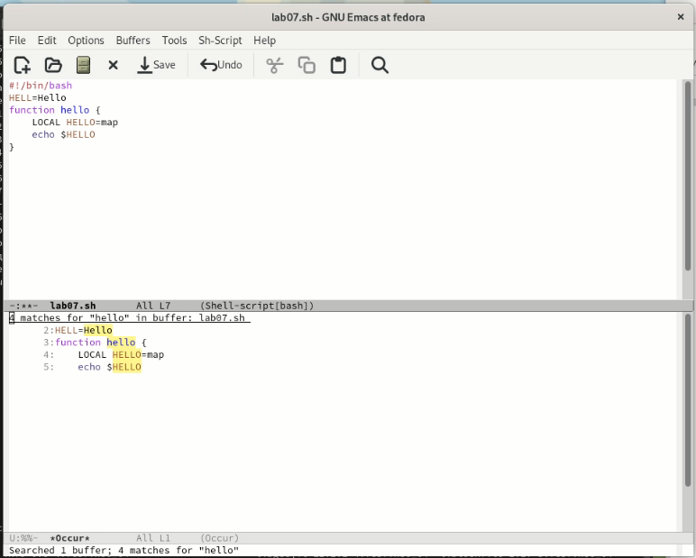{#fig:016 width=70%}

## Процесс выполнения

Отличие от обычного режима в том, что тут появляется отдельное окно с текстом из файла с выделенными словами, которые нужно было найти.

## Выводы

В процессе выполнения лабораторной работы я получил практические навыки работы в редакторе Emacs.

# Спасибо за внимание!
