---
## Front matter
lang: ru-RU
title: Презентация по лабораторной работе №13
subtitle: "Средства, применяемые при разработке программного обеспечения в ОС типа UNIX/Linux"
author:
  - Сагдеров Камал
institute:
  - Российский университет дружбы народов, Москва, Россия
date: 05.05.2023

## i18n babel
babel-lang: russian
babel-otherlangs: english

## Formatting pdf
toc: false
toc-title: Содержание
slide_level: 2
aspectratio: 169
section-titles: true
theme: metropolis
header-includes:
 - \metroset{progressbar=frametitle,sectionpage=progressbar,numbering=fraction}
 - '\makeatletter'
 - '\beamer@ignorenonframefalse'
 - '\makeatother'
---

## Цель работы

Приобрести простейшие навыки разработки, анализа, тестирования и отладки приложений в ОС типа UNIX/Linux на примере создания на языке программирования С калькулятора с простейшими функциями.

## Основные задачи

1. В домашнем каталоге создайте подкаталог ~/work/os/lab_prog.
2. Создайте в нём файлы: calculate.h, calculate.c, main.c. Это будет примитивнейший калькулятор, способный складывать, вычитать, умножать и делить, возводить число в степень, брать квадратный корень, вычислять sin, cos, tan.
При запуске он будет запрашивать первое число, операцию, второе число. После этого программа выведет результат и остановится. Реализация функций калькулятора в файле calculate.h:
3. Выполните компиляцию программы посредством gcc:

## Основные задачи

4. При необходимости исправьте синтаксические ошибки.
5. Создайте Makefile со следующим содержанием:
6. С помощью gdb выполните отладку программы calcul (перед использованием gdb исправьте Makefile):
– Запустите отладчик GDB, загрузив в него программу для отладки
7. С помощью утилиты splint попробуйте проанализировать коды файлов calculate.c и main.c

## Процесс выполнения

1. В домашнем каталоге создайте подкаталог ~/work/os/lab_prog.
2. Создайте в нём файлы: calculate.h, calculate.c, main.c 

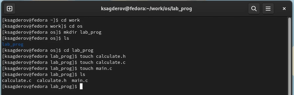{#fig:001 width=70%}

## Процесс выполнения

Это будет примитивнейший калькулятор, способный складывать, вычитать, умножатьи делить, возводить число в степень, брать квадратный корень, вычислять sin, cos, tan.При запуске он будет запрашивать первое число, операцию, второе число. После этогопрограмма выведет результат и остановится. Реализация функций калькулятора в файле calculate.h: 

## Процесс выполнения

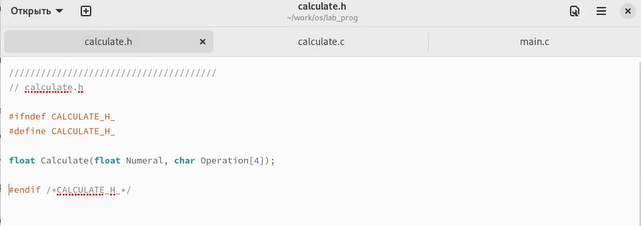{#fig:002 width=70%}

## Процесс выполнения

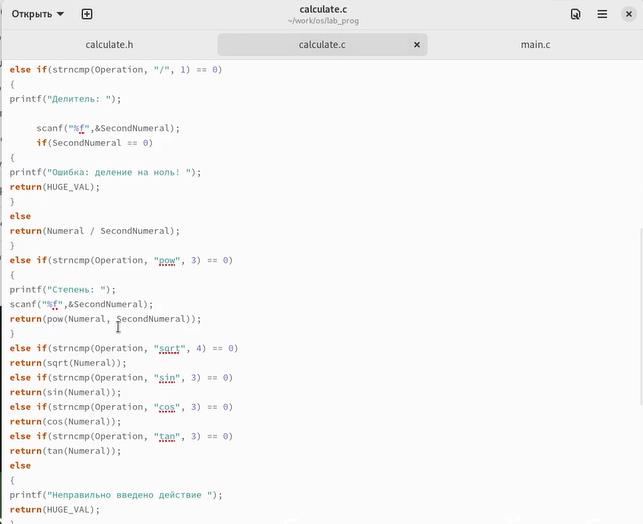{#fig:003 width=70%}

## Процесс выполнения

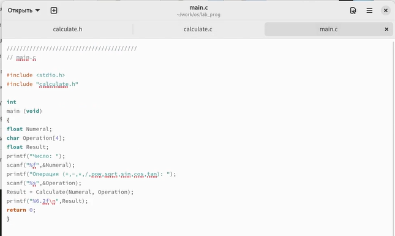{#fig:004 width=70%}

## Процесс выполнения

3. Выполните компиляцию программы посредством gcc: 

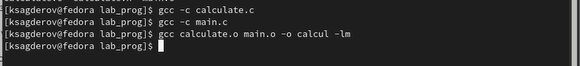{#fig:005 width=70%}

## Процесс выполнения

4. При необходимости исправьте синтаксические ошибки.
5. Создайте Makefile со следующим содержанием: 

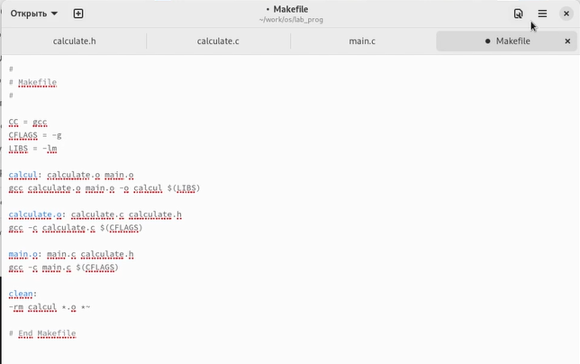{#fig:006 width=70%}

## Процесс выполнения

6. С помощью gdb выполните отладку программы calcul (перед использованием gdb исправьте Makefile):
– Запустите отладчик GDB, загрузив в него программу для отладки:
– Для запуска программы внутри отладчика введите команду run 

## Процесс выполнения

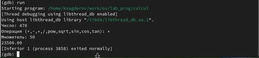{#fig:007 width=70%}

## Процесс выполнения

– Для постраничного (по 9 строк) просмотра исходного код используйте команду list:
– Для просмотра строк с 12 по 15 основного файла используйте list с параметрами: 

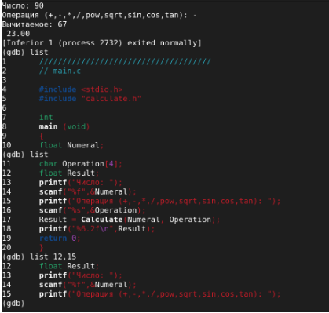{#fig:008 width=70%}

## Процесс выполнения

– Для просмотра определённых строк не основного файла используйте list с параметрами:
– Установите точку останова в файле calculate.c на строке номер 21:
– Выведите информацию об имеющихся в проекте точка останова:
- Запустите программу внутри отладчика и убедитесь, что программа остановится в момент прохождения точки останова:
– Отладчик выдаст следующую информацию
– Сравните с результатом вывода на экран после использования команды
- Уберите точки останова: 

## Процесс выполнения

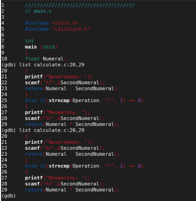{#fig:009 width=70%}

## Процесс выполнения

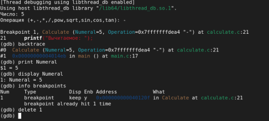{#fig:010 width=70%}

## Процесс выполнения

7. С помощью утилиты splint попробуйте проанализировать коды файлов calculate.c и main.c

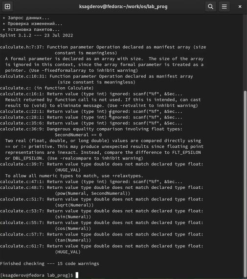{#fig:011 width=70%}

## Процесс выполнения

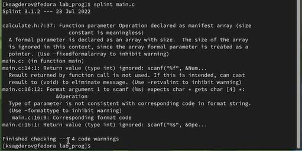{#fig:012 width=70%}

## Выводы

В процессе выполнения лабораторной работы я приобрел простейшие навыки разработки, анализа, тестирования и отладки приложений в ОС типа UNIX/Linux на примере создания на языке программирования С калькулятора с простейшими функциями.

# Спасибо за внимание!

