---
## Front matter
lang: ru-RU
title: Первый этап индивидуального проекта.
subtitle: Создание сайта
author:
  - Сагдеров Камал
institute:
  - Российский университет дружбы народов, Москва, Россия
date: 25.02.2023

## i18n babel
babel-lang: russian
babel-otherlangs: english

## Formatting pdf
toc: false
toc-title: Содержание
slide_level: 2
aspectratio: 169
section-titles: true
theme: metropolis
header-includes:
 - \metroset{progressbar=frametitle,sectionpage=progressbar,numbering=fraction}
 - '\makeatletter'
 - '\beamer@ignorenonframefalse'
 - '\makeatother'
---

## Цель работы

Создать сайт на Hugo

## Задание

1. Установить необходимое программное обеспечение.
2. Скачать шаблон темы сайта.
3. Разместить его на хостинге git.
4. Установить параметр для URLs сайта.
5. Разместить заготовку сайта на Github pages.

## Теоретическое введение

Сайт – это информационная единица в интернете, ресурс из веб-страниц (документов), которые объединены общей темой и связаны между друг с другом с помощью ссылок. Он зарегистрирован на одно юридическое или физическое лицо и обязательно привязан к конкретному домену, являющемуся его адресом. 
В лабораторной работе мы будем создавать статистический сайт, с помощью Hugo.
Hugo - генератор статистических страниц для интернета.

## Выполнение лабораторной работы
№1
Установим необходимое программное обеспечение, скачаем Hugo и Go, а также скачиваем необходимый релиз.

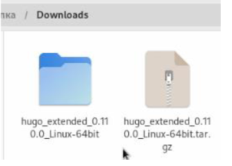{#fig:001 width=70%}

Распакованный файл помещаю в usr/local/bin 

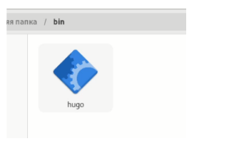{#fig:01a width=70%}

## Выполнение лабораторной работы
№2
В качестве шаблона индивидуального сайта используется шаблон Hugo Academic Theme. 

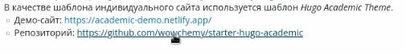{#fig:002 width=70%}

Переходим по ссылке и создаем репозиторий blog (я создал репозиторий blogk). Клонируем
репозиторий 

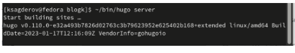{#fig:003 width=70}

## Выполнение лабораторной работы
№3
С помощью команды ~/bin/hugo server создаю необходимы для работы файлы. 

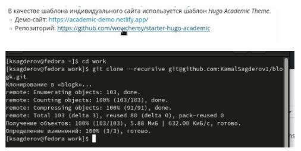{#fig:004 width=70%}

Получаю ссылку на свой сайт и перехожу на данный сайт.

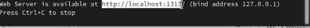{#fig:005 width=70%}

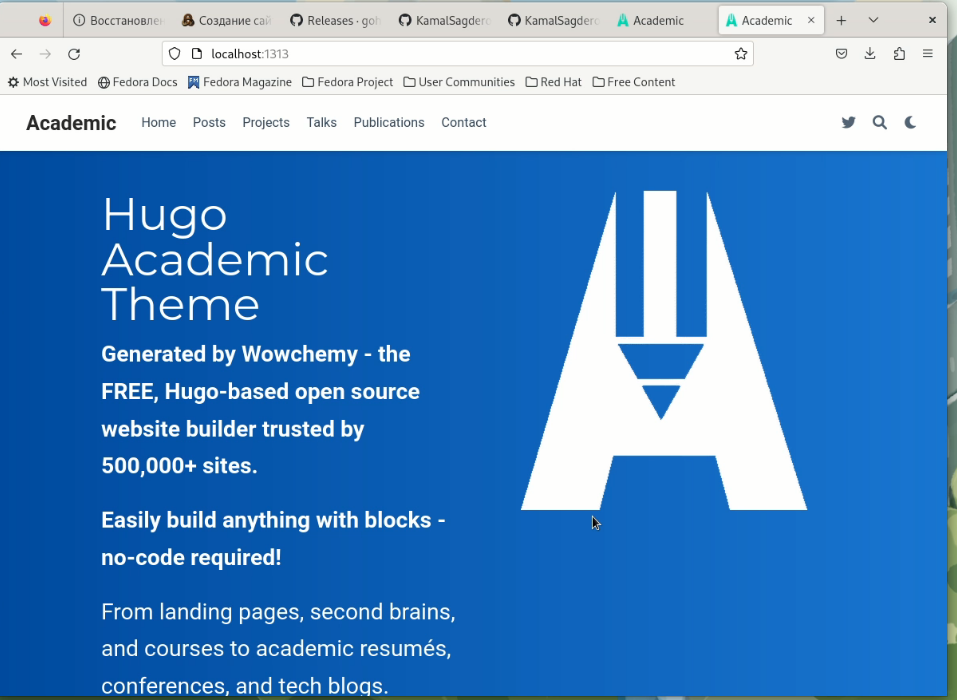{#fig:006 width=70%}

## Выполнение лабораторной работы
№4
Мой сайт видно только с моего устройства, поэтому создаю еще один репозиторий. Теперь сайт
можно открыть на любом устройстве. 

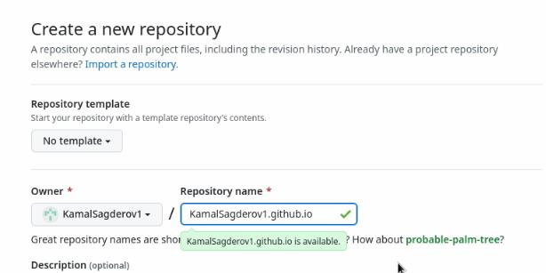{#fig:007 width=70%}

Клонирую свой новый репозиторий. 

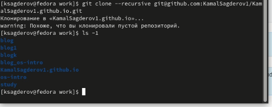{#fig:008 width=70%}

Создаю ветку main(обязательно)

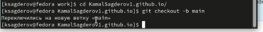{#fig:009 width=70%}

Создаю файл Readme.md и добавляю в репозиторий. 

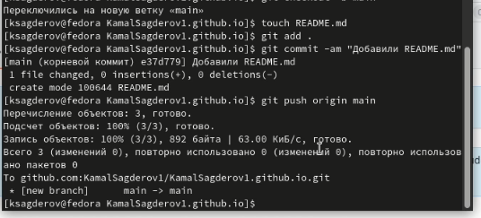{#fig:010 width=70%}

##Выполнение лабораторной работы
№5
Подключаю свой репозиторий к папке public 

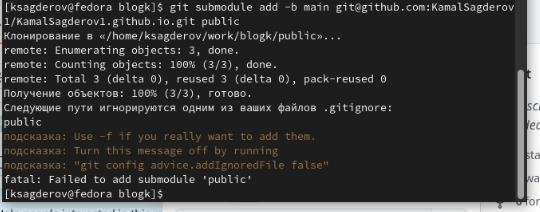{#fig:011 width=70%}

Добавили файлы в репозиторий. 

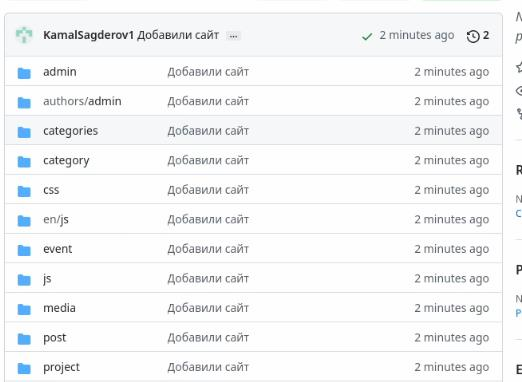{#fig:012 width=70%}

Перехожу на свой сайт 

{#fig:013 width=70%}

## Вывод

После завершения первого этапа индивидуального проекта, я научился создавать статистические сайты с помощью Hugo.

# Спасибо за внимание!

