---
## Front matter
title: "Отчет по индивидуальному проекту. Этап 1."
subtitle: "Создание сайта на Hugo"
author: "Сагдеров Камал. НКАбд-05-22"

## Generic otions
lang: ru-RU
toc-title: "Содержание"

## Bibliography
bibliography: bib/cite.bib
csl: pandoc/csl/gost-r-7-0-5-2008-numeric.csl

## Pdf output format
toc: true # Table of contents
toc-depth: 2
lof: true # List of figures
lot: false # List of tables
fontsize: 12pt
linestretch: 1.5
papersize: a4
documentclass: scrreprt
## I18n polyglossia
polyglossia-lang:
  name: russian
  options:
	- spelling=modern
	- babelshorthands=true
polyglossia-otherlangs:
  name: english
## I18n babel
babel-lang: russian
babel-otherlangs: english
## Fonts
mainfont: PT Serif
romanfont: PT Serif
sansfont: PT Sans
monofont: PT Mono
mainfontoptions: Ligatures=TeX
romanfontoptions: Ligatures=TeX
sansfontoptions: Ligatures=TeX,Scale=MatchLowercase
monofontoptions: Scale=MatchLowercase,Scale=0.9
## Biblatex
biblatex: true
biblio-style: "gost-numeric"
biblatexoptions:
  - parentracker=true
  - backend=biber
  - hyperref=auto
  - language=auto
  - autolang=other*
  - citestyle=gost-numeric
## Pandoc-crossref LaTeX customization
figureTitle: "Рис."
tableTitle: "Таблица"
listingTitle: "Листинг"
lofTitle: "Список иллюстраций"
lotTitle: "Список таблиц"
lolTitle: "Листинги"
## Misc options
indent: true
header-includes:
  - \usepackage{indentfirst}
  - \usepackage{float} # keep figures where there are in the text
  - \floatplacement{figure}{H} # keep figures where there are in the text
---

# Цель работы

Создать сайт на Hugo

# Задание

1. Установить необходимое программное обеспечение.
2. Скачать шаблон темы сайта.
3. Разместить его на хостинге git.
4. Установить параметр для URLs сайта.
5. Разместить заготовку сайта на Github pages.

# Теоретическое введение

Сайт – это информационная единица в интернете, ресурс из веб-страниц (документов), которые объединены общей темой и связаны между друг с другом с помощью ссылок. Он зарегистрирован на одно юридическое или физическое лицо и обязательно привязан к конкретному домену, являющемуся его адресом. [@site:bash]
В лабораторной работе мы будем создавать статистический сайт, с помощью Hugo.
Hugo - генератор статистических страниц для интернета.

# Выполнение лабораторной работы

№1
Установим необходимое программное обеспечение, скачаем Hugo и Go, а также скачиваем необходимый релиз.(рис. @fig:001).

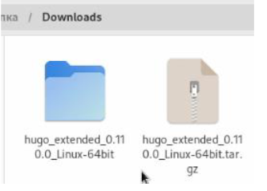{#fig:001 width=70%}

Распакованный файл помещаю в usr/local/bin 

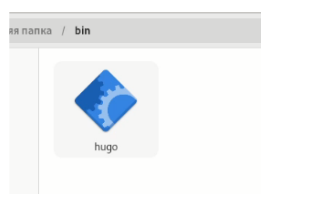{#fig:01a width=70%}

№2
В качестве шаблона индивидуального сайта используется шаблон Hugo Academic Theme. (рис. @fig:002).

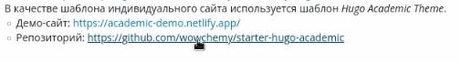{#fig:002 width=70%}

Переходим по ссылке и создаем репозиторий blog (я создал репозиторий blogk). Клонируем
репозиторий (рис. @fig:003).

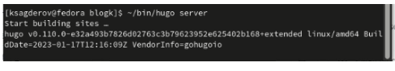{#fig:003 width=70%}

№3
С помощью команды ~/bin/hugo server создаю необходимы для работы файлы. (рис. @fig:004).

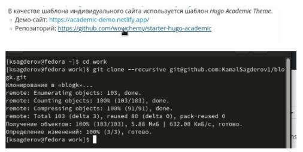{#fig:004 width=70%}

Получаю ссылку на свой сайт и перехожу на данный сайт. (рис. @fig:005).

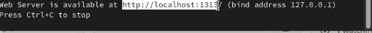{#fig:005 width=70%}

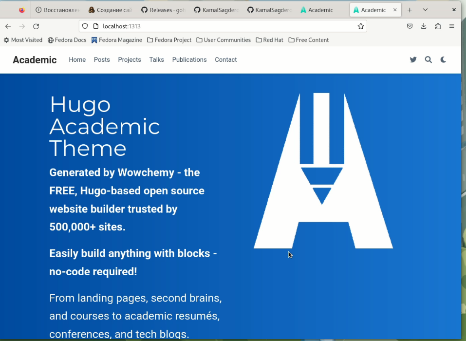{#fig:006 width=70%}

№4
Мой сайт видно только с моего устройства, поэтому создаю еще один репозиторий. Теперь сайт
можно открыть на любом устройстве. (рис. @fig:007).

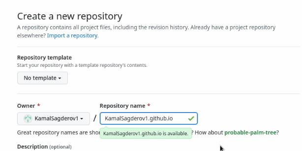{#fig:007 width=70%}

Клонирую свой новый репозиторий. (рис. @fig:008).

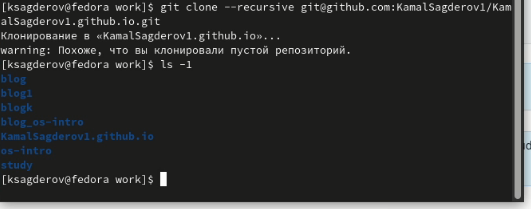{#fig:008 width=70%}

Создаю ветку main(обязательно) (рис. @fig:009).

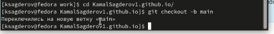{#fig:009 width=70%}

Создаю файл Readme.md и добавляю в репозиторий. (рис. @fig:010).

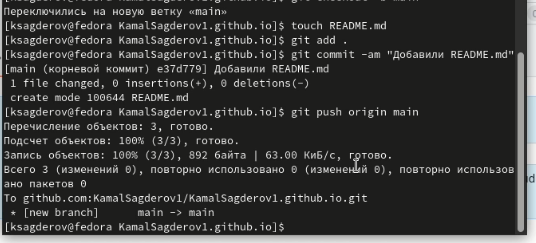{#fig:010 width=70%}

№5
Подключаю свой репозиторий к папке public (рис. @fig:011).

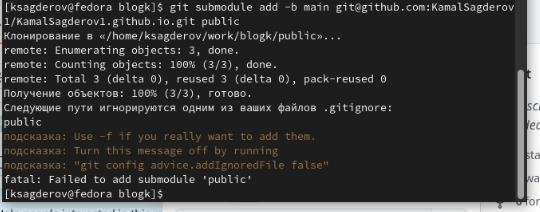{#fig:011 width=70%}

Добавили файлы в репозиторий. (рис. @fig:012).

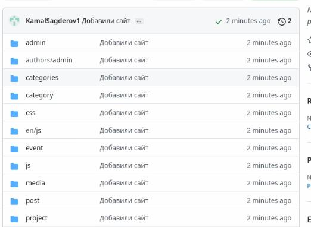{#fig:012 width=70%}

Перехожу на свой сайт (рис. @fig:013).

{#fig:013 width=70%}

# Вывод

После завершения первого этапа индивидуального проекта, я научился создавать статистические сайты с помощью Hugo.

# Списки литературы

::: {#refs}
:::
