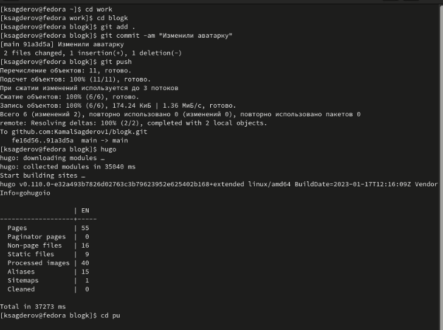
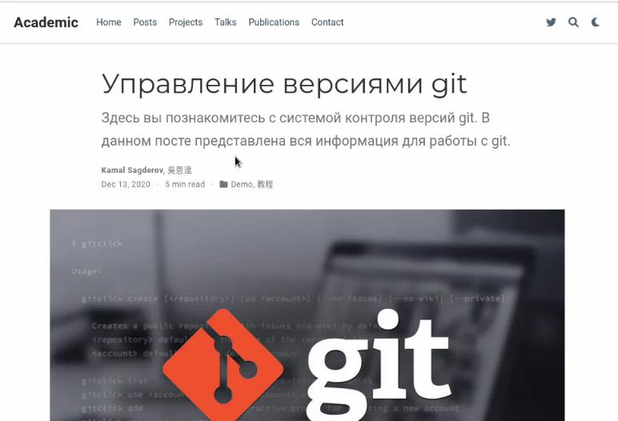
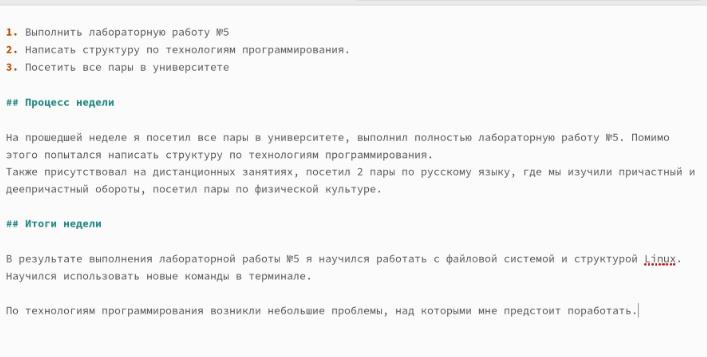
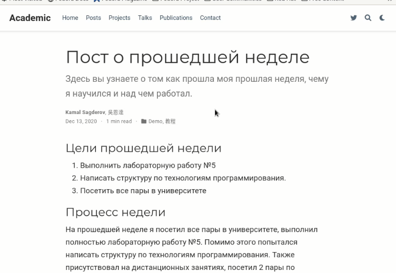

---
## Front matter
lang: ru-RU
title: Второй этап индивидуального проекта.
subtitle: Добавление на сайт личных данных
author:
  - Сагдеров Камал
institute:
  - Российский университет дружбы народов, Москва, Россия
date: 17.03.2023

## i18n babel
babel-lang: russian
babel-otherlangs: english

## Formatting pdf
toc: false
toc-title: Содержание
slide_level: 2
aspectratio: 169
section-titles: true
theme: metropolis
header-includes:
 - \metroset{progressbar=frametitle,sectionpage=progressbar,numbering=fraction}
 - '\makeatletter'
 - '\beamer@ignorenonframefalse'
 - '\makeatother'
---

## Цель работы

Редактировать сайт в соответствии с требованиями. Добавить данные о себе на сайт

## Задание

1. Разместить фотографию владельца сайта.
2. Разместить краткое описание владельца сайта (Biography).
3. Добавить информацию об интересах (Interests).
4. Добавить информацию от образовании (Education).
5. Сделать пост по прошедшей неделе.
6. Добавить пост на тему по выбору: Управление версиями. Git. Непрерывная интеграция и непрерывное развертывание (CI/CD).

## Выполнение работы

1. Разместить свою фотографию на сайт 

{#fig:001 width=70%}

## Выполнение работы

2. Разместим краткое описание владельца сайта (Biography) .

{#fig:003 width=70%}

## Выполнение работы

3. Добавим информацию об интересах (Interests). Добавим информацию от образовании 

{#fig:002 width=70%}

## Выполнение работы

{#fig:004 width=70%}

## Выполнение работы

{#fig:005 width=70%}

## Выполнение работы

4. Добавим пост на тему по выбору(я выбрал тему: Управление версиями Git)

{#fig:006 width=70%}

## Выполнение работы

{#fig:007 width=70%}

## Выполнение работы

5. Сделаем пост по прошедшей неделе 

{#fig:008 width=70%} 

## Выполнение работы

{#fig:009 width=70%}

## Выводы

В процессе  выполнения второго этапа индивидуального проекта я научился редактировать и добавлять данные о себе на сайт, а также писать посты и добавлять их на свой сайт.

# Спасибо за внимание!
