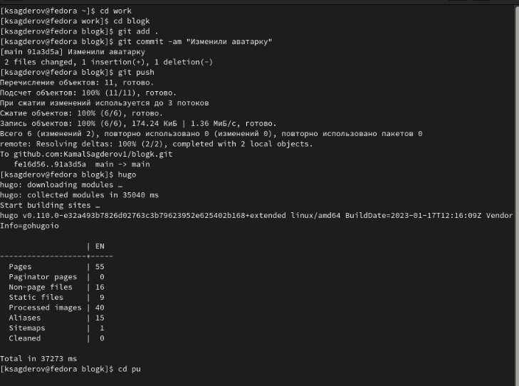
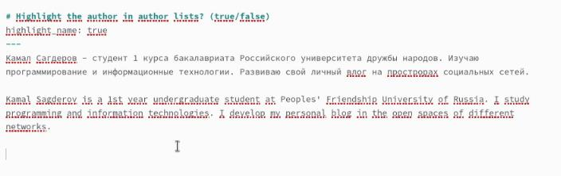
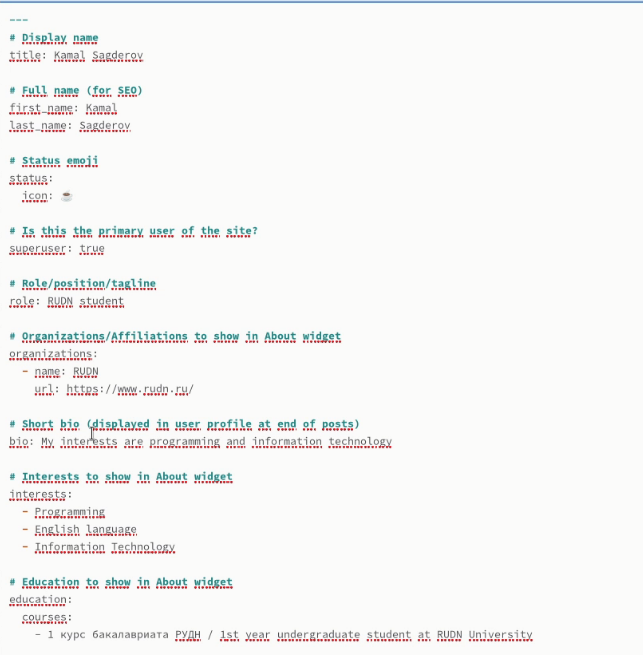
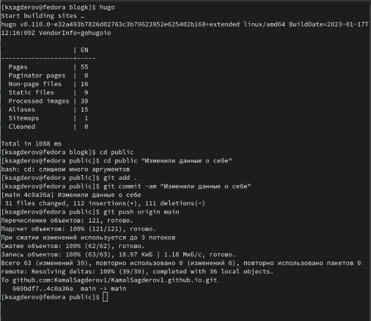
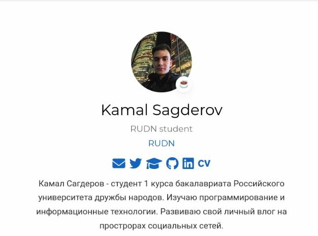
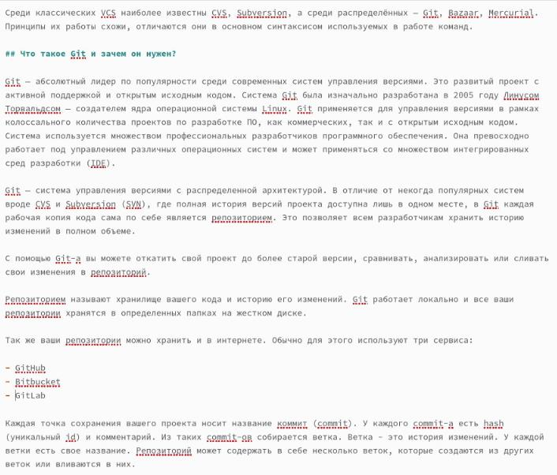
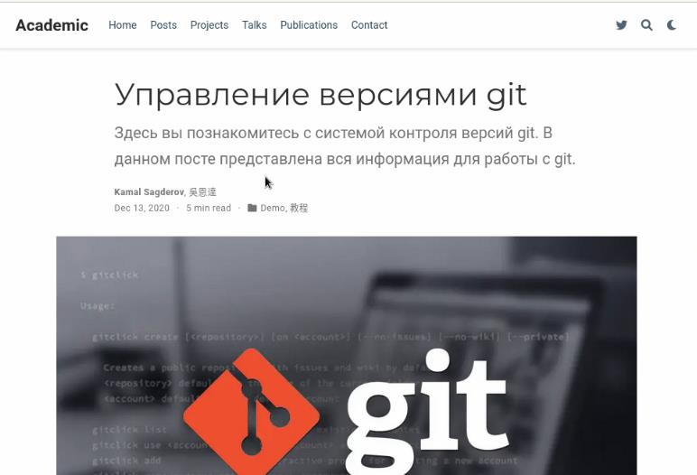
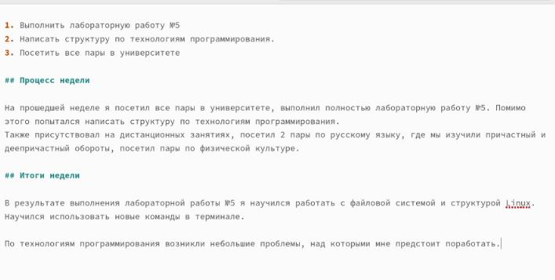
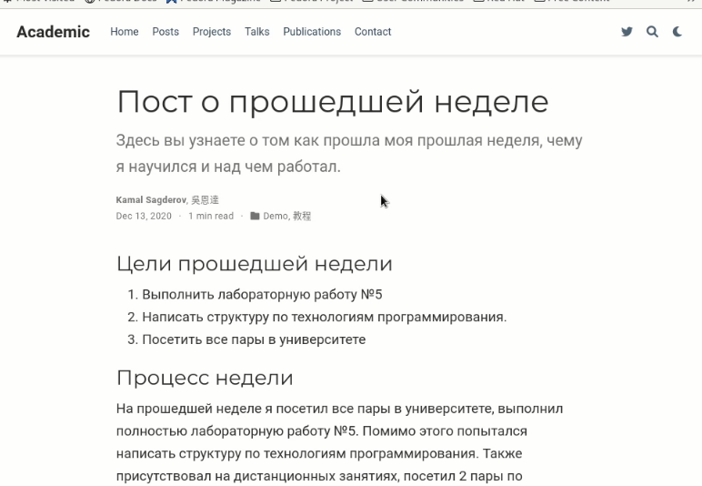

---
## Front matter
title: "Второй этап индивидуального проекта"
subtitle: "Предмет: Операционные системы"
author: "Сагдеров Камал"

## Generic otions
lang: ru-RU
toc-title: "Содержание"

## Bibliography
bibliography: bib/cite1.bib
csl: pandoc/csl/gost-r-7-0-5-2008-numeric.csl

## Pdf output format
toc: true # Table of contents
toc-depth: 2
lof: true # List of figures
lot: false # List of tables
fontsize: 12pt
linestretch: 1.5
papersize: a4
documentclass: scrreprt
## I18n polyglossia
polyglossia-lang:
  name: russian
  options:
	- spelling=modern
	- babelshorthands=true
polyglossia-otherlangs:
  name: english
## I18n babel
babel-lang: russian
babel-otherlangs: english
## Fonts
mainfont: PT Serif
romanfont: PT Serif
sansfont: PT Sans
monofont: PT Mono
mainfontoptions: Ligatures=TeX
romanfontoptions: Ligatures=TeX
sansfontoptions: Ligatures=TeX,Scale=MatchLowercase
monofontoptions: Scale=MatchLowercase,Scale=0.9
## Biblatex
biblatex: true
biblio-style: "gost-numeric"
biblatexoptions:
  - parentracker=true
  - backend=biber
  - hyperref=auto
  - language=auto
  - autolang=other*
  - citestyle=gost-numeric
## Pandoc-crossref LaTeX customization
figureTitle: "Рис."
tableTitle: "Таблица"
listingTitle: "Листинг"
lofTitle: "Список иллюстраций"
lotTitle: "Список таблиц"
lolTitle: "Листинги"
## Misc options
indent: true
header-includes:
  - \usepackage{indentfirst}
  - \usepackage{float} # keep figures where there are in the text
  - \floatplacement{figure}{H} # keep figures where there are in the text
---

# Цель работы

Редактировать сайт в соответствии с требованиями. Добавить данные о себе на сайт

# Задание

1. Разместить фотографию владельца сайта.
2. Разместить краткое описание владельца сайта (Biography).
3. Добавить информацию об интересах (Interests).
4. Добавить информацию от образовании (Education).
5. Сделать пост по прошедшей неделе.
6. Добавить пост на тему по выбору: Управление версиями. Git. Непрерывная интеграция и непрерывное развертывание (CI/CD).

# Теоретическое ведение 

Сайт – это информационная единица в интернете, ресурс из веб-страниц (документов), которые объединены общей темой и связаны между друг с другом с помощью ссылок. Он зарегистрирован на одно юридическое или физическое лицо и обязательно привязан к конкретному домену, являющемуся его адресом. 
В лабораторной работе мы будем создавать статистический сайт, с помощью Hugo.
Hugo - генератор статистических страниц для интернета.

# Выполнение лабораторной работы

1. Разместить свою фотографию на сайт (рис. @fig:001).

{#fig:001 width=70%}

2. Разместим краткое описание владельца сайта (Biography) (рис. @fig:003).

{#fig:003 width=70%}

3. Добавим информацию об интересах (Interests). Добавим информацию от образовании (рис. @fig:002),(рис. @fig:004),(рис. @fig:005).

{#fig:002 width=70%}

{#fig:004 width=70%}

{#fig:005 width=70%}

4. Добавим пост на тему по выбору(я выбрал тему: Управление версиями Git) (рис. @fig:006),(рис. @fig:007).

{#fig:006 width=70%}

{#fig:007 width=70%}

5. Сделаем пост по прошедшей неделе (рис. @fig:008),(рис. @fig:009).

{#fig:008 width=70%} 

{#fig:009 width=70%}

# Выводы

В процессе  выполнения второго этапа индивидуального проекта я научился редактировать и добавлять данные о себе на сайт, а также писать посты и добавлять их на свой сайт.

