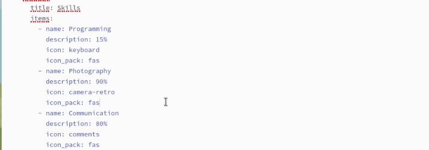
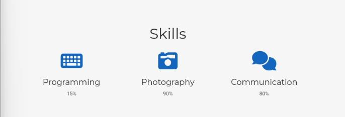
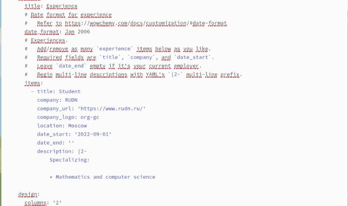
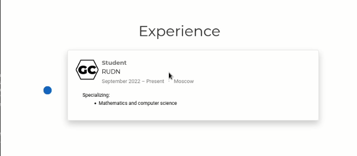
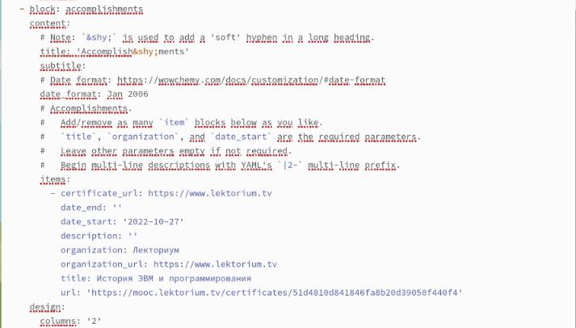
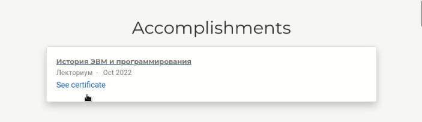
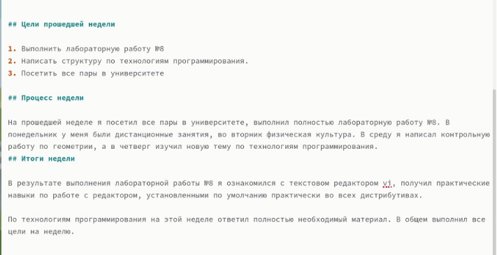
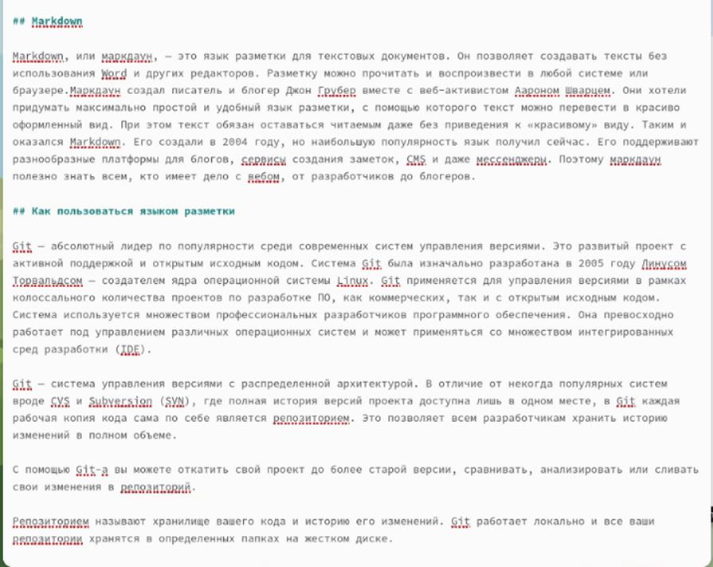
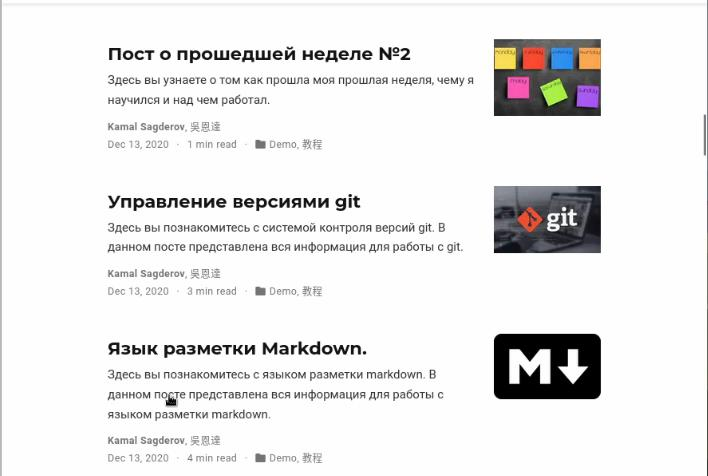

---
## Front matter
lang: ru-RU
title: Третий этап индивидуального проекта
subtitle: Добавить к сайту достижения.
author:
  - Сагдеров Камал
institute:
  - Российский университет дружбы народов, Москва, Россия
date: 04.04.2023

## i18n babel
babel-lang: russian
babel-otherlangs: english

## Formatting pdf
toc: false
toc-title: Содержание
slide_level: 2
aspectratio: 169
section-titles: true
theme: metropolis
header-includes:
 - \metroset{progressbar=frametitle,sectionpage=progressbar,numbering=fraction}
 - '\makeatletter'
 - '\beamer@ignorenonframefalse'
 - '\makeatother'
---

## Цель работы

Продолжить редактировать личный сайт.Добавить к сайту достижения.

## Задание

1. Добавить информацию о навыках (Skills).
2. Добавить информацию об опыте (Experience).
3. Добавить информацию о достижениях (Accomplishments).
4. Сделать пост по прошедшей неделе.
5. Добавить пост на тему по выбору:
- Легковесные языки разметки.
- Языки разметки. LaTeX.
- Язык разметки Markdown.

## Выполнение работы

1. Добавим информацию о навыках (Skills) 

{#fig:001 width=70%}

## Выполнение работы

{#fig:002 width=70%}

## Выполнение работы

2. Добавим информацию об опыте (Experience) 
{#fig:003 width=70%}

## Выполнение работы

{#fig:004 width=70%}

## Выполнение работы

3. Добавим информацию о достижениях (Accomplishments) 
{#fig:005 width=70%}

## Выполнение работы

{#fig:006 width=70%}

## Выполнение работы

4. Сделаем пост по прошедшей неделе 

{#fig:007 width=70%}

## Выполнение работы

5. Добавим пост на тему по выбору: Язык разметки Markdown 

{#fig:008 width=70%}

## Выполнение работы

{#fig:009 width=70%}

## Выводы

В процессе выполнения третьего этапа индивидуального проекта я продолжил редактировать свой сайт, а именно добавил информацию о своих достижениях, продолжил писать посты.

# Спасибо за внимание!
