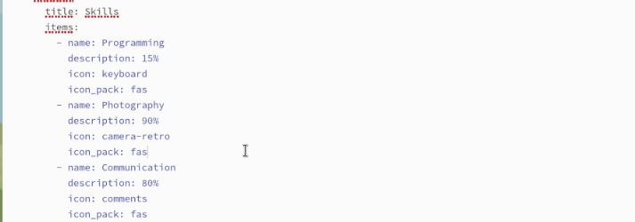
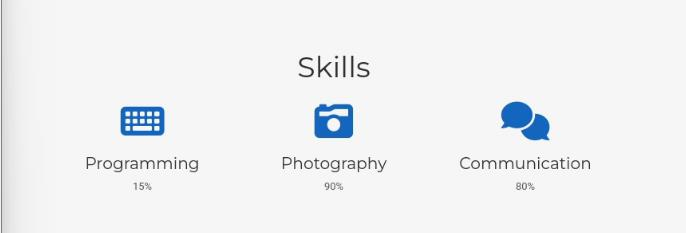
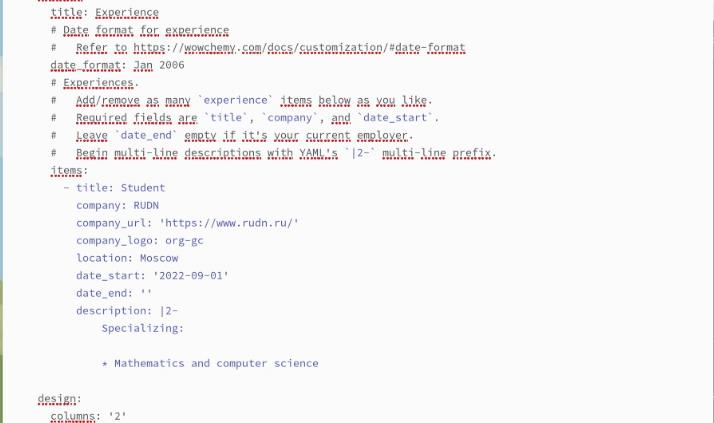
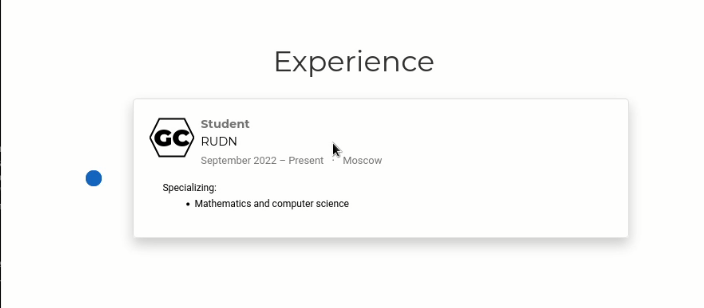
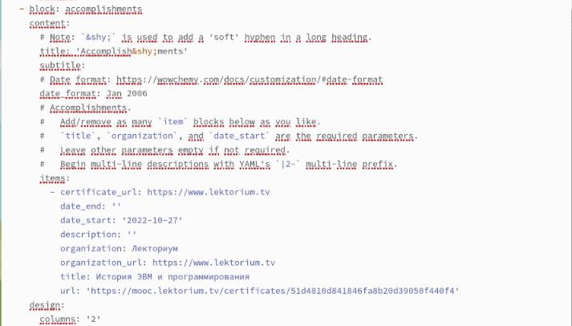
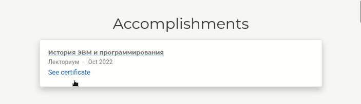
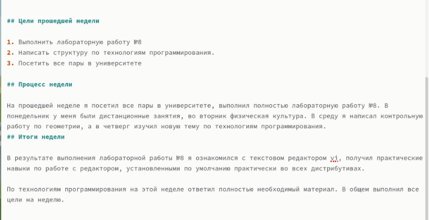
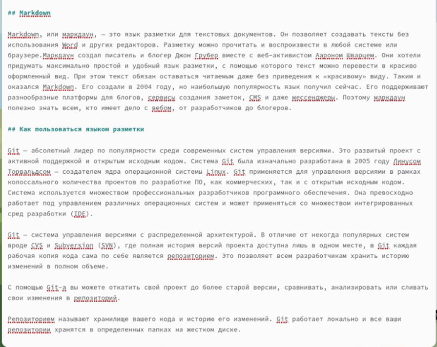
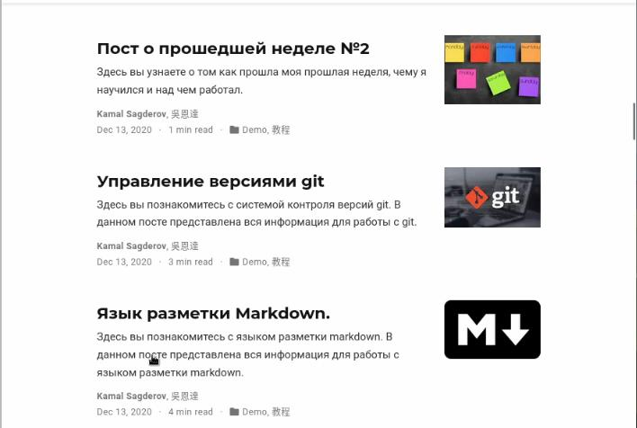

---
## Front matter
title: "Третий этап индивидуального проекта"
subtitle: "Операционные системы"
author: "Сагдеров Камал"

## Generic otions
lang: ru-RU
toc-title: "Содержание"

## Bibliography
bibliography: bib/cite03.bib
csl: pandoc/csl/gost-r-7-0-5-2008-numeric.csl

## Pdf output format
toc: true # Table of contents
toc-depth: 2
lof: true # List of figures
lot: false # List of tables
fontsize: 12pt
linestretch: 1.5
papersize: a4
documentclass: scrreprt
## I18n polyglossia
polyglossia-lang:
  name: russian
  options:
	- spelling=modern
	- babelshorthands=true
polyglossia-otherlangs:
  name: english
## I18n babel
babel-lang: russian
babel-otherlangs: english
## Fonts
mainfont: PT Serif
romanfont: PT Serif
sansfont: PT Sans
monofont: PT Mono
mainfontoptions: Ligatures=TeX
romanfontoptions: Ligatures=TeX
sansfontoptions: Ligatures=TeX,Scale=MatchLowercase
monofontoptions: Scale=MatchLowercase,Scale=0.9
## Biblatex
biblatex: true
biblio-style: "gost-numeric"
biblatexoptions:
  - parentracker=true
  - backend=biber
  - hyperref=auto
  - language=auto
  - autolang=other*
  - citestyle=gost-numeric
## Pandoc-crossref LaTeX customization
figureTitle: "Рис."
tableTitle: "Таблица"
listingTitle: "Листинг"
lofTitle: "Список иллюстраций"
lotTitle: "Список таблиц"
lolTitle: "Листинги"
## Misc options
indent: true
header-includes:
  - \usepackage{indentfirst}
  - \usepackage{float} # keep figures where there are in the text
  - \floatplacement{figure}{H} # keep figures where there are in the text
---

# Цель работы

Продолжить редактировать личный сайт.Добавить к сайту достижения.

# Задание

1. Добавить информацию о навыках (Skills).
2. Добавить информацию об опыте (Experience).
3. Добавить информацию о достижениях (Accomplishments).
4. Сделать пост по прошедшей неделе.
5. Добавить пост на тему по выбору:
- Легковесные языки разметки.
- Языки разметки. LaTeX.
- Язык разметки Markdown.

# Теоретическое введение

Сайт – это информационная единица в интернете, ресурс из веб-страниц (документов), которые объединены общей темой и связаны между друг с другом с помощью ссылок. Он зарегистрирован на одно юридическое или физическое лицо и обязательно привязан к конкретному домену, являющемуся его адресом. 
В лабораторной работе мы будем создавать статистический сайт, с помощью Hugo.
Hugo - генератор статистических страниц для интернета.
В этом этапе проекта мы научимся добавлять на сайт достижения.
Markdown, или маркдаун, — это язык разметки для текстовых документов. Он позволяет создавать тексты без использования Word и других редакторов. Разметку можно прочитать и воспроизвести в любой системе или браузере.Маркдаун создал писатель и блогер Джон Грубер вместе с веб-активистом Аароном Шварцем. Они хотели придумать максимально простой и удобный язык разметки, с помощью которого текст можно перевести в красиво оформленный вид. При этом текст обязан оставаться читаемым даже без приведения к «красивому» виду. Таким и оказался Markdown. Его создали в 2004 году, но наибольшую популярность язык получил сейчас. Его поддерживают разнообразные платформы для блогов, сервисы создания заметок, CMS и даже мессенджеры. Поэтому маркдаун полезно знать всем, кто имеет дело с вебом, от разработчиков до блогеров. 

# Выполнение лабораторной работы

1. Добавим информацию о навыках (Skills) (рис. @fig:001),(рис. @fig:002).

{#fig:001 width=70%}

{#fig:002 width=70%}

2. Добавим информацию об опыте (Experience) (рис. @fig:003),(рис. @fig:004).

{#fig:003 width=70%}

{#fig:004 width=70%}

3. Добавим информацию о достижениях (Accomplishments) (рис. @fig:005),(рис. @fig:006).

{#fig:005 width=70%}

{#fig:006 width=70%}

4. Сделаем пост по прошедшей неделе (рис. @fig:007),(рис. @fig:009).

{#fig:007 width=70%}

5. Добавим пост на тему по выбору: Язык разметки Markdown (рис. @fig:008),(рис. @fig:009).

{#fig:008 width=70%}

{#fig:009 width=70%}

# Выводы

В процессе выполнения третьего этапа индивидуального проекта я продолжил редактировать свой сайт, а именно добавил информацию о своих достижениях, продолжил писать посты.

# Список литературы{.unnumbered}

::: {#refs}
:::
